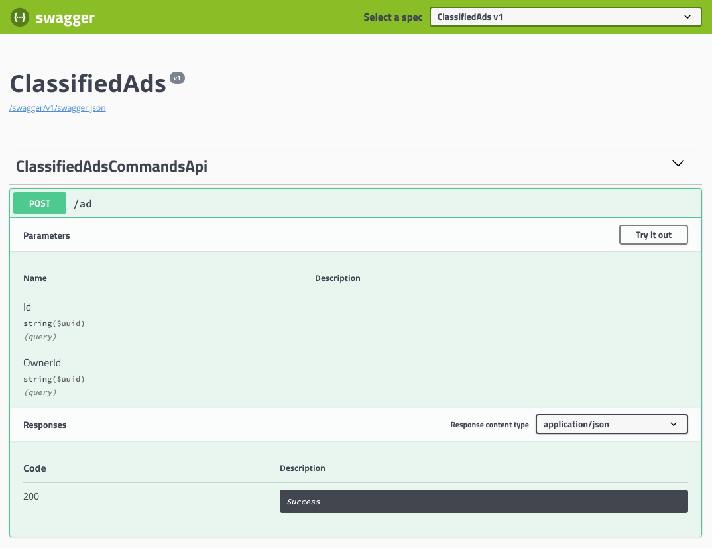
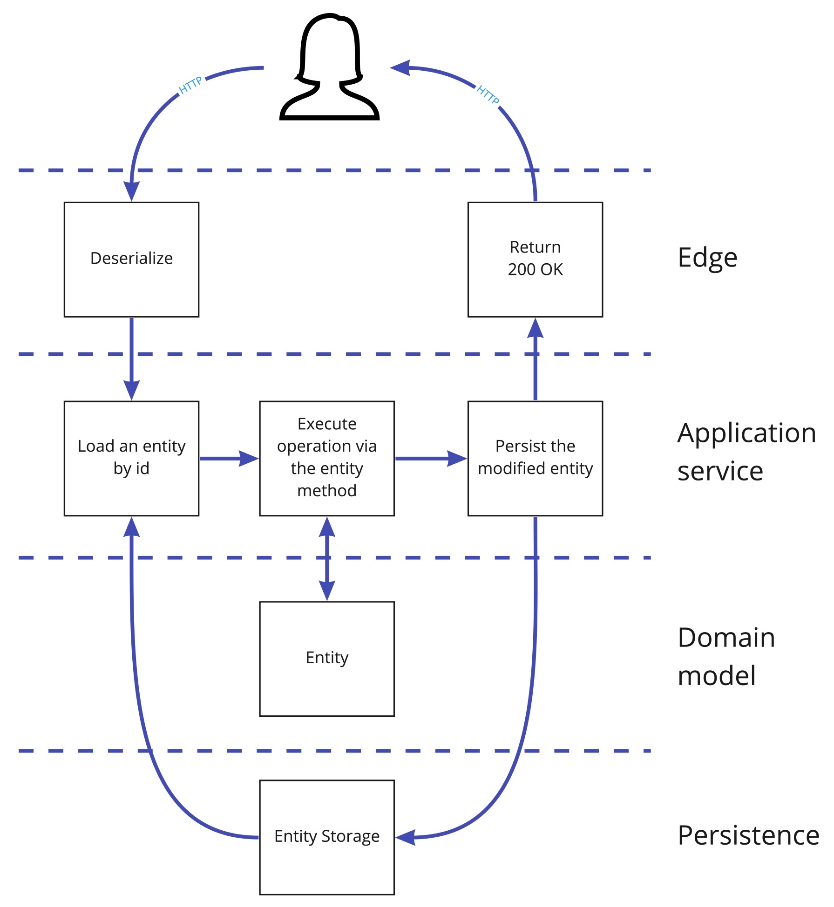

## Outside the domain model

我们努力保持领域模型不受任何与基础设施、持久性、执行和通信相关的东西的影响。这使领域模型变得纯粹，并使其专注于业务。然而，我们仍然需要围绕它来创建整个系统，使领域模型作为系统的核心。

整个的运行时围绕着我们的领域模型，在本节中，我们将剖析构建系统所需的所有必要组件，并研究这些组件需要如何相互绑定以及如何与域模型绑定在一起。

## Exposing the web API

我们的系统需要对用户有一定的可见性，因此，在某些时候，需要构建一个用户界面。我们将在未来讨论这个主题，但是现在我们需要以一种方式公开我们的应用程序，以便将来可以在其上构建 UI。我们希望系统支持不同的客户端。想想 _single-page web application (SPA)_ 和手机 App。作为这两种前端的后端，我们需要构建一个 web API。我将避免使用术语 REST API，因为它不仅仅是一个简单的 web API，而且我们不打算深入探讨这个主题。相反，我们将专注于使用 HTTP 对领域模型进行一些调用，以完成一些有用的工作。

让我们从创建一个 ASP.NET WebAPI controller 开始，我们将在其中放置一些 HTTP endpoint 的处理程序。为此，我们需要向 Marketplace 项目中添加一个 _class_，因为现在我们将不在领域模型内部工作，而是在它外部。

在添加 _controller_ 之前，我们先创建一个名为 Api 的项目文件夹，以便将所有 _controller_ 和相关服务放在一个位置。稍后我们将向 Marketplace 项目添加不同类型的组件，因此最好从一开始就保持整洁。

### Public API contracts

要处理 HTTP 请求，我们需要的不仅仅是一个 _controller_。_controller_ 需要接受强类型的请求，这些请求的集合将是我们的公共 API，这些请求的模型将是我们的契约。在 Marketplace 项目中创建一个名为 Contracts 的文件夹，这个文件夹将放置这些契约模型。

这些 contract 都是 **data-transfer objects (DTOs)** 和 **plain-old C# objects (POCOs)**。这意味着它们没有逻辑，只包含基元类型，不需要任何序列化和反序列化的技巧。实际上，您可以将复合类型添加到 DTO 中，因为许多 contract 中使用了一些复合类型。这种类型的一个例子就是 Address 。

假设我们有以下 contract class：

```csharp
public class UpdateCustomerAddressDetails
{
    public string BillingStreet { get; set; }
    public string BillingCity { get; set; }
    public string BillingPostalCode { get; set; }
    public string BillingCountry { get; set; }
    public string DeliveryStreet { get; set; }
    public string DeliveryCity { get; set; }
    public string DeliveryPostalCode { get; set; }
    public string DeliveryCountry { get; set; }
}
```
使用复合类型而不是分别列出两个地址的所有属性会非常方便。在我们添加了一个名为 Address 的新类型之后，我们的 contract 将会更加紧凑：
```csharp
public class Address
{
    public string Street { get; set; }
    public string City { get; set; }
    public string PostalCode { get; set; }
    public string Country { get; set; }
}

public class UpdateCustomerAddressDetails
{
    public Address BillingAddress { get; set; }
    public Address DeliveryAddress { get; set; }
}
```

请注意，复合类型会增加兼容性问题，因为当您更改类型时，使用它的所有 contract 也会更改，而此更改将是隐式的。由于您没有此 contract 的内部消费者，因此您将无法查看使用此 contract 的客户端是否会受到影响。这些信息只能通过测试获得。

说到更改，请记住，对外发布的所有内容都被认为是公开的。任何具有适当权限的人都可以使用公共 API。实际上，这意味着您不能控制谁在使用您的 API。因此，发布的 API 中的任何更改都可能破坏系统的其他部分或其他系统。公共 contract 的变更需要谨慎制定，因为既有非破坏性变更也有破坏性变更。

POCO 类型中的某些更改被认为是非破坏性的，例如：
* 更改属性的类型，以便以前使用的类型的任何值，都可以序列化为新的类型。例如，我们可以将一个属性从整数更改为字符串，它将是兼容的。
* 添加新的属性也被认为是一种非破坏性的更改。这是因为，当我们试图反序列化没有这个新属性的 XML 或 JSON 对象时，这是因为当我们试图反序列化一个没有这个新属性的 XML 或 JSON 对象时，如果发送方还没有更新他们的 contract ，大多数流行的序列化程序都会接受它，如果没有提供这个值，则会使用默认值。

我们的软件在不断发展，当然，不可能总是做出非破坏性变更。这意味着我们应该准备好做出突破性的改变。我我们已经讨论了公共 API 是如何在公开后立即共享的。因此，我们需要确保，当我们做出一个破坏性的更改时，所有使用旧 API 的人都不会出现异常，并且至少在一段时间内能够像以前一样工作。这是通过 **API versioning** 来实现的。对于 GitHub 或 Twitter 等流行服务，您可能遇到过不同的 API 版本。例如，Twitter API 的文档告诉我使用这个调用来获取tweet 的时间轴：https://api.twitter.com/1.1/statuses/home_timeline.json。如您所见，他们使用 1.1 作为 URI 的一部分，这是他们当前的稳定API 版本。我们可以假设它们还有其他版本，其中一些旧版本可能仍在运行和使用中。因此，在我们的 API 中，也将使用版本化的 contract ，尽管我们在开始时并不期望有太多的变化。

我们已经知道可以对领域执行哪些操作，因此可以添加一些 contract 来从外部调用这些操作。让我们创建一个文件，在其中放置我们的第一个 contract 。我们已经有了 Contracts 文件夹，所以我们可以在这个文件夹中创建一个名为 ClassifiedAds.cs 的 c# 类文件。文件准备好后，我们就可以在那里添加第一个 contract ：
```csharp
using System;

namespace Marketplace.Contracts
{
    public static class ClassifiedAds
    {
        public static class V1
        {
            public class Create
            {
                public Guid Id { get; set; }

                public Guid OwnerId { get; set; }
            }
        }
    }
}

```
在这里，我们使用嵌套的 static class，ClassifiedAds 和 V1 替代命名空间，以便在需要时在一个文件中拥有更多版本。此方式可以让我们使用 static member import 来使代码更简洁。

我们这里有一个*命令（command）*。我第一次提到命令是在第1章，当我们讨论 CQRS 时。命令允许用户和其他系统在我们的领域模型中执行操作。当一个命令被成功处理时，领域模型的状态会发生变化，并发出新的*领域事件（domain event）*。现在，当我们在代码中实现了一个命令时，我们需要接受来自外部世界的这个命令，我们将为此使用一个 HTTP endpoint 。

### HTTP endpoints

由于目前 API 最简单的通信方式是使用同步 HTTP 调用，所以我们将从这里开始。我们将使用 ASP.NETWeb API 。因此，我们需要添加一个 controller 来接受我们的命令。将一个名为 ClassifiedAdsCommandsApi.cs 的文件添加 Marketplace 项目的 Api 文件夹中，使他继承 Controller，并添加一个 Post 方法来处理我们在前一节中添加的命令：
```csharp
using System.Threading.Tasks;
using Microsoft.AspNetCore.Mvc;

namespace Marketplace.Api
{
    [Route("/ad")]
    public class ClassifiedAdsCommandsApi : Controller
    {
        [HttpPost]
        public async Task<IActionResult>
        Post(Contracts.ClassifiedAds.V1.Create request)
        {
            // handle the request here
            return Ok();
        }
    }
}

```

这里还没有做任何事情。相反，我们创建了一个 web API，它将接受来自外部世界的命令。稍后我们将添加处理这些命令的代码。记住，这是我们的 HTTP 基础设施适配器，它位于 onion 架构的最外层。我们把这个层称为 **边缘层（the edge）**，因为它之外没有任何东西，我们可以把它看作是我们应用程序的一部分。应用程序可以有多种与外部世界通信的方式，如果我们添加了一些其他的适配器，比如消息，我们希望这个新的通信适配器来处理相同的命令。

现在，我们需要在应用程序启动时添加一些代码，以使 web API 工作。我们需要对 Program *classs* 做一些事情：
* Build the configuration
* Configure the web host
* Execute the web host

要执行这些操作，我们需要对 Program 做一些修改：
```csharp
using System.IO;
using Microsoft.AspNetCore.Hosting;
using Microsoft.Extensions.Configuration;
using Microsoft.Extensions.DependencyInjection;
using static System.Environment;
using static System.Reflection.Assembly;

namespace Marketplace
{
    public static class Program
    {
        static Program() => 
            CurrentDirectory =
                Path.GetDirectoryName(GetEntryAssembly().Location);

        public static void Main(string[] args)
        {
            var configuration = BuildConfiguration(args);

            ConfigureWebHost(configuration).Build().Run();
        }

        private static IConfiguration 
        BuildConfiguration(string[] args) => 
            new ConfigurationBuilder()
                .SetBasePath(CurrentDirectory)
                .Build();

        private static IWebHostBuilder 
        ConfigureWebHost(IConfiguration configuration) => 
            new WebHostBuilder()
                .UseStartup<Startup>()
                .UseConfiguration(configuration)
                .ConfigureServices(services => services.AddSingleton(configuration))
                .UseContentRoot(CurrentDirectory)
                .UseKestrel();
    }
}
```
这里并没什么特别的。我们确保当前目录是可执行文件所在的目录，因为这也是我们可以找到配置文件的地方。然后我们读取配置，并从配置中创建 web host 并启动它。现在，我们还没有配置文件，因此没有配置，但我们将在稍后添加一些。

现在，我们使用 Startup *class* 来配置 service ，这也需要注意。在 Startup 中，我们需要配置 web API，以便它能够使用 controller 。此外，我们还需要一种简单的方式来与 API 交互，而不需要任何用户界面。一个简单的方式就是使用 [Swagger](https://Swagger.io/) 。开始使用它之前，需要添加一个 Swagger 的 NuGet 包（Swashbuckle.AspNetCore） 。对于新的 .csproj 文件格式，添加包的最简单方式是将包引用直接添加到项目文件中。在这里，你可以看到对 Marketplace.csproj 文件的更改（Swashbuckle.AspNetCore 这一行）：
```csharp
<Project Sdk="Microsoft.NET.Sdk.Web">
    <PropertyGroup>
        <TargetFramework>netcoreapp2.1</TargetFramework>
    </PropertyGroup>
    <ItemGroup>
        <PackageReference Include="Microsoft.AspNetCore.App" />
        <PackageReference Include="Swashbuckle.AspNetCore" Version="4.0.1" />
    </ItemGroup>
    <ItemGroup>
        <ProjectReference
            Include="..\Marketplace.Domain\Marketplace.Domain.csproj" />
    </ItemGroup>
</Project>
```
接着是 Startup.cs 文件：
```csharp
using Microsoft.AspNetCore.Builder;
using Microsoft.AspNetCore.Hosting;
using Microsoft.Extensions.Configuration;
using Microsoft.Extensions.DependencyInjection;
using Swashbuckle.AspNetCore.Swagger;

using static System.Environment;

// ReSharper disable UnusedMember.Global
namespace Marketplace
{
    public class Startup
    {
        public Startup( IHostingEnvironment environment, IConfiguration configuration)
        {
            Environment = environment;
            Configuration = configuration;
        }

        private IConfiguration Configuration { get; }

        private IHostingEnvironment Environment { get; }

        public void ConfigureServices(IServiceCollection services)
        {
            services.AddMvc();
            services
                .AddSwaggerGen(c =>
                    c.SwaggerDoc("v1",
                        new Info { Title = "ClassifiedAds", Version = "v1" }));
        }

        public void Configure(IApplicationBuilder app, IHostingEnvironment env)
        {
            if (env.IsDevelopment())
            {
                app.UseDeveloperExceptionPage();
            }

            app.UseMvcWithDefaultRoute();
            app.UseSwagger();
            app.UseSwaggerUI(c =>
                    c.SwaggerEndpoint(
                        "/swagger/v1/swagger.json", "ClassifiedAds v1"));
        }
    }
}

```

现在一切就绪，启动应用程序，在浏览器中打开：http://localhost:5000/swagger 。会看到一个 POST 操作，当我们展开它时，应该会出现以下内容：

<center>Swagger user interface for testing the API</center>

我们完成了公开 web API endpoint 的所有必要步骤。还创建了一个表示 create classified ad 的命令的API contract ，现在是让这个命令起作用的时候了。

## Application layer

边缘层（the edge）—— 在我们的例子中，它是一个简单的 web api ——接受来自外部世界的请求。我们的*边缘层*的主要工作是接受一些请求，这些请求以 JSON、XML、RabbitMQ消息或任何其他通信通道和序列化类型发送；将其转换为命令；然后确保该命令得到处理。

当然，*边缘层*可以直接与领域模型一起工作，但这意味着我们要接受这样一个事实，即我们将始终只使用一种边缘类型，使用一种通信协议。此外，边缘组件通常严重依赖于通信基础设施——这对于集成测试来说是有益的，因为给此类组件创建单元测试可能会很有挑战性。


为了将通信基础设施与实际的请求处理隔离开来，我们可以引入 application layer 。在这一层中，我们需要一个组件接受来自边缘层的命令，并使用我们的领域模型来处理这些命令。这样的组件称为 **application service** 。

回顾一下第4章，查看 onion 架构的图片，您会发现基础设施和领域模型之间的 application service 。application service 不依赖于边缘层（web api）。

但是，service 需要有加载和存储实体的方法，因为通常 aplication service 的操作就是执行这样的命令：

<center>Typical interaction flow</center>

在这个流程中有几个例外。当 application service 接收到需要创建新实体的命令时，它不会从实体存储库中加载任何内容，因为还没有要加载任何内容。它将创建实体并将其保存到实体存储库中。另外，当处理的命令是需要删除实体时，application service 将加载该实体，但不一定将其保存回存储中。它可能只是从存储中删除这个实体，但这在很大程度上取决于模型。例如，如果业务需要保存所有数据，我们可以将实体标记为已删除，然后将更改持久化到实体存储。

向项目中添加一个 application service *class*，并编写一些代码。首先，我们需要在 Marketplace 项目的 Api 文件夹中创建一个新文件。有些人可能会说 application service 不是 API 的一部分，但是现在，我们只有一个 service ，没有真正的理由把它们分开。新的文件名为 ClassifiedAdApplicationService.cs：
```csharp
namespace Marketplace.Api
{
    public class ClassifiedAdsApplicationService
    {
        public void Handle(Contracts.ClassifiedAds.V1.Create command)
        {
            // we need to create a new Classified Ad here
        }
    }
}
```

在 Startup 中注册这个 service ：
```csharp
public void ConfigureServices(IServiceCollection services)
{
    services.AddSingleton(new ClassifiedAdsApplicationService());
    ...
}
```

然后对 ClassifiedAdsCommandsApi controller 做一些修改：
```csharp
using System.Threading.Tasks;
using Microsoft.AspNetCore.Mvc;

namespace Marketplace.Api
{
    [Route("/ad")]
    public class ClassifiedAdsCommandsApi : Controller
    {
        private readonly ClassifiedAdsApplicationService _applicationService;

        public ClassifiedAdsCommandsApi(
            ClassifiedAdsApplicationService applicationService) => 
                _applicationService = applicationService;

        [HttpPost]
        public async Task<IActionResult> Post(
        Contracts.ClassifiedAds.V1.Create request)
        {
            _applicationService.Handle(request);

            return Ok();
        }
    }
}
```
在下一节中，我们将深入研究命令的处理，包括将实体保存到实体存储并检索它们。我们还将添加更多的命令和处理程序。