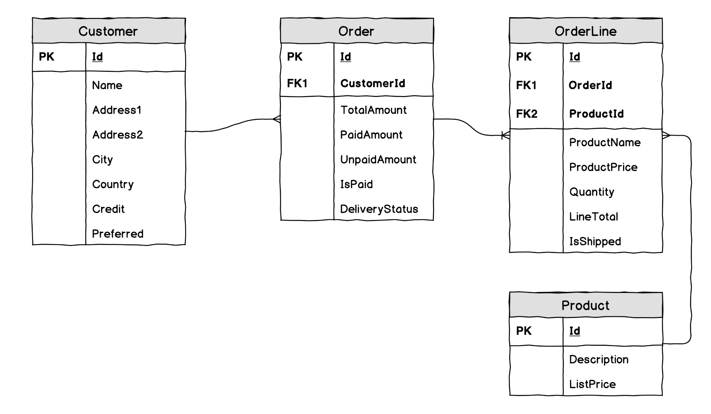
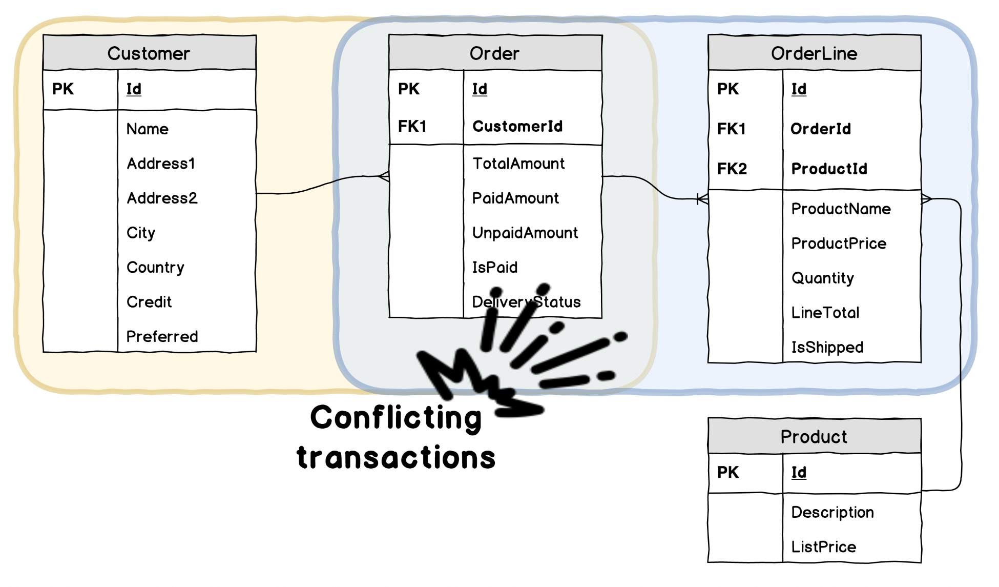
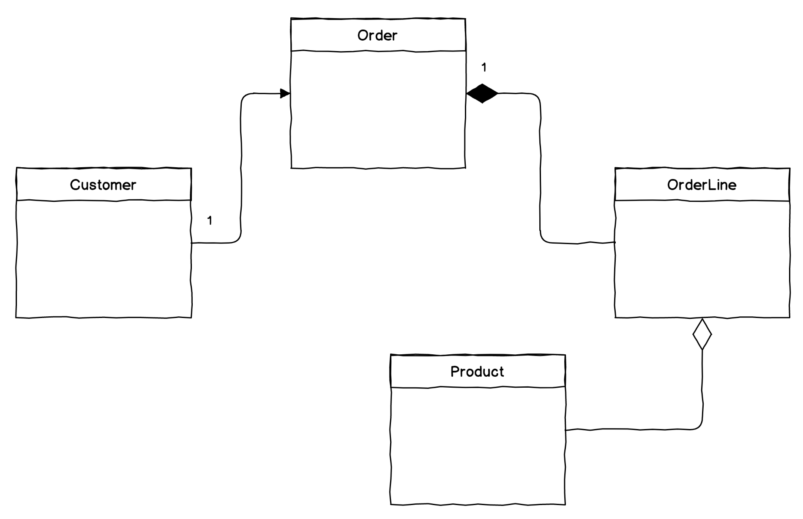

## Domain model consistency

说到建模，我们经常听说数据模型需要处于任何系统的中心。*如果你想要一个好的系统，你得首先需要一个好的数据模型*。在我作为软件工程师的职业生涯中，这句话我已经听过无数次了。我的一位同事曾经说过这句话，然后又补充道:“*我参与了一个大项目，我们从定义数据模型开始，18个月后，这个项目被关闭了，因为模型还没有完成*“。奇怪的是，这两个陈述对他来说并没有因果关系，因为第一个陈述是一个公理，项目失败似乎是由许多原因造成的，但不是通过设计一个复杂的系统数据模型而导致的。

如果我们先创建一个数据模型，然后尝试围绕它创建代码，那么就很难理解为什么要强制执行某些规则，为什么该表中的那些列是必需的，以及为什么一个表与另一个表有多对多的关系。这些关系也很难测试，即使我们有测试，我们也只能在正确配置了一组预填充数据的数据库的情况下运行它们，因此我们的测试也变得面向数据库。

当领域模型本质上与持久性分离时，DDD提倡一种不同的方法，它主要是为了服务于特定的业务规则。当我们处理领域模型时，我们追求不同的设计目标。我们需要在 *class* 中封装足够的信息，这样我们就可以确保模型在任何状态转换之后保持一致。我们所说的一致性并不是指可以外包给数据库引擎的关系数据库一致性。相反，我们希望确保对象不会违反业务定义的规则，这些规则需要在代码中显式定义。让我们看看我们可以应用什么样的原则，以及如何在以领域模型为中心的设计方法中定义不同类型的一致性边界。

## Transaction boundaries

正如前面所讨论的，命令表达了用户对系统进行操作的意图。命令可能来自另一个系统，甚至来自一个计时器，但是它仍然表达了某种意图。在处理命令之前，领域模型处于有效状态。在处理命令时，领域模型也应该处于有效状态。如果命令处理导致执行了某个操作，则此状态可以是新的状态；如果命令处理失败，则此状态可以是与以前相同的状态。

让我们看看前一章中命令处理的代码：
```csharp
private async Task HandleUpdate(
    Guid classifiedAdId, Action<ClassifiedAd> operation)
{
    var classifiedAd = 
        await _store.Load<ClassifiedAd>(classifiedAdId.ToString());

    if (classifiedAd == null)
        throw new InvalidOperationException(
            $"Entity with id {classifiedAdId} cannot be found");

    operation(classifiedAd);

    await _store.Save(classifiedAd);
}
```
这是一个通用的命令处理程序，除了创建和删除之外，它可以用于现有实例的任何操作。我们能够像这样使命令处理更通用的原因是，所有命令都以类似的方式处理：
* 通过实体 ID 从存储中检索实体
* 执行一个操作
* 将更改提交回存储

如果操作失败，或者存储不能根据给定的 ID 找到任何东西，处理程序将抛出异常。

对于本章来说，前面的代码以及在 application service 处理命令时所执行的步骤列表中，最重要的一点是我们只对*单个*实体执行操作。

让我们看看为什么会这样，为此，我们考虑一种非常常见的实现应用程序的方式——以数据库为中心。我们将使用电子商务领域作为示例，因为它相当复杂，而且代码不会干扰我们对 Marketplace 应用程序正在进行的工作。

如果您有几年用 .NET 开发软件的经验，那么您可能见过许多这样的代码：
```csharp
[Route("/api/order/pay/credit/{orderId}")]
public async Task TakeOnCustomerCredit(int orderId)
{
    using (var context = new CommerceContext())
    using (context.Database.BeginTransaction())
    {
        var order = 
            await context.Orders.Where(x => x.Id == orderId).FirstAsync();

        var amount = order.UnpaidAmount;
        var customer = order.Customer;

        if (customer.Credit < amount)
            throw new InvalidOperationException("Not enough credit");
            
        customer.Credit -= amount;
        order.PaidAmount += amount;
        order.UnpaidAmount -= amount;
        customer.TotalSpent += amount;

        if (customer.TotalSpent > CommerceConstants.PreferredLimit)
            customer.Preferred = true;
            
        order.IsPaid = order.UnpaidAmount == 0;
        
        await context.SaveChangesAsync();
    }
}
```

在这里，controller 看起来像是在完成一个逻辑操作，它直接在 HTTP endpoint 的请求处理方法中处理命令。操作似乎是独立和简洁的。说实话，在我的职业生涯中，我见过更糟糕的代码，用户的一个请求导致许多不相关的数据库操作，但是我们坚持使用这个示例，因为它在一开始看起来很合理。因此，此代码使用了 **unit of work** 模式，而包装在 using 块中的 DbContext 完美地实现了此模式，因为它在调用 context.SaveChangesAsync() 时将数据库元素中的所有更改累积起来，并一次性提交所有更改。

来看一下与此代码关联的数据模型

<center>Simplified eCommerce data model</center>

当然，我们可以期望在整个模型中有更多的表。它可能包括 Product、Supplier 和 Shipment 。对于我们的目的，只有这四个表就足够了。这些表都与其他表有关系，而且这些关系都是一对多（或0对多）。Entity Framework 模型在 Order 和 Customer 之间使用了对象引用。，这种引用在使用 ORM 框架时非常流行，因为它给开发人员带来了便利。可以通过使用 order.Customer 访问与特定订单关联的 Customer 对象，并根据需要修改 Customer 的属性，这正是上面代码所做的。它在一个逻辑操作中更改订单和客户的属性。该操作要么完全成功，要么失败。我们不能容忍客户的信用金额减少，但订单仍然没有支付的事实。这种行为通常与数据库事务相关联。事务带是四条原则，称为 **ACID**：
* Atomicity
* Consistency
* Isolation
* Durability

现在，让我们集中讨论*原子性*。这一特征意味着一个事务中的所有操作必须全部完成，否则什么都不会发生，这通常被称为 **all-or-nothing** 。

在前面的代码中，可以看到事务包装了使用客户的信用卡支付订单的整个操作。这是正确的，我们在这里处理的是一个**事务边界（transactional boundary）**。对于 TakeOnCustomerCredit 这个方法，*事务边界*将包括两个表—— Customer 和 Order。如果我们在同一个模型上设想另一个操作，可能是这样的：
```csharp
public async Task ShipOrderLine(int orderLineId)
{
    using (var context = new CommerceContext())
    using (context.Database.BeginTransaction())
    {
        var orderLine = 
            await context.OrderLines
                .Where(x => x.Id == orderLineId)
                .FirstAsync();

        orderLine.IsShipped = true;
        orderLine.Order.DeliveryStatus =
            orderLine.Order.OrderLines.All(x => x.IsShipped)
                ? DeliveryStatus.Shipped
                : DeliveryStatus.PartiallyShipped;

        await context.SaveChangesAsync();
    }
}
```

这个方法仍然使用相同的模型，并且有一些令人担忧的问题。但是，现在，让我们看看在这里处理的是什么事务边界。在这个 unit of work 中，我们在一个事务中更改了 Order 和 OrderLine 表中的记录。

这两个代码片段表明，在传统的分层架构中，由于没有真正的领域模型，事务边界是由在数据库中执行更改的任何代码段所决定的。模型本身并不强制任何类型的边界。两个方法（可以位于一个控制器类中）操作两个不同的事务边界，尽管两个方法所更改的 Order 表将是两个事务的一部分。很容易想象，表将是两个事务的一部分。TakeOnCustomerCredit 方法支付客户的剩余订单，ShipOrderLine 方法将某个订单标记为已装运，很容易想象，如果这两个并行的执行会产生什么结果：

<center>Updates for different reasons cause unjustified conflicting transactions</center>

从业务逻辑的角度来看，这是两种不同的操作，但是由于 ACID 的一致性，其中一个方法将失败。对于该系统的用户来说，如果他们知道支付过程与发货交付有某种关系，那将是非常奇怪的。

这种模型出现的原因是很清楚的。面向对象编程主张，程序中的对象即表示真实世界的事物。

数据模型采用类似的方法。经常会看到一个系统有一个全局的数据模型，它紧密地代表了真实世界的模型，涵盖了系统实现的领域的所有方面。它自然会导致代码中的大型对象图反映这样一个整体数据模型。然而，当我们需要专注于建模时，DDD提倡另一种方式：建模那些为系统实现一组用例绝对需要的真实世界模型的那些方面。我们已经在第4章涉及了建模方面的知识。

当构建模型时，我们可以定义事务边界，这样当我们的软件需要在相同的现实世界对象上执行操作时，不同的用例就不会相互冲突，而且，在软件模型中，这些对象可以用不同的对象来表示，甚至属于不同的对象。

## Aggregate pattern

在本章前面我们处理的数据模型中，我们有一个*组合（composition）*—— Order 是 OrderLine 元素的组合。如果我们从数据模型转移到类图，您可能知道这个模型会是什么样子的：

<center>Aggregation in UML</center>

在UML中，组合意味着子元素不能脱离父元素而存在。事实上，OrderLine 不与任何 Order 相关联这是没有意义的。这样的组合作为一个整体，形成了一个逻辑上不可分割的结构，虽然，在这个结构中，可以找到个别的元素。对于外部世界，Order 包括它的 OrderLine ，被视为一个东西，尽管 Order 可以有许多 OrderLine 。在 DDD 中，这样的构造称为聚合。因为这里我们只是临时使用一下 UML ，所以它可能会造成一些混乱，因为在 UML 中，聚合意味着其他的东西，而与 DDD 聚合最接近的类比是 UML 的组合概念。这就是——父对象包含或拥有所有子对象，并且当父对象被删除时，所有子对象也必须被删除，因为这些对象的存在已经没有意义了。聚合的父对象称为*聚合根*。具有单个父对象的复杂对象图可以像树一样被可视化，其中父对象是所有树分支的起源，因此使用根作类比非常有意义。