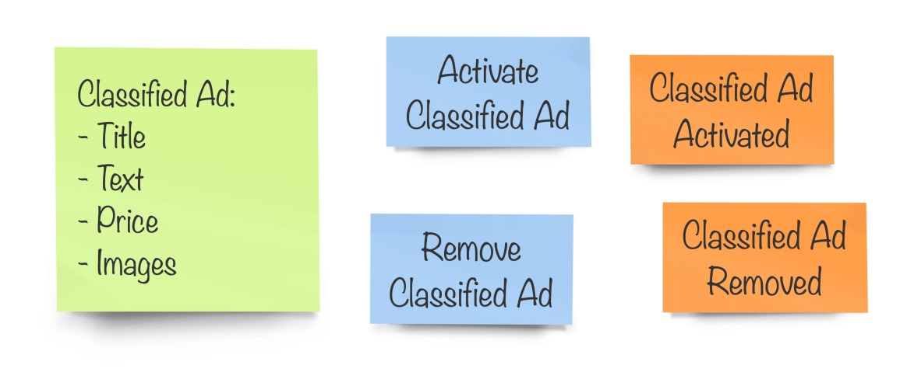
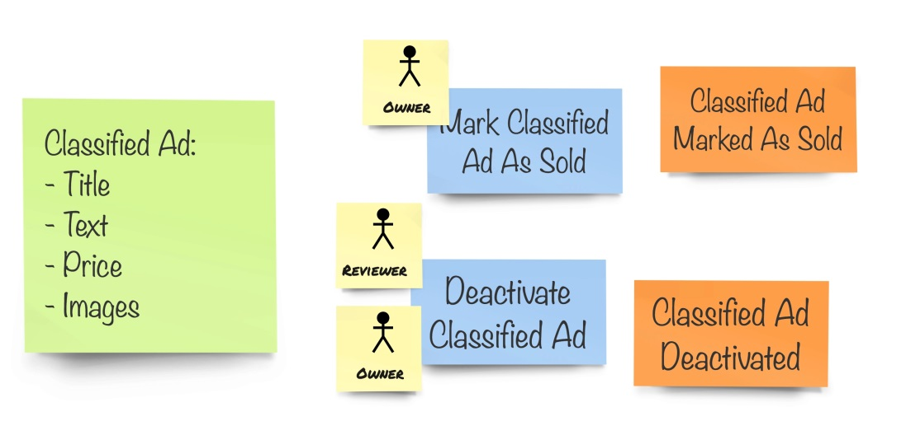
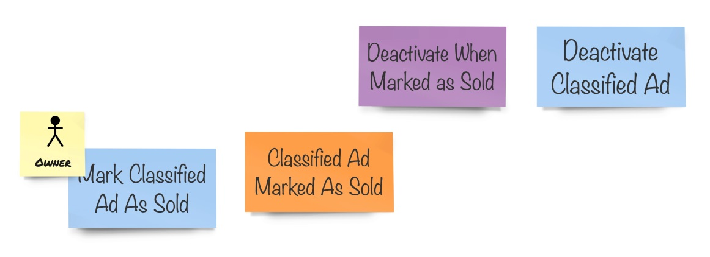
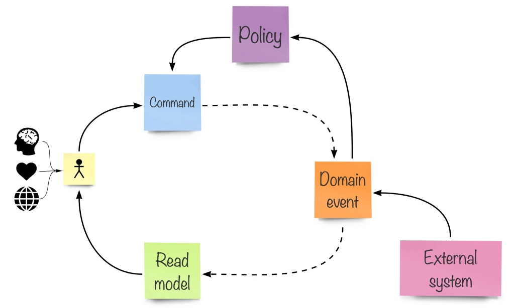
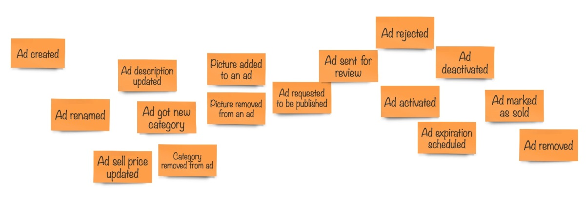
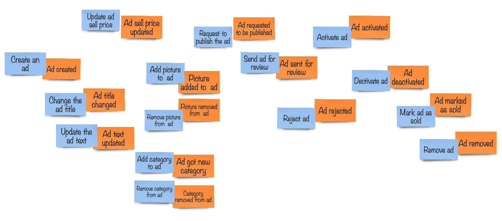
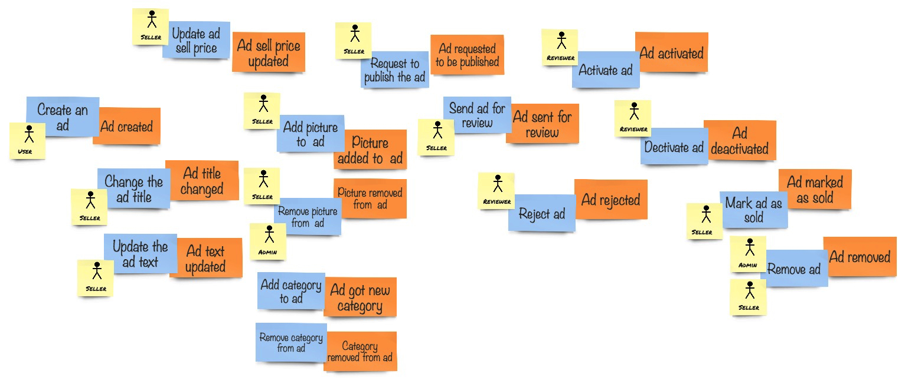
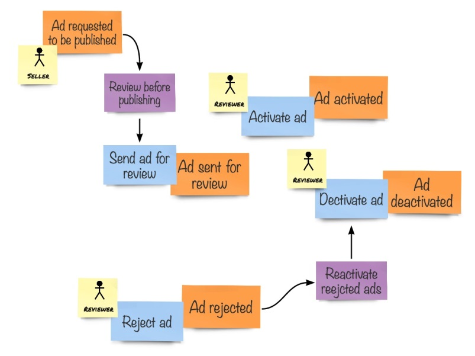

## Design-level EventStorming

在前一章中，我们介绍了使用 EventStorming 进行了整个业务建模的过程。我们主要讨论了领域事件以及后来添加的热点和外部系统。

在本节中，我们将使用更丰富的表示法，对模型进行更详细的描述，以便更接近模型在代码中的实际实现。

## Getting deeper knowledge

回到我们完成 EventStorming 研讨会的那一刻。团队花了几个小时讨论重要的话题：
* 业务运行哪些流程？
* 哪些对象参与到这些过程中？
* 关于系统行为，我们可以记录哪些事实？
* 有那些人？做哪些事？
* 我们需要学习和使用哪些基本术语？

对这些话题的讨论产生了一个大图，图上包含许多带有颜色的便利贴。橙色的代表 *领域事件（生活的事实）*。亮粉色的代表 *热点（需要注意、进一步澄清或引起担忧的事情。通常，这意味着知识缺失）*。

所有这些都让团队更接近实际的实现，但是他们还不想开始编码。团队成员需要深入设计，并获得关于在系统中那些人可以执行那些操作的更具体的知识。

这是 EventStorming 的另一个主题（**design-level** EventStorming）所包含的内容。让我们仔细看看如何组织这样的研讨会。

<blockquote>

👉&nbsp;&nbsp;&nbsp;前几个章节介绍的关于 EventStorming 的内容是属于 <b><i>Big Picture</i></b> 这个主题的，关于这个主题的研讨会叫做 <i>Big Picture会议</i> 。

</blockquote>

## Preparation for the workshop

对于更详细的 EventStorming 研讨会，您需要的东西和之前差不多：
* 纸卷或任何其他类型的尽量大的模型空间
* 不同颜色的便利贴
* 足够的记号笔

当然，最重要的是要有合适的人。但是现在，我们正在深入细节，所以选择一个要探索的范围是必要的，而找到这样一个范围通常是一项艰巨的任务，我们将在本章后面讨论。因此，正确的人选应该是那些将忙于编写代码的人、作为产品所有者负责系统的那一部分的人，以及所选领域的领域专家。正如你所看到的，我们可以将我们的组限制在比之前的 *Big Picture 会议* 更少的人。

这两种选择——限制范围和限制人数，二者都允许我们以更高层次的细节讨论设计，只有一个讨论主题，让每个人都表达自己的想法和提出问题。

## Extended notation

由于 EventStorming 是语言和技术无关的，我们使用诸如 class, field, method, function 之类的东西来建模。相反，需要使用更通用的概念。我们已经在 CQRS 部分讨论了这些思想，在那里我们看到我们，在领域模型中的行为不仅仅是方法列表，而是执行的命令。*命令* 表达了用户的意图。然后领域模型进行状态转换，并产生新的事件，记录目的和状态转换。*查询* 表示用户希望在屏幕上看到什么，以便做出决策和执行其他命令。因此，这为设计会话提供了一些与任何特定编程语言或技术无关的元素。

### Commands

命令和事件无关与任何语言或技术。它们很好地描述了系统的行为，使用了 Ubiquitous Language ，表达了用户的意图。

因此，我们在 design-level EventStorming 阶段中使用表示命令的符号。命令表达了与系统交互的用户的意图，因此将命令应用到我们的系统会自然地产生状态转换，并导致在我们的领域模型中发出事件。如果我们对命令使用蓝色便签，命令处理的常规流程将如下所示：

The command triggers the state change

注意，没有使用箭头连接便利贴。流程是通过将它们按时间顺序排列在一起来决定的。首先，我们操作系统做一些事情，当操作被接受并执行时，系统转换它的状态并发出新的事件。

一般情况下，避免在建模空间中使用箭头，因为它们会为便笺创建空间锁定，您将停止移动便利贴，因为箭头被画在纸上或白板上，不能移动。这样的锁定降低了建模的动态性并会打消实验的积极性。

### Read models

下一个我们将引入模型的元素是 *读取模型（read model）*。读取模型是我们的用户在对系统做操作之前要查看的东西。它可以是应用程序中的任何页面，如 form 、dashboard 或 report 等等。任何这样的页面都包含一组元素，元素类型的数量有限。通常，我们可以对元素进行如下分类：
* 以文本和图像显示的信息
* 表单元素，如 输入框、复选框和单选按钮
* 操作按钮
* 导航菜单

当导航菜单将用户从一个页面移动到另一个页面时，操作按钮用于向系统发送命令。信息元素和表单元素是用户在决定做什么之前需要查看的内容。这些元素中显示的内容是由 *读取模型* 定义的。出于建模的目的，我们可以假设我们的 *读取模型* 是系统中的页面，这样我们就可以确定需要组合并向用户显示哪些信息。

为了演示这一点，让我们看一下下面的示例：

Read model, commands, and events

所以，这里的绿色便签代表 classified ad 的 *读取模型*。在那里，用户可以做特定的操作：publish ad 或 remove 。执行其中一个命令将产生由领域模型发布的事件。

### Users

大多数时候，系统中的命令是由使用系统的人（user）执行的。在设计模型时，我们经常需要了解谁在运行哪个命令，因为并不是所有命令都允许每个人执行。我们可以定义不同的用户角色，比如 *administrator, manager, reviewer* 等等，并以某种方式将它们和它们执行特定命令的能力可视化。您可能还会发现，识别某个人并将它们用于角色之外或替代角色是很有用的。如果您期望一个人在系统中扮演不同的角色，或者当你在一个现有的系统中建模时，你知道特定的人和他们的特殊职责，并且在模型中直接使用他们的名字，这将给所有相关的人带来清晰和理解。

在视觉上，我们可以使用带有人物图形的较小的便利贴。

Users are those who trigger commands

我使用了不同的读取模型，可以由两种不同类型的用户使用。在这里，分类广告所有者可以标记为已售出。但是所有者和具有审阅者角色的人都可以停用广告。

### Policies

在 design-level 会议阶段使用的最后一个元素是 *策略（policy）*。正如我们所了解的，系统中的动作是由 *命令* 来表示的。用户可以通过发送命令来执行操作。当一个命令被处理时，系统改变它的状态并发出 *事件*。这是系统对用户操作的初始反应。但是，当我们发布事件时，也会让领域模型的其他元素知道发生了一些事情，这些元素以前并不知道正在执行的命令。为了避免一次执行与某个操作相关的所有工作，这是非常有用的。理想情况下，我们应该将处理命令的工作量限制在绝对最小值。从技术上讲，这样的原子操作可以表示为一个事务。作为领域模型状态转换的结果，可能还需要执行一些其他操作，但我们不需要将这些操作包装在一个事务中，并强制用户等待所有这些工作完成。这正是我们需要 *策略* 的地方。策略订阅领域事件，当策略接收到它感兴趣的某些领域事件时，它将检查事件内容并可能向系统发送另一个命令以补充工作。可能有许多策略对同一事件类型做出反应，以异步方式进行各种处理，而用户在执行原始命令后重新获得控制权。

我们可以在建模空间中这样表示 *策略*：

Policies might trigger commands based on events

看看这个模型，我们可以这样解释——*当 classified ad 的所有者将其标记为已出售时，系统也应该停用这个广告。*

如您所见，*策略* 可以根据特定条件对领域事件作出反应并发出 *命令*。这种行为称为 **reactive behavior**，使用此模式的系统称为 **reactive systems** 。

<blockquote>

👉&nbsp;&nbsp;&nbsp;请注意，术语 “reactive” 在最近几年变得含糊不清。<i>Reactive Manifesto</i> 提出了 “reactive system” 的定义，这与我在本书中的意思不同。<

</blockquote>

### All together now

总结一下，我们可以为本节中介绍的所有元素画一个概念图，如下所示：

The picture that explains (almost) everything—Alberto Brandolini

这张照片的转录是用户,使用信息系统,以读模式,和来自外部世界的信息,情感,和用户的思想,将操作请求发送到系统,称为命令,它可能导致生产域系统状态变化的事件。域事件可以触发策略，策略可能会根据在这些事件中接收到的信息和系统的状态发出新的命令。外部系统也可以产生域事件。系统状态的变化也会导致读取模型的更新，这样用户就可以从系统接收到新的信息，循环往复。

此图片的转录将是用户使用来自系统的信息（表示为读取模型）和来自外部世界的信息、用户的感受和想法，向系统发送操作请求，称为命令，这可能导致系统状态更改，从而产生域事件。域事件可以触发策略，策略可能根据在这些事件中接收到的信息和系统状态发出新命令。外部系统也可以产生域事件。系统的状态变化导致读取模型也被更新，因此用户可以从系统接收新的信息，并且循环重复。

这张图片表示的是，用户使用来自系统的信息（表示为 *读取模型* ）和来自外部世界的信息、用户的感受和想法，向系统发送操作请求（称为 *命令* ），这可能导致系统 *状态* 更改，从而产生 *领域事件* 。领域事件可以触发 *策略*，策略可能根据在这些事件中接收到的信息和系统状态发出新命令。外部系统也可以产生领域事件。系统的状态变化导致读取模型也被更新，因此用户可以从系统接收新的信息，并且循环往复。

大多数系统都和此图描述的类似，并且您可能认为它不仅适用于软件系统。这幅图也很好地映射了 CQRS，我相信这使得 CQRS 模式非常有用。有些人可能认为 CQRS 由于会给系统增加复杂性。然而，如果操作正确，它会为模型增加更多的清晰度，因为它直接实现了 **关注点分离**（**separation of concerns，SoC**）原则（*On the role of scientific thought* by Edsger W. Dijkstra, 1974），并且通常会使系统更容易构建和维护。

## Modeling the reference domain

本节将使用本章中介绍的工具来设计示例领域的一部分。

我们的团队又要聚在一起，更详细地讨论系统的核心部分。他们已经决定在第一阶段，把 classified ad 的生命周期视为核心领域，而与附加服务和支付相关的部分将在稍后实现，因为他们的投资者决定在盈利之前先获得用户。

<blockquote>

👉&nbsp;&nbsp;&nbsp;重要的是要认识到，这样的决策不能仅仅由开发人员做出，而在决策过程中让所有涉众参与进来是至关重要的。

</blockquote>

首先，需要快速回顾被识别为 classified ad 生命周期一部分的 *事件*。团队开始工作，很快他们就会发现这些事件：

The first round of the session—domain events only

正如您所看到的，这个模型与上一章的最终模型有一点不同。每次团队讨论模型时，都会发生一些更改，因为团队成员对领域有了更好的理解。

他们做的下一件事是添加一些 *命令*，这些命令会产生上图模型中的事件。在许多情况下，命令显示了用户的直接意图（做一些操作导致事件的发生）。这些命令是最先出现在模型中的最明显的命令。

模型看起来是这样的：

Events and commands

团队随后同意大多数命令由 *用户* 执行，但随后引发了关于用户是谁的讨论。从技术上讲，使用该系统的每个人都是用户。但不同的人可以做不同的事情，管理员允许做的事情，普通用户就不能做了。这是很明显的，但是这里，团队确定了根据所做的事来区分用户。当然，一个人总是可以扮演不同的角色，但是在这个具体的例子中，大多数操作都是由一种类型的用户完成的——那些想要*销售*东西的用户。当然，这个角色被定义为 *卖方（seller）*。有了这个发现之后，模型开始变得更加详细：

Events, commands, and actors

如您所见，在此过程中，标识了更多的角色并将其分配给命令。例如，ad 不能被 *seller* 审批；这毫无意义。服务内部的人员需要完成这项工作，他们要么允许发布 ad，要么出于这样或那样的原因拒绝发布。

有趣的是，由于所讨论的上下文只涉及 ad 的生命周期，因此不涉及 **buyer** 。因此，团队一直交替使用 **owner** 和 **seller** 这两个词。为了保持一致性，他们倾向于使用术语 **seller**，但要记住，Ubiquitous Language 的所有词都是特定于上下文的。我们这里没有 **buyer** 的原因是，就团队目前而言，他们只会在系统的其他部分与 **buyer** 打交道，这意味着另一个上下文。初步而言，他们确定 **buyer** 将参与有关购买协议和条款的对话，如果需要的话，第三方托管方面也会参与。同时，团队也会不断思考相互的评论，自然，**seller** 和 **buyer** 都会参与到这个活动中来。

然后，思想开始漫游到那些因不同原因而出现的事件。其中一个事件是 **Ad deactivated**。*buyer* 在查看 ad 时可能会点击 **Deactivate** 按钮，或者审查员（reviewer）可能会拒绝发布 ad 。研究发现，Deactivate Ad 命令可以由 *seller* 和系统本身执行（**策略（policy）** 被触发）。向模型中添加策略会得到更多的细节：

Part of the model with policies

最后，团队检查了一些命令，这些命令需要显示特定的信息，以允许用户做出决策并将其作为命令执行。在第一次迭代中，并不是所有地方都能达到这样的清晰度，在这种情况下，团队需要将任何决策推迟到稍后的阶段。取得进展和继续前进比追求过于细化的模型更为重要，因为模型无论如何都不会完美。

例如，当向广告中添加一个类别时，卖家必须能够使用一些高级技术（如智能搜索）从现有类别列表中进行选择。对于评论者来说，这不仅有助于查看广告内容，还可以了解广告所有者的详细信息。综合考虑卖家对平台的体验、之前发布的广告数量、当前发布的广告数量，最后是当前的广告内容，可以为审查人员提供清晰的信息，帮助他们区分恶意广告和合法广告。

当使用 *读取模型（read model）* 时，开发人员有很多机会与 UX 专家、UI 设计师和其他人一起工作，因为真实的模型是 UI 的自然组成部分。但是也不应该忘记 *命令（command）*，因为它们是使系统执行一些有用的操作的处理器。如果没有命令，整个系统将只是一个静态页面的集合，因为没有办法更改系统的状态和执行任何行为。任何系统的 UI 都是一个读取模型的集合，其中命令作为按钮和其他动作触发元素附加在它们上面。

您可能还会考虑 *基于任务*（*task-based*）的 UI，这是一种设计 UI 元素的有效方法，可以引导用户进行简单、原子和精确的操作。在我们的示例中，我们也使用了基于任务的UI，因为我们的销售者将广告价格与广告标题分开来更改，而这仅仅是因为这些操作有本质上的不同。基于任务的 UI 的思想与 CQRS 和命令处理非常一致。毫不奇怪，关于这项技术的大部分信息可以在[ Greg Young 写的关于 CQRS 相关的文章](https://cqrs.wordpress.com/documents/task-based-ui/)中找到