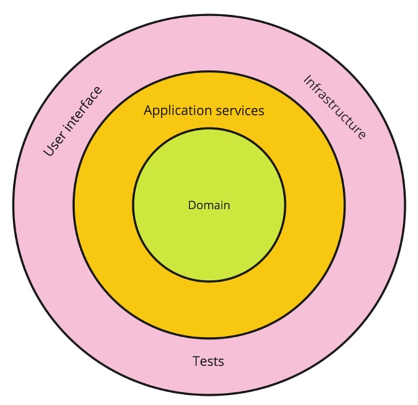
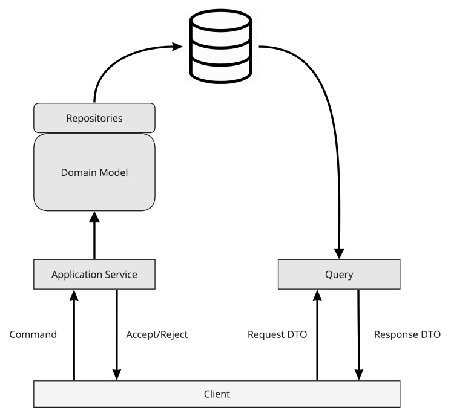

## Domain model

正如我们在第1章中讨论的，*Why Domain-Driven Design?*，我们设计和实现的软件只有一个主要目的——解决一个领域的问题。理解 *问题空间* 或业务领域对于寻找合适的解决方案，以及使用我们创建的系统能够满足用户来说是至关重要的。当我们使用 EventStorming 对这个领域有了更多的了解时，我们需要深入一点，尝试使用其他人能够理解并能够推理的视觉工件，来可视化我们的知识。简而言之，我们需要一个 **model（模型）**。

## What does the model represent?

单词模型描述了许多不同的东西。当我们说模型时，我们可以想到一个汽车，轮船，甚至房子的比例模型。这些模型以不同的比例代表现实生活中的物体，同时也展示了本质上不同层次的细节。有些模型可能非常抽象，例如建筑群的模型。然而，通过有些模型可以更详细地了解它们所代表的内容，例如汽车的比例模型，这些模型通常非常精确。但大多数时候，这类汽车模型也缺少了真正汽车的一些重要功能，比如发动机、变速箱和复杂的电子设备。

所以，模型代表了现实世界的一些人工制品，但作用很狭隘。例如，在建筑项目的第一个评审阶段，建筑将占据多大的空间和整个综合体将有多高，这通常只能够做一个粗略的模型。模型并不能够复制真实的生活。相反，它们根据模型的目的，在特定的细节级别上代表了现实生活的某些特定方面。

城市交通图就是一个很好的例子。在任何通用地图中，你都可以看到交通线、车站和变化。它还表明一些重要的地理位置，如相对距离的海洋或车站在河的哪一边。

与此同时，这样的地图并没有显示车站之间的距离，与实际地理位置无直接相似之处。为了准确地找到车站在城市中的位置，或者车站之间需要花费的时间，你需要另一张地图。

这个例子说明了一个特定的模型可以代表现实生活中一些特定的方面，但是可以忽略其他不必要的元素。这并不意味着那些被忽视的方面不重要，只是它们对特定的 *问题空间* 不重要。因此，交通图解决了公共交通用户的定位问题，并且做得很好。但它并没有解决在街上导航的问题，也不需要这样做，因为它有不同的目的。

同样地，软件中的领域模型，也需要表示业务领域中对解决问题至关重要的那些方面。有时候，我们很想把我们所知道的一切，都放到模型中。但是这会给模型增加不必要的复杂性，对解决问题没有帮助。更糟糕的是，在模型中放置太多不相关的细节可能会扩大实现范围，并使业务人员在指定他们想要解决的问题时的意图变得模糊。

回到第1章，Why Domain-Driven Design?，如果业务领域和待解决的问题位于 *问题空间*，则领域模型就位于 *解决方案空间* 。我们将为我们的解决方案建模，而这些模型将成为我们的领域模型。

## Anemic domain model

术语 **领域模型（domain model）** 尽管已经存在，但在 Martin Fowler 的著作 *Patterns of Enterprise Application Architecture* (Addison Wesley, 2003) 中提到它后，这个术语得到了广泛的认可。以下是 Fowler 在他的书中对这个[术语的定义](https://martinfowler.com/eaaCatalog/domainModel.html)：
> Domain model: An object model of the domain that incorporates both **behavior** and **data**.

这个定义相当简短。但是，不管怎么说，如果你在 Google 上搜索 domain model，你会发现大部分链接是错误的。大多数找到的图片和大部分链接，都会导致我们可以把领域模型（domain model）认为是数据模型（data model）或实体模型（entity model）的东西。这些模型将实体、具有类型的数据字段以及实体之间的关系可视化。链接是按照领域术语（如 attentions 或 consist of）来划分的，在一些罕见的情况下，才能找到显示一些带有方法的类图。

实体模型或数据模型其实是所谓的 **贫血模型（anemic model）**。正如术语所暗示的那样，这样的模型只表示系统的状态，而不知道这种状态是如何变化的，也不知道在系统中执行了哪些操作。通常，如果您查看这些系统的实现，就会发现系统所做的一切都是一些数据操作。创建新的实体，建立新的关系，并更改实体中的字段。这是所有。

贫血模型变得流行有几个原因。首先，UML中可视化领域模型的指导方针建议，所设想的事物是 **概念类（conceptual classes）**。这些类表示真实世界的实体及其属性。在UML中，这样的模型包括具有属性（字段）的项（实体）、它们的关联（关系）和参与者。因此，在概念类中没有 *行为* 的位置。下一个原因是，概念类这个概念不知怎么地消失了，这些UML模型成为了唯一的领域模型，其中领域行为被认为是无关紧要的。

回到 [Fowler 关于贫血模型的文章](https://martinfowler.com/bliki/AnemicDomainModel.html)。他明确地将这种建模系统的方法定义为一种 *反模式*。除了前面的描述之外，贫血模型通常倾向于用来实现数据库操作。由具有关系的对象组成的模型与关系模型非常相似，因此关系数据库最常用于持久化此类对象。贫血域模型和它在数据库中的状态之间的关联是如此紧密，以至于它们成为兄弟，并且不能相互区分。

通常，如果您发现一个把贫血模型当做领域模型的系统，您将很难理解该系统做了什么，因为在代码中看到的都是SQL调用。如果您询问系统的工作人员在哪里可以找到他们模型的实现，他们很可能会直接指向数据库。还有一种观点认为，贫血领域模型在应用程序只有很少或没有 *行为* 的情况下非常有用，这样的模型作为持久性模型非常好。我认为在这种情况下，就不应该称其为领域模型。数据模型非常好，因为它们服务于持久性的目的。然而，没有真正的理由将数据模型表示为领域模型，因为这是两种不同的东西。

### Functional languages and anemic models

这里还有一件事值得一提。函数式编程社区中也有关于他们设计的模型是否也贫血的讨论。这是因为，在函数式编程中，类的使用不是强制性的，有时甚至是不可能的（有的 fp 语言里没有类的概念）。即使在可能的情况下，使用类也不自然，因为函数和函数组合可以更容易地解决许多问题。我认为，如果行为是作为函数建模和实现的，那么这样的模型就不是贫血的。这可能不直接符合最初的定义，但2003年是面向对象编程语言占主导地位的时期，因此使用术语 **对象模型（object model）** 是很自然的。然而，这里的关键在于数据和行为的组合，而且肯定的是，当使用富类型系统与明确定义的表达意图的函数组合时，这样的模型确实不是贫血的。

## What to include in the domain model

正如我们前面提到的，领域模型表示对象的数据和行为。这里的 **对象**，我并不是指任何与面向对象语言相关的东西，而是指它们所代表的本质。领域模型的实现也由所使用的编程语言来决定，因此这样的对象可以是 records, structs，或者实际上是 objects。因为这本书是关于使用 c# 来实现域驱动设计(DDD)的，所以我们将使用 *classe and object* 来实现我们的域模型。

<blockquote>

👉&nbsp;&nbsp;&nbsp;c# 9 及之后的版本将带来了更多的函数式语言特性，可以使用 *record* 建模

</blockquote>

即使有多态性的概念，我们也可以在类中组合数据和行为。这并不直接意味着我们的领域模型将包含这样的类。属于领域实现的所有东西也是领域模型的一部分。对于领域模型，没有比实现这样一个模型的代码更好的文档了。

**模型中的行为和数据是相互关联的。模型的行为除了操纵模型的数据外并没有其他意义，而且由于数据只表示模型感兴趣和操作的内容，因此这种数据也称为 *状态（state）*。状态是描述系统在某一特定时刻的数据。模型的每一个行为都会改变状态。状态是我们持久化到数据库中，并且在应用新行为之前可以随时恢复的东西。**

这可以用一个简单的例子来说明：

State transition is triggered by an action, causes a reaction

在这里，您可以看到帐户余额作为一个状态。当我们应用行为时，状态会改变。这被称为 **状态转换（state transition）**。每个领域模型的行为都会导致状态的转换。记录领域状态如何变化的所有内容都应该是领域模型的一部分。

### Design considerations

正如前面看到的，在面向对象语言中，经常会使用多态性来关联行为和包含状态的类。然而，在函数式语言中，状态通常是单独维护的，并且通常使用 record type 实现，行为使用 function 实现，用来操作 record 的实例。

从逻辑上讲，通信协议、用户输入验证和持久性实现等内容都不被视为领域模型的一部分。这些都是技术和基础设施方面的问题。这里的一个经验法则是，整个领域模型应该是可测试的，而不涉及任何基础设施。首先，在领域模型的测试中，不应该使用 test harnesses 和 mocks 。

如果你看看 *onion architecture, the hexagonal architecture, clean architecture* 的原则，就会发现它们有一个共同点。任何应用程序的中心都是 **领域（Domain）**：

Onion architecture

**Application services** 和 **Infrastructure** 在外部，并围绕在系统的这个核心的周围。与依赖关系从 UI 层一直延伸到数据层的分层架构不同，这里我们可以看到 **领域（Domain）** 是一切的中心，一切都依赖于它。这种改变虽然可以被认为是一种小的调整，但却具有非常重大的影响。与依赖于数据层（它使数据库成为所有的中心）不同，焦点转移到 *领域*，使领域模型成为系统中最重要的部分。

### CQRS

除了前面讨论的使用面向对象和函数编程的方式对领域建模之外，还有一种不同的方法来表示领域内的状态转换。关于这个，就是 CQRS 模式，它是由 Greg Young 在十年前创造的。

这个术语起源于 **命令查询分离（command-query separation，CQS ）**，由 Bertrand Meyer 提出，他说对象方法被分为两类。这些类别如下：
* Command，改变系统（通常是对象）状态，并返回 void 。
* Query，它返回系统的状态，但不改变系统的状态。这使得查询是没有副作用的(除了日志记录之类的事情)，并且是幂等的，因此可以多次执行查询并得到相同的结果。

**Command-query responsibility segregation (CQRS)** 在对象之外采用了这一原则。这是相同的原则，但适用于系统级别。这个模式的开发花了很多年，从 2007 年 Greg 在 InfoQ 会议上提出了它的早期构想，到 2010 年发表[总结论文](https://cqrs.files.wordpress.com/2010/11/cqrs_documents.pdf)。Google 也花了几年时间才认识到这个缩写。几年前，当人们急切地寻找 CQRS 的时候，从 Google 搜索得到的建议是，你是指汽车（CARS）吗？但如今，这种模式已广为人知，并受到广泛赞扬。

在系统级上分离命令和查询意味着，系统的任何状态转换都可以通过命令来表达，这样的命令应该高效，并进行优化以执行状态转换。另一方面，查询返回从系统状态派生的数据，这意味着查询可以以不同的方式执行，并且可以进行优化，以便读取状态或状态的任何派生（如果存在此类派生）。

当对数据库的读和写之间存在明显的不平衡时，这种分离是有益的。典型的面向商业或面向消费者的应用程序在读取方面严重不平衡。但是，典型的实现使用规范化的关系数据库对写操作进行了优化，其中写操作可以非常高效地执行，但是读操作需要大量的 join 和 filter ：

CQRS with a single database

在最简单的场景中，CQRS 可以通过使用数据库映射的领域域对象在领域模型上执行改变系统状态的操作（通常是使用 ORM 工具完成的），并使用直接的 SQL 查询和跨多个表的 join 来检索系统，完全忽略领域模型类层次结构。这促使了对读取的极大优化，同时提高了你对状态持久性机制的认识。虽然这种方法是完全合法的，但是您应该意识到，在这种情况下，查询需要从数据持久性层充分抽象出来，或者在领域模型之外进行设计。

在更复杂的场景中，我们不仅可以有两个不同的 *clients* 来操作相同的领域实体，还可以将这些实体分开。在本书后面讨论 event sourcing 时，我们将仔细研究这些技术。

您可能想知道为什么 CQRS 被放到了书中关于领域模型设计的部分，而不是在属于实现的部分进行解释。这样做的原因是 CQRS 将命令和查询视为一级对象（irst-class domain objects）。领域事件应该始终被视为一级领域对象，但在更高级的 CQRS 实现模型中，领域事件在保持整个系统的一致性方面发挥着至关重要的作用，因此领域事件的作用变得更加重要。

这就是为什么在这里提到CQRS，为了让我们认识到，我们不仅应该具有包含领域模型的属性和方法的类，而且像命令、查询和领域事件这样的东西也同样属于模型，我们将在下一节讨论如何建模所有的这些元素。

最后我要说明的是，不管您是否使用 CQRS ，EventStorming 都是很有价值的。