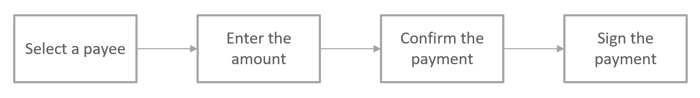
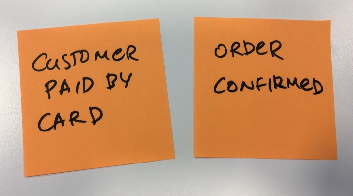
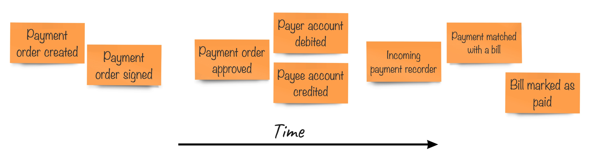
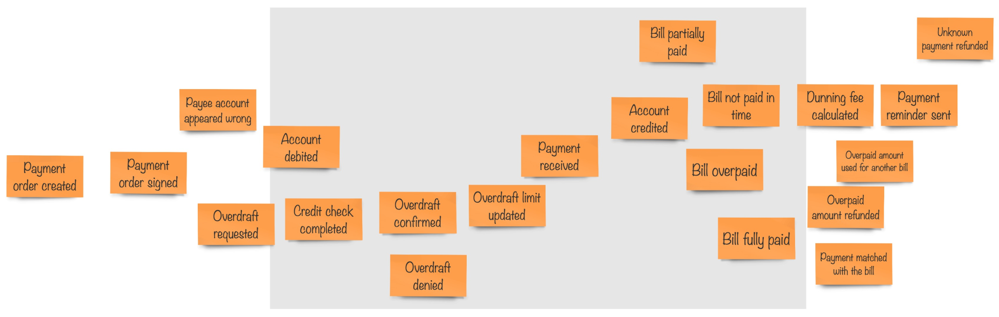

## EventStorming

在前几章中，我们了解了理解实际问题的重要性。还深入探讨了 Ubiquitous Language 的概念，并解释了 Ubiquitous Language 不仅是术语表，而且还是用单词描述的系统行为。

如何开始知识分析，如何加强我们与领域专家的交流，以更好地理解问题，并对我们要构建的内容有一个恰当的概述，这些都还不清楚。

经常看到开发人员以需求规格的形式了解领域。我们已经讨论了这个主题，现在您应该意识到需求规格是有其缺陷的。因此，您希望通过组织研讨会或会议与领域专家直接交谈来提高自己的知识。会议上，你们会聊上两三个小时；讨论了许多事情，许多新的见解浮出水面，但是任何建模的方式都得至少有一定的输出吧。当然，您可以开始绘制UML图，但是业务人员会理解它们吗？你可以通过做笔记来确定是否还需要一到两轮的概念澄清的研讨会，因为有太多模糊和隐含的概念形成了你未来系统的基础，这使得它很难理解。

这里有几个我们需要解决的基本问题：
* 在讨论期间提供可见性。当许多人用不同的术语讨论同一件事情时，这应该可以消除假设和歧义。它还能避免将一些模糊的表述埋在坑里。它把这些模糊的概念挖掘出来进行进一步的探索。
* 使用一种大家都能够理解的建模语言。UML不是一个选项，而且这些普通的方框和箭头对应到真实世界没有任何意义，因此人们可能会感到困惑，并开始花时间试图解释这些符号的含义。
* 让大家同时参与。在传统的会议中，只有一个人可以有效地传递信息，而其他人需要闭嘴并倾听。一旦大家同时开始讲话，就不再是交谈而是闹哄哄了吧。但是，假设有不同兴趣和背景的人参加了这个会议，如果不让他们说话，他们可能会感到无聊，越来越没有积极性。
* 找到一种能够表达术语、行为、建模过程和决策的方式，而不是功能和数据。

早在2013年，Alberto Brandolini 就提出了一种他称之为 **EventStorming** 的方法，他试图在这个方法中解决以上问题。本章中将学习这种方法。

## Modeling language

EventStorming 背后的基本思想是，它提供一种简单的建模符号，用来以一种每个人都能理解的方式可视化系统的行为。这种方法创建了可见性，增加了参与性，并让那些本来会对参与建模会话感到焦虑的人也有兴趣参与进来。

把行为视为领域知识的核心，我们所做的整个 EventStorming 的练习就是要找出业务是如何运作的。一般来说，我们可以假设每个系统在任何给定时刻处于一个特定的状态。用户对系统执行某些操作时，状态可能会改变。用户的这些操作导致系统改变状态，随着状态的改变系统会发生一些变化。周而复始。

让我们看一个简单的例子，使用网上银行支付账单：

The sequence of events for payment processing (simplified)

正如你在这里看到的，从个人的角度来看，他们账户中的钱减少了，支付完成了，账单被认为已经支付，可以扔掉了。然而，从收款人的角度来看，当他们拿到钱的时候，账单就被认为是已经支付了，可以通过使用发票号码或在账单和付款上的一些信息，将此付款与未结账单匹配起来。

在这些系统中，用户的每个操作都进行了一些状态转换。（请注意这些动词使用的是过去时）
> The payment order was **created** and **signed**。  
> The amount was **deducted** from the payer's account。  
> The amount was then **added** to the payee's account。  
> The bill was marked as **paid**。  

所有这些行动都变成了*生活的事实*，除非我们有一台时间机器，否则我们无法逆转它们。如果收款人发现账单是已经被支付过的，他们也不可能逆转这一切。他们需要通过启动新的付款方式把钱退回去。

这些已变成的事实被称为 **领域事件（domain event）** 。它是 EventStorming 最基本也是最重要的概念。这就是为什么它被称为 EventStorming 。领域事件的概念对任何人来说都不陌生。生活里真实的东西是人们可以迅速掌握的。它们是发生过的事情；不是某人想做的事；不是一个功能特性；不是表单或按钮。每个领域事件代表一个事实，一个我们试图建模的系统中的变化。

因此，建模语言的首要部分是创建领域事件的概念。在 EventStorming 中，每个概念都用一个特定颜色的便利贴来表示。颜色是非常重要的，因为当我们在模型中引入更多的想法时，我们需要使用颜色在整个模型中表达相同的想法，以避免混淆。

Alberto 最初的建议是使用*橙色*的便利贴来表示领域事件  
最简单的模型是这样的：

Start small and go from there

上面按顺序发生了两个领域事件：  
> first, a customer **paid** using a credit or debit card  
> then their order was **confirmed**  

可以将其看成是 e-commerce 领域。写在便利贴上的句子没有什么特别之处，除了一条重要的规则——事件必须有主语（名词）和谓语（动词）。动词必须是过去式，表示某事已经发生并成为事实。

回到账单支付的例子，我们可以尝试弄清楚在那里会找到什么事件：

Events are placed on the timeline

有几件事你可能会立刻注意到。首先领域事件遵循一个时间轴。这是非常符合逻辑的，因为事实代表了系统中后续的变化，因此以特定的顺序发生。例如，付款在签名之前是不被批准的。有些事件可以同时发生，例如，一旦付款指令被批准，就同时借记和贷记账户，这可能意味着银行确信付款人有足够的资金来完成付款。

其次是我们这里并不是只有一个系统。事实上，我们正在建模整个过程，但至少有三个部分可以被清楚地区分——网银，创建和签署付款单；银行后台系统，完成交易；以及收款人自己的支付账单系统，顺便说一下，可以完全手工操作。

## Visualization

如你所见，这个简单模型已经为参与研讨会的人员提供了相当多的价值。我们不仅试图确定在支付账单的过程中发生了什么，而且把整个流程放在一个时间轴上，能够粗略地识别出在不同物理系统中可能发生的部分过程。

当人们看到了被认为是全局的东西时，有些人可能会开始问“如果……会怎样”的问题。如果账户里的钱不够怎么办？如果帐单编号错了怎么办？如果收款人账户不正确怎么办？如果，如果，如果？这样看来，我们这个简单的过程最终并没有那么简单。还记得可用性启发吗（availability heuristic），**WYSIATI**(**你看到的就是全部的（What You See Is All There Is）**)？我们将最初的理解建立在对世界的一种简化的看法上。一切都正常运转;没有例外和边缘情况，人们的行为和计划都不会犯错误，无论是否有意这样做。这可能让人感到惊讶，但现实世界要复杂一些。大多数情况下，处于边缘的个案数目；超出被认为是常规事件流的范围。当事件被可视化并让每个人都能看到时，所有这些边缘情况和潜在的例外情况都变得更加明显。

这是个问题，可能会对那些试图创建一个合适的事件模型的人造成伤害。你可以想象这样的研讨会发生在一间会议室里。通常，人们围坐在一张桌子旁交流。正如我们已经指出的，这不是 EventStorming 的工作方式。我们希望人们在房间里四处走动，积极参与对话，这些对话可能同时发生在房间的不同角落。所以，我们需要一些空间。但这并不是我们需要的全部空间。请仔细查看前面的简单模型。尽管我们都同意我们只是建模了正常路径，没有边界情况和异常，现实生活中的过程要复杂得多；这个图已经占用了一些水平空间。现在，想象一下用这样的方式模拟真实世界的场景。事实上，一个传统的两三米长的白板会对你造成伤害。

想象你的模型是这样的：

For a reasonably complex system you need a bigger space

这里中间的部分是你的白板。但这个模型却是如此的长。正如 Alberto 所说，*my problem is bigger!*

当白板上没有足够的空间时，会发生什么？人们把剩下的空间当作神圣的资源。它变得珍贵，人们开始节省空间。有些事件变得**不重要**，因此不写在白板上。有些想法变成次要的，不值得探讨。总之，建模讨论需要节省一些白板空间。

这是正常的，这就是我们大脑的工作方式。如果我们看到了某种限制，不管回顾起来它是多么的愚蠢或虚假，我们都会感觉到它的存在，也会相应地安排我们的活动。如果您的建模空间有限，请准备得到一个有限的模型。因此，要注意这个问题，并为任何建模活动（特别是 EventStorming 会议）的参与者提供尽可能多的建模空间。

我们将在下一节中得到一些更具体的建议。