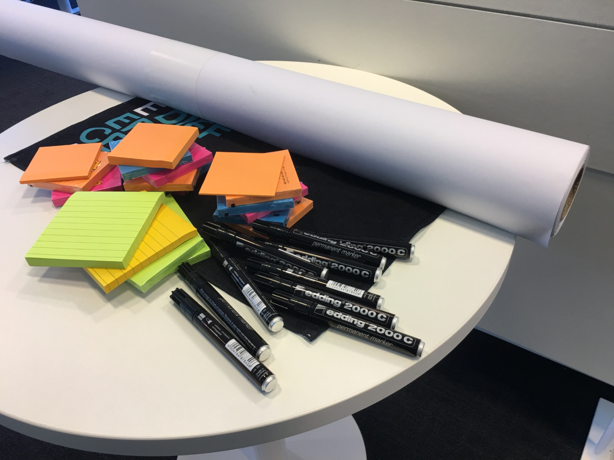
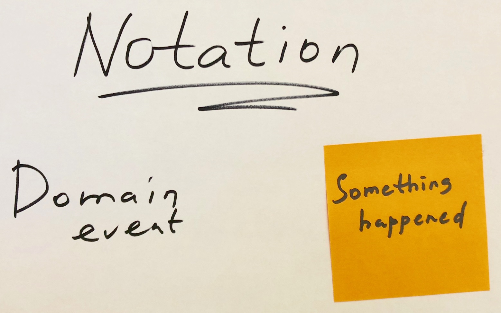
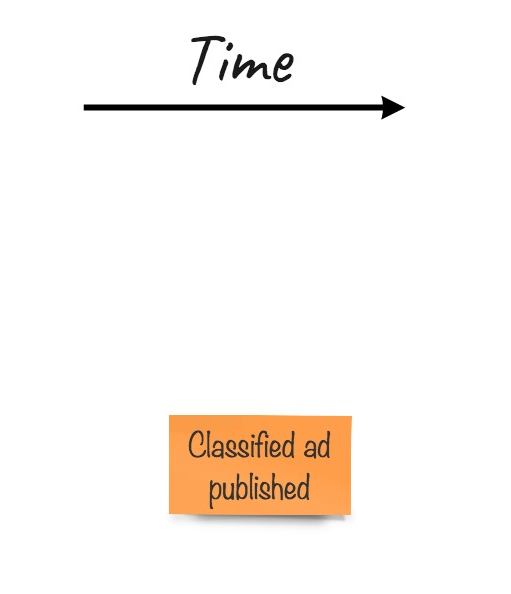
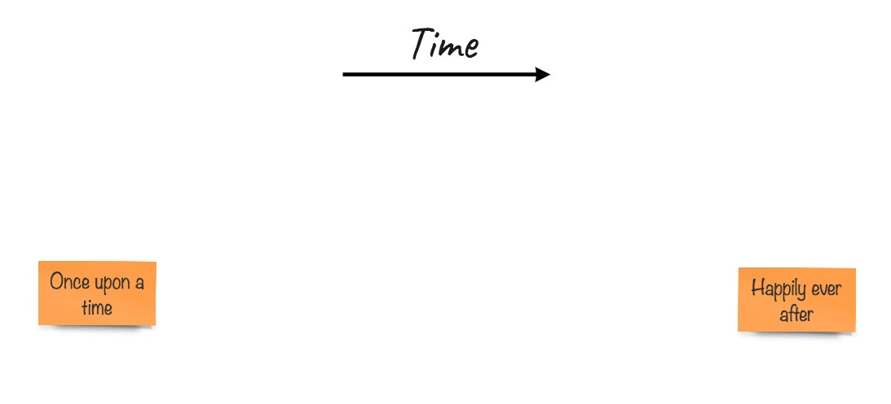
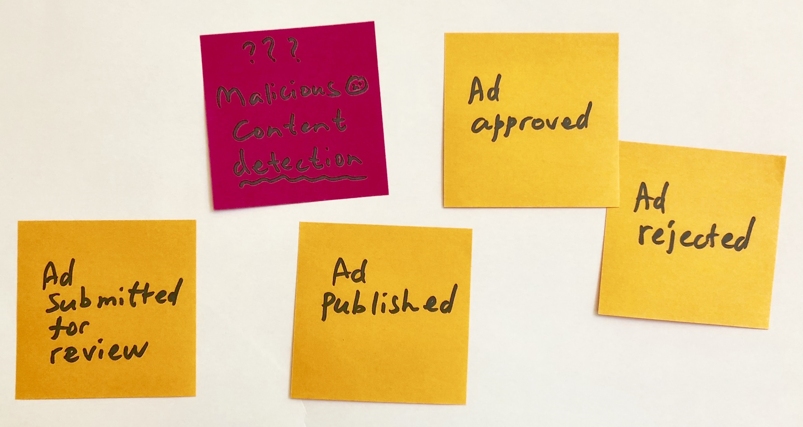
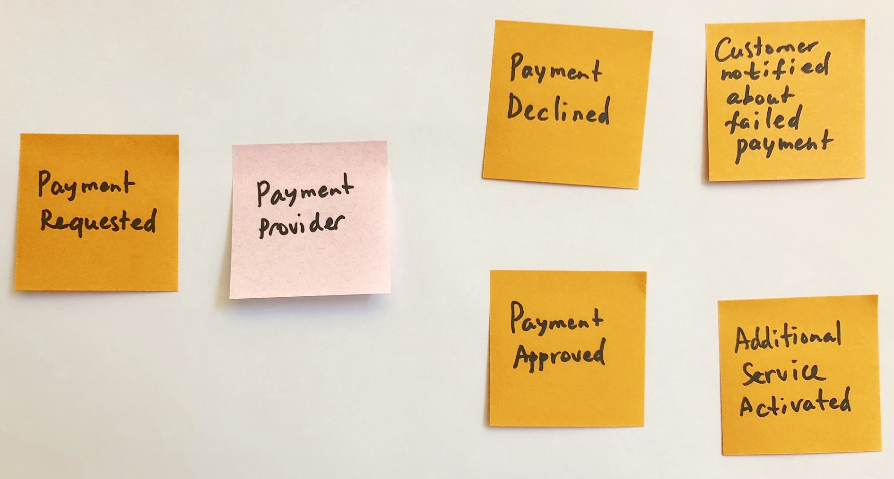
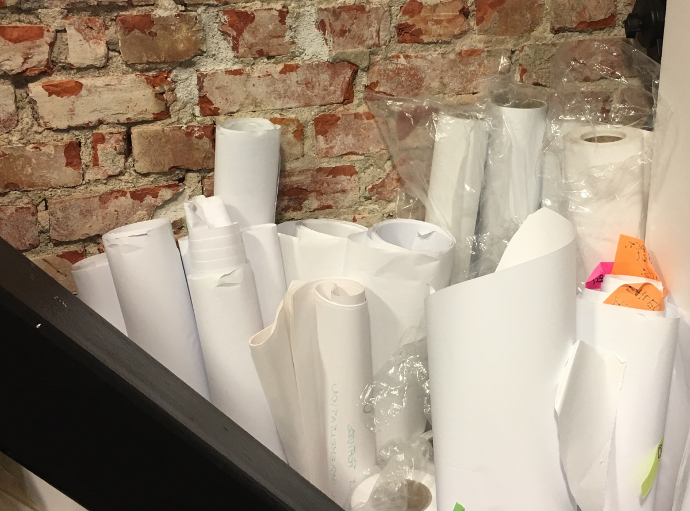

## Facilitating an EventStorming workshop

作为 EventStorming 研讨会的主持人，本节将为您提供一些实用的建议，并分享一些现实生活中的经验。记住，在使用 EventStorming 之前，你不需要在你的组织中“**贩卖**” DDD。即使您没有计划在项目中运用 DDD，EventStorming 这个相当简单但非常有效的技术，也可以给你提供很大的帮助。当您计划为此创建一些软件时，它将帮助您建立对领域的理解。它也在开发者和他们的潜在用户之间创造了更好的关系，因为他们将公开讨论用户的问题，并对这些问题表示关切，同时寻求解决方案。

## Who to invite

对于研讨会，您将始终需要有两种类型的人——有问题的人和有答案的人。

有问题的人是开发人员和架构师。令人惊讶的是，开发人员很少愿意参加会议，尽管这些会议是直接涉及他们计划开发的软件的潜在用户的。第1章“Why Domain-Driven Design?” 中讨论问题空间和解决方案空间的分离时触及到了这个主题。因此，让开发人员参加这些研讨会是非常重要的。还有另一组人，这些人可能认为他们有答案，但实际上他们有更多的问题，他们是业务分析师或需求分析师，或者在组织中的其他人员。诚然，他们花了很多时间与潜在用户和客户在一起，但通常，在 EventStorming 研讨会上，他们会得到新的见解，因为这个练习不是一对一的，而是针对整个团队的。

有问题的人需要预先学习已经可用的领域的信息(如果已经有了需求规格文档)，并准备问题。

有答案的人通常是那些我们称为**领域专家**的人。但是要记住，他们并不知道所有的细节，他们也会有一种知识的盲点。这就是为什么你需要尽可能多的专家参加研讨会，因为这些人通常不容易聚集在一个房间里，他们的日程很忙。这间接地表明，这些人通常在组织中的地位很高，但也不一定。你目标是从每个部门获取尽可能多的人。你应该根据一些标准，寻找那些知道事情是怎么做的人，而不是那些只知道应该怎么做的人。

所有的这两类人员都需要预先准备好他们的问题。想象一下哪些问题需要解决，并对这些问题进行更具体的说明，可能会在研讨会期间有所帮助。

## Preparing the space

经常看到当人们来到一个在常规会议室举行研讨会时，发现没有白板，投影仪不能工作，并且演讲者的视频输出插座与房间里的视频设备不兼容。这些事情都非常令人沮丧，因为它们需要花费很多时间来修复，留给实际工作的时间更少了。更糟糕的是，不仅仅是一个人的时间被浪费在这类问题上。这个房间里的每个人都被有效地阻止做任何事情，只能等待。有时为了不浪费更多的时间，不得不取消会议。

### Materials

当你们已经约定了日期和时间，立即开始准备相关材料。

最重要的材料是你未来的建模空间。记住，你的问题远比你在任何会议室里找到的白板要大得多(也许除了你为 EventStorming 而设计的那个，但我怀疑你是否有)。这意味着你将不得不使用墙壁作为建模空间。便利贴不能很好地贴在墙上，除非墙壁是玻璃做的。你还需要把你的模型从墙上拿下来，以免让在你之后使用这个房间的人感到沮丧。

因此，你需要一个纸卷。对于小型的 EventStorming 活动，你可以使用宜家的一种简单的纸卷，这种纸卷最初的目的是为了给孩子们提供无限的绘画空间。但它太窄，最好的选择是购置绘图纸卷。这些卷筒更宽(通常约一米宽)，更长，由高质量的纸张制成。

第二件事是你需要一些东西把纸固定在墙上。你需要预先检查墙壁的表面，并尝试不同的固定方法。确保你的纸卷能够平整的固定在墙面上。

当然，你需要很多便利贴。我的意思是很多。你永远不知道人们会写多少个领域事件，你最不想经历的事情就是当人们开始重新考虑事件时，却没有便签了。便签是便宜的，而想法是昂贵的，所以要注意带足够的便签来抓住所有的想法。你需要不同的尺寸和颜色;我们将在本章后面讨论颜色所代表的符号：

This is the least you will need

最后一部分是文具。它常常被人遗忘，然后当只剩下几个高薪的，非常忙碌的人在房间里时，却只有一支笔。这会让人非常恼怒。所以，买足够的永久性记号笔，最好是黑色的，不要很薄也不要很厚。理想情况下，每人需要一支记号笔和一些备用笔。

### The room

最后的选个合适地方。EventStorming 不会在人们都坐着的时候发生。恰恰相反，他们需要在整个空间里自由地站立和行走。传统的会议室在中央放一张大桌子，周围再放很多椅子，这不太合适。所以，首先你需要确保你准备放纸卷的墙壁之间有足够的空间让人们自由移动。理想情况下，所有的椅子都需要移开，或者至少移到一个远离模型空间的地方。

应该有放置所有文具的地方。因此，你至少需要在角落里放一张小桌子。同时，让符号可见也很有帮助，所以人们会用特定的颜色来表示特定的概念。为一个概念使用不同的颜色是非常混乱的，应该避免。

EventStorming 会议通常是非常紧张的，包括大量的活动、思考和谈话，有时还会有争论。这通常很有趣，但也会让人筋疲力尽。因此，作为一名召集人，你需要保持体力和喉咙舒缓。准备一些零食，饮料和水果——这很有帮助。人们也会因这种待遇而感受到被尊重，并有一种被邀请参加特殊活动的感觉。

## The workshop

所以，现在空间已经准备好了，你需要叫人进入房间。当你让他们来参加你的会议时，使用本节中的技巧来留意时间，让会议更有成效。我们还将介绍一些如何观察和解释人类行为的技巧，以及如何使会议富有建设性。

## Timing and scheduling

每次至少计划两小时。这可能感觉不够(这通常是正确的)，但在这样的环境中，人们很难长时间高效工作。一个更大范围的研讨会将耗尽讨论，并创造出一种绕圈子的感觉。这可能是因为几乎所有可以讨论的东西都已经被考虑过并挂在墙上。因此，不要急于计划更多的研讨会，比如全天会议。

第一个小时通常很紧张，但之后，你会看到大家体力下降。让大家休息十分钟，喝杯咖啡，吃你为他们准备的水果。通常，参与者会在小组中不断地交流已经讨论过的内容，这样他们的大脑仍会以更轻松的方式处理信息。休息一段时间后，通常会发现新的见解。另外，你需要一步一步地运用不同的技巧，第一个小时后的休息会给你一个绝好的机会去做一些不同于你在研讨会第一部分所做的事情。我们将在本章后面讨论这些技术。

## The beginning

EventStorming 会议开始的时候，可能有一些从来没有参加过这种会议的人，会感觉有点尴尬。这时您作为一个召集人，需要向人们解释规则，并给他们笔和便签，然后做个示范：

The first element in the notation

在这之后，将会有那么这一刻的沉默和人群中不确定的移动。没有人知道该做什么，而且人们通常对自己不熟悉的事情感到不舒服。如果这样的活动需要在人群面前进行，这就变得特别明显：

The random event in the middle—the icebreaker

这一刻需要主持人打破僵局。这并不难做到。在组织这样的会议时，您已经对组织和领域有了一些了解。想象一个、两个或更多的领域事件，如何把这些领域事件用便签粘贴到墙上正是人们需要学习的。整件事不难做到，但如果没有例子，人们就会感到不安全。所以，作为一个召集人，你需要把第一张或几张便利贴贴在墙上。试着故意犯些错误，期待人们的反应与嘲笑和讽刺，修正你的错误。当然，你得到的第一反应是，人们大声说出他们认为需要贴在墙上的东西，而根本没有采取任何行动，并期望你写下来。这是传统会议的方式——人们交谈，希望有人在做笔记。抵制。当你看到有人解释你需要在下一张便签上写些什么，或者告诉你墙上的东西写错了，就给他们一支笔和一叠便签。他们会开始书写。他们将会开始有所产出。他们将讨论。然后，你的工作将是观察和指导，以防人们陷入困境。

关于如何在墙上贴第一张便利贴，我至少知道两种方法。第一个来自 Alberto Brandolini 。他说，你可以把任何你想要的东西放在任何你想要的地方，但不能放在开头。从头开始是你要避免的。作为人类，寻求结构是很自然的，在我们看来，每个过程都在某个地方开始和结束。所以，从逻辑上讲，我们需要从头开始。这里唯一的问题是哪里是开始的地方？首先，我们总是花费大量的时间和精力来讨论流程从哪里开始，却没有任何成果。第二，在任何确定的开始之前，肯定会有一些事情发生。因此，把第一个便利贴粘在中间的某个地方，然后从那里开始工作。事件之前发生的东西会往左走，事件之后发生的东西会往右走：
<!--  -->

Now fill all the space in between

Dan North 在 DDD Exchange 2016 上提到了另一种技术。他在一张粘纸上写下了 **很久以前（Once upon a time）**，并把它放在卷纸的左边，而不是边缘。在第二张粘纸上，他写下了 **从此幸福地在一起（Happily ever after）**，并把它放在了纸卷的右边，但同样，不在边上。你需要在两边都有空隙，因为，正如前面提到的，肯定会有比 **很久以前** 更早的东西，比 **从此幸福地在一起** 更晚的东西，你需要在边缘留有空间。正如您所看到的，当你完全不了解这个领域时才能使用这两个便利贴，而且它工作得非常高效。人们会有一种时间感，墙上已经有了一些东西，中间有空间让他们去填充，这会激发他们的想象力。

## During the workshop

作为一个会议召集者，你的角色不是制定规则，而是观察和指导。你制定和执行的规则越少，你的工作室就会越好。破冰之后，有些人会开始往墙上贴东西，而其他人会开始问问题。在这个阶段，有几件事要记住：
* 人们倾向于向主持人提问，因为他们认为主持人是会议组织者，因此是一个拥有更多信息和权威的人。作为一个引导者，将他们和他们的问题引导到那些你邀请的有答案的人那里。
* 关于领域事件会有一些混淆，特别是如果您的受众不是以英语为母语的人，并且术语 **领域事件（domain event）** 可以被视为技术性的(在这里它不是)。因此，可能会有一些人继续粘贴他们希望拥有的功能（比如支付处理或购物车），或者命令式的操作（比如处理支付或注册客户）。主持人的工作是防止这种情况发生，并再次解释，在这个阶段，目标是描述流动的领域事件，它们是真实世界的描述，不能撤消、删除或更改。
* 除了前面提到的以外，人们不可能犯真正的错误，至少在符号层面上是这样的。不要试图消除重复的事件或泛化，不要说人们做的事情不正确，从而打击他们做事情的积极性。

通常，这三个技巧有助于从组织的角度推动研讨会。但因为我们是在和人打交道，所以总会由于一些个人方面的问题发生一些事情，这些事情对于召集者来说是必须要观察的，有时还需要进行干预。

首先，为复杂的讨论做好准备。如果没有讨论，要么是这个领域太简单，要么是你找错了人，要么是有什么东西阻碍了人们畅所欲言。争论是不可避免的，因为房间里的每个人都有自己的观点。即使是开发人员在理解了最初的想法或者阅读了规范之后也会很快形成他们的观点。这里的关键是开发人员需要提问。对于发生了什么以及如何发生不应该有任何假设。鼓励开发人员参与是召集者的工作，因为他们中的一些人是内向的，并不真正喜欢参与公开的讨论。但是因为我们的目标是让开发人员更好地理解这个领域，所以他们需要参与进来。

试着关注边缘情况。当没有异常和错误发生时，人们总是更喜欢按照正常路径（happy path）建模。我们必须牢记，在一定条件下，一个事件是另一个事件的结果。是的，可能会有一些直接的事件流，但它们并不常见，尤其是当我们在谈生意的时候。例如，*payment processed* 可以在逻辑上导致 *order paid*，然后是*order shipped*，然后是*order delivered*。但是如果付款失败了怎么办？如果付款金额不包括全部订单(部分付款)怎么办？如果货物没有现货，尽管我们认为它们有现货，怎么办？如果包裹在运输过程中丢失了怎么办？所有这些事情都会发生。对于开发人员来说，它们可能看起来很复杂，而且通常除了抛出异常之外，他们不知道如何处理这些情况。但是真实的业务通常有适当的过程来修复大多数这些情况，应该对这些修复的过程进行建模。

<blockquote>

👉&nbsp;&nbsp;&nbsp;<b><i>边缘情况（edge cases）</i></b>：比如出现异常的地方。<b><i>正常路径（happy path）</i></b>：假定程序没有异常，没有例外，正常执行。 

</blockquote>

其次，关于边缘情况的讨论几乎肯定会产生一些模糊和不确定性，因为不是所有的例外都包含在业务流程中，或者研讨会上人员不知道怎么处理这种情况。如果有几个领域专家在一个房间里，他们可能不同意见并且互相争论。对于你的短期研讨会来说，这样的情况是适得其反的。因此，如果你看到一些激烈的讨论正在发生，或者在某个时刻，有太多的困惑的面孔，没有人可以把事情弄清楚，你需要为这些无法确定的事情标记一个 *热点（hotspot）*。热点通常用明亮的便利贴标记；例如，Alberto 建议用**亮粉色**。所以，你可能在墙上有这样的东西：

Bright colors help to bring attention

识别和描述 *热点* 问题可以让你推迟决策，停止争论，有效地推动团队向前，而不是陷入僵局。你可能会发现你的墙壁充满了热点，到研讨会结束，这是完全正常的。它表示，你邀请的人要么需要就处理某些情况达成一致，要么你需要和其他人谈谈，收集遗漏的信息。热点问题值得密切关注，但应该是在研讨会结束后。试着停止没有意义的讨论，通过贴一个粉色的粘纸，让人们继续向前。

第三点要记住的是，当你有几个领域专家专门研究一个更大领域的不同部分时，你会观察到他们按功能专业领域分组，形成孤岛，几乎不与其他群体产生的孤岛相连接。这是非常有趣的观察和必要的捕捉，因为你可能正在目睹你的 *上下文映射（context map）* 的初稿。我们将在本书后面讨论 *上下文映射*。不要试图劝阻他们这样做，随波逐流。注意这些孤岛是如何相互连接的。通常，有少量的事件属于多个领域事件组。

最后，您的业务系统有可能与不受您控制的组织和系统合作。这样的实体可以称为 **外部系统（external systems）**，并且需要放在模型中。有一些领域事件可以进入这些系统，您还可能从外部系统接收一些事件。这就引入了一个新的符号，并且在 Alberto 的配色方案中 *外部系统* 是可视化的，使用 **浅粉色**：

Payment provider is an external system

记住无限的建模空间，并确保人们不会因为没有太多的空间剩下，而试图节省空间。重新安排活动，腾出更多空间，或者最好在墙上多贴些纸。记住，纸是便宜的，知识是宝贵的。你不想因为有人在纸上节省空间而失去理解领域知识的机会。

当人们没有主意的时候，会有一些尴尬的沉默时刻。您可能需要再次点燃火焰，提出从不同的角度看待模型。通过添加缺少的内容，至少有两种相对简单的方法来丰富模型。首先，让人们倒着走过时间轴。很多时候，被认为不重要的事情不会被挂在墙上，但这件事对下一件事情的发生是至关重要的。例如，有些人可能忘记了在发货之前需要产生一份装箱单。另一项技术是确定业务在哪里创造价值。不妨试着跟着钱走。很多时候，开发人员开始讨论“拥有的美好”，却忘记了业务需要赚些钱来支付他们的薪水。

最后，如前所述，记住时间，每小时至少休息一次。遵守诺言，不要做过头；不要让员工停留超过他们计划的时间。如果你听从我的建议，买了一些水果和饮料，有些人甚至还想继续，但你的研讨会是否要比预期的时间长，这要由他们来决定。

## After the workshop

结束后，很可能你会有一个长长的纸卷，上面有很多不同颜色的便利贴。制作它花费了大量的时间和精力，纸卷通常应该被视为珍贵的结晶。然而，事实并非如此。您可能希望保留所讨论和建模的内容的证据，特别是 *热点*。但主要的收获是开发者和其他参与者刚刚获得的知识。更多的领域知识和更少的无知是这次会议中最重要的，尽管是无形的工件。

这并不意味着你要把纸卷扔掉。第一次这样做的人可能会认为这是不尊重的表现。保留纸卷，拍全景照片，发给每个人。是的，很可能你再也不会打开它了。如果需要重新创建，从头创建所有这些事件会更有效率。人们已经知道了，而且用这种方式来完善模型对他们会更有好处。但是，为了安全起见，把纸卷保留几个星期：

Keep them, but you'll probably never look at them again

记得计划后续会议来讨论 *热点* 问题。通常，可能只需要较小的小组参与。有时候你需要邀请别人来回答你的问题。您可能不需要重复已经做过的事情，而是集中讨论您发现的问题。的确，在这种讨论中使用 EventStorming 是有益的，并将丰富这种模式。

下一章，将讨论如何实现 design-level EventStorming，这是一种更技术化的方法，只能在较小的功能区域内完成。此类会话的结果可以直接记录到 issue tracker。