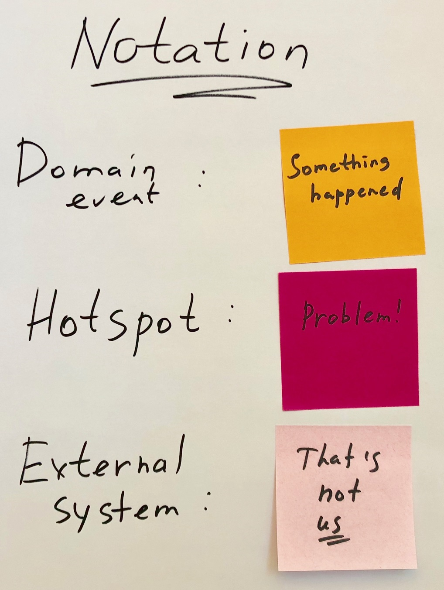

## Our first model

现在，来尝试为我们的示例领域练习并执行一个假想的 EventStorming 会议。很难想象，因为任何 EventStorming 研讨会最重要的方面是人和他们的行为。我们肯定不能在这里以书面形式再现它，但我们可以想象一些可能发生的讨论和产生的事件流。

我们将经历一个虚构的会议，其中将讨论一个 *分类广告（classified ads）*应用程序。一位主持人，我们叫她 Ann，邀请了下面的人来参加研讨会：
* John，公司老板。他相信该系统将因其简单和独特的特点而成为市场的领导者。
* Mary 是UX(用户体验)设计师，她对现有系统做了一些研究，并与一些潜在用户进行了交谈。
* Nick 和 Eve 是 full-stack developers。
* Ian 负责后勤部门，处理财务问题，确保公司运作良好。

到了计划的会议时间，人们涌入会议室，试图找到椅子，但没有。房间里有两张小桌子——一张是水果和饮料;另一张放着一堆不同颜色的便利贴和许多记号笔，房间足够容纳两倍大的人群。两面墙用一张长约7米的纸卷装饰。还有一个投影仪和一个白板。人们看起来有点困惑，现在是时候做一下解释了：

> **Ann**：欢迎来到我们的第一次，但希望不是最后一次 EventStorming 研讨会。我们将探索公司希望业务如何运营，在这次会议结束时，在座的每个人都应该对我们想要做的事情有一个共同的理解。为了达到这个目标，我们将讨论一下当客户使用我们的服务时，我们这边会发生了什么。把这些将要发生的事情当成 *事实*，这些 *事实* 叫做 *领域事件*。我们这儿有便利贴。想象一下公司是如何运作的，当事情发生时，在一张便利贴上用过去时态写几个字，然后把它贴在墙上。

Ann 在白板上写下 *legend* 一词，并在中间贴了一张橙色的便利贴，上面写着 *something happened —— 领域事件*。然后她在靠近白板的顶部的部分画了一个水平的箭头，在下面写了 *time*。

> **Ann**：由于一个事实接一个事实，它们形成序列或过程，这些过程不是同时发生的，而是按顺序依次发生的。因此，我们尝试在时间轴上安排这些事件。

房间里的人似乎明白了，Ann 给了每个人一打便利贴和一支笔。尽管如此，每个人似乎都不愿意做任何事情，而是互相看着，感觉有点不舒服和紧张，好像他们害怕做错了什么。

> **John**：最好的起点就是开始。首先会发生什么？也许是当客户在我们这里注册时。

这种不确定性引发了一场无果而终的讨论。白板上仍然没有一张便利贴。注意到这一点后，Ann 在一张便利贴上写下了 **Classified Ad Published**，并把它贴在中间的某个地方。

这一张便利贴引发了一场讨论：系统中的主要元素应该被称为什么？*classified ad*？，或者仅仅叫做 *ad*，还是别的什么？人们开始把一些看似应该在 *ad* 发布之前发生的事情放在上面，比如 **Ad created** 和 **Ad updated**。看了一眼之后，Mary 对这些术语表示怀疑，因为 ad 不会 updated 。ad 有多个独立的属性，它们的变化是不同的。例如，上传图片是单独完成的，然后更新广告标题。改变广告类别可能会受到限制，而更新价格可能会引发一些有趣的行为，比如通知订阅了某个feed的用户最近价格有所下降的广告（ad）。

与此同时，John 开始讨论一些高级功能，比如卖方（seller）和买方评级（buyer ratings），最终，他们发现，在白板的另一部分，没有买方或卖方，而是 *用户（user）*。这个术语在讨论身份验证和用户信息时似乎有意义，但在销售和购买过程中没有帮助。

此时，白板看起来是这样的：

First model

终于完成了一些工作，人们需要稍微休息一下，享受 Ann 为他们准备的所有好吃的，并反思讨论和发现的东西。

稍做休息之后，继续讨论。

Eve 和 John 开始讨论审批过程（approval process），这是之前完全没有的。在竞争对手的网站上，似乎存在着很大比例的潜在欺诈和恶意的分类广告，而且它们都有一些预防机制。那些根本不费心做任何审查的网站很快就失去了信誉和信任，并被挤出了这个行业。但是我们公司没有人员来手动检查所有的广告，所以讨论一直在兜圈子。安注意到了这一点，在墙上贴了一张亮粉色的便利贴，上面写着：*malicious ads detection*

> **Ann**：我们似乎需要这个，但我们不知道该怎么做。我们把它放在这里作为一个提醒，等我们讨论完剩下的内容后再回到这里。

然后，关于这一主题的讨论随后停止，继续讨论其他的。

此时，第三个类符号也已经添加到其中了：

Final notation for the Big Picture workshop

Ian 在讨论中不是很活跃，他四处走动，点头，有时还做个鬼脸表示不同意。当 Ann 问他怎么了，伊恩不耐烦地回答：

> **Ian**：都没有人考虑过我们要怎么赚钱。没有任何收入，我们将无法生存。我们没有那么多的投资，我们最好尽快获得一些收入。

这给整个团队带来了一个小的冲击波，他们开始思考他们是如何忘记了把钱的问题考虑进来的。然后，John 解释了最初的想法，基本的服务是免费的，但是一些额外的服务，如在搜索结果里置顶广告，显示大图片，等等，将需要少量的费用。他还解释说，免费服务只对个人开放，如果一家公司想通过该网站销售产品，他们需要有独家协议。此外，他继续说，销售汽车和房地产应该是完全不同的事情，因为它需要集成其他服务和一些安全措施，这些服务永远不会是免费的。

这个新信息引发了讨论，不久之后，每个人都同意，对于第一个版本，他们需要针对最大的受众和最直接的可能的服务。这意味着他们将只提供免费广告和一些选择，这将为以后创造主要的收入来源打下基础。

会议结束了，墙上贴满了便利贴。就像下面这样：

Final big picture model

正如我们所看到的，会议揭示了一些以前不知道的或假设的但从未阐明的知识点。下面是一些例子：
* 没有 *ad updated* 之类的事情，只有 *picture uploaded*，*price decreased* 等等，更加精准，触发不同的逻辑。
* 在不同的情况下，一个人被称为 *user*，同时又被称为 *seller* 或 *buyer*。这些上下文之间的联系并不稳定，这可能表明它们至少是不同的实体。
* **最小可行产品**（**minimal viable product (MVP)**）缩小到了免费广告的最低限度，只增加了少量付费广告。其他的一切都会在以后实现。
* 像卖家和买家评级和智能推荐这样的功能是很好的，但不会立即给用户带来价值。
* 然而，如果考虑每天将会发布的广告的数量，那么对恶意内容检测系统的需求将会非常强烈，因为人工审核非常低效。

开发人员更好地了解了企业对系统的期望，UX 专家对系统的 ui 也有了一定的想法。他们做了许多调整，并产生了很多原创的想法，每个人都在同一目标上。无知的程度比以前低了很多，开发人员忙于解决错误问题的风险也大大降低了。