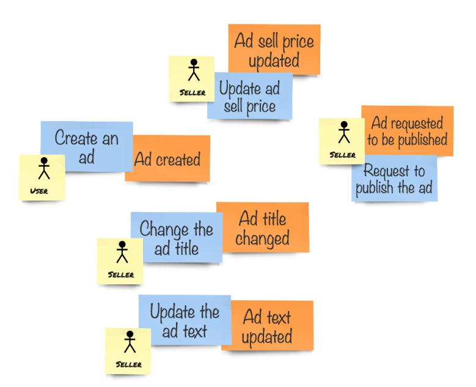

## Domain events in code

EventStorming 让我们有更多的机会发现有用的领域。我们获得了一些关于该领域的知识，并设法将其可视化，以共享理解的知识。*命令（command）* 也出现在更详细的模型上。在本章中，我们学习了如何创建实体来预防执行无效的操作，并且永远不会进入无效状态。对实体的操作是通过 *方法（method）* 来实现的，这些方法非常类似于我们在详细模型中发现的命令。所以，这部分或多或少是清晰的，但是 *事件（event）* 到目前为止还没有出现在我们的代码中。

实际上，在使用 DDD 的原则和模式实现系统时，可以不需要任何领域事件。在花了这么多时间使用便利贴后，这听起来可能很奇怪，但这是事实。当我们执行一个实体方法时，它会改变实体的状态。此状态的更改便是隐式的事件。例如，当我们的系统执行 ClassifiedAd 实体的 RequestToPublish 方法时，它将把实体状态属性设置为 ClassifiedAdState.PendingReview 。实际上，这可以被翻译成 **classified ad sent to review** ，这是我们之前写在橙色便利贴上的。

然而，多数情况下，让领域事件成为领域模型中的一等公民有很大的好处的。作为领域模型的一部分显式的实现领事件，这里有两种技术可以实现，如下所示：
* 允许系统的某个部分使用 Ubiquitous Language 和 *状态变化的详细信息*， 通知系统的其他部分：我们已经讨论了把系统分成多个部分的想法，这些部分需要通过监听彼此的事件和执行必要的操作来很好地协同工作。如果一个系统是以这样一种方式构建的，即系统的不同部分对彼此的变化作出反应，那么这种系统被称为**反应式系统（reactive system）**。
* 持久化领域事件以获得领域模型内状态更改的完整历史：然后，通过读取这些事件的历史记录，并将它们重新应用到实体，任何实体的状态都可以被重新构建。这种模式被称为 **Event Sourcing** ，我们将在本书中花大量的时间来讨论它，特别是在第10章。

这两种技术可以组合在一起，因此当我们持久化领域事件时，我们还可以监听系统其他部分的变动，并对这些事件作出响应。

在本章中，我们将着眼于如何将领域事件引入到代码中，以及实体方法如何触发它们以便我们以后使用这些事件。

## Domain events as objects

将领域事件引入到代码中很容易。每个事件都是一个对象。这意味着可以将事件类型表示为 *class* 或 *struct* 。由于稍后需要序列化事件，而 *struct* 不能很好地与序列化器协同工作，因此我们将领域事件实现为 *class* 。

对于 ClassifiedAd 实体，我们有以下基本操作：
* 创建一个新的 classified ad
* 设置 title
* 更新 text
* 更新 price
* 发布 ad (送审)

这些操作中的每一个都会更改实体的状态，并引发一个领域事件。所有这些事件在我们的便利贴，如下所示：

<center>The full picture for the core business domain</center>

表示事件的 *class* 需要清楚地描述事件(发生了什么)，并包含系统状态是如何改变的必要信息。通常，事件是对命令执行的反应。因此，事件中的数据通常表示命令中的数据，以及引发事件的实体的一些其他细节。

现在让我们创建一些领域事件 *class* 。请记住，这是我们第一次实现领事件，如果您正在阅读过诸如 Event Sourcing 之类的内容，您可能会发现它实现的过于简化了，但这是有意为之的：
```csharp
using System;

namespace Marketplace.Domain
{
    public static class Events
    {
        public class ClassifiedAdCreated
        {
            public Guid Id { get; set; }

            public Guid OwnerId { get; set; }
        }

        public class ClassifiedAdTitleChanged
        {
            public Guid Id { get; set; }

            public string Title { get; set; }
        }

        public class ClassifiedAdTextUpdated
        {
            public Guid Id { get; set; }

            public string AdText { get; set; }
        }

        public class ClassifiedAdPriceUpdated
        {
            public Guid Id { get; set; }

            public decimal Price { get; set; }

            public string CurrencyCode { get; set; }
        }

        public class ClassifiedAdSentForReview
        {
            public Guid Id { get; set; }
        }
    }
}

```
事件 *class* 都包装在 Events *static class* 中，这给我们提供了一些命名空间。因此，这些 *class* 中的所有属性都是基础类型。我们在事件中不使用值对象。这是一件值得记住的重要原则。在事件中只使用基础类型的原因是，正如前面提到的，领域事件经常跨系统使用。事件可以看作是我们系统发布的契约。如果我们使用 Event Sourcing，并且将事件持久化，那么我们也不能允许某些值对象中的规则发生更改的情况。此外，我们不能再加载事件，因为值对象的数据现在被认为是无效的。当然，在事件中不使用值对象意味着一些更复杂的值对象需要被扁平化（flatter）。例如，在我们的例子中，需要将 ClassifiedAd *class* 中的 Price 属性的值提取到 ClassifiedAdPriceUpdated 的两个属性：Price（表示数量） 和 CurrencyCode。

可以看到，每个事件都有 Id 属性，因为在不知道事件来自哪个实体的情况下引发事件是没有意义的。因此，每个操作都需要注意在它引发的事件中填充实体 id。

关于领域事件，最重要的是要表示已经发生的事情，而这些事情是无法改变的，因为我们没有 时间机器 或 TARDIS 来擦除或修复过去。因此，事件应该尽可能简单，这样我们就可以加载过去的事件，而且这永远不会失败。

## Raising events

现在，让我们看看在实体中如何使用领事件。首先，我们需要从方法中触发事件。为此，我们需要在实体中添加一些事件列表，以便保存正在创建的事件。否则，首先创建事件实例就没有什么意义。

我们希望将事件保存在实体内的某种列表中，因此我们可以将其移到实体的 *base class* 中，让我们创建一个 *abstract class* 并将其称为 Entity：
```csharp
using System.Collections.Generic;
using System.Linq;

namespace Marketplace.Framework
{
    public abstract class Entity
    {
        private readonly List<object> _events;

        protected Entity() => _events = new List<object>();

        protected void Raise(object @event) => _events.Add(@event);

        public IEnumerable<object> GetChanges() => _events.AsEnumerable();

        public void ClearChanges() => _events.Clear();
    }
}
```

events 表示对实体所做的更改，检索事件列表并清除该列表的方法称为 GetChanges 和 ClearChanges。

下一步是将这个 *base class* 添加到我们的实体中，并开始从方法中触发事件：
```csharp
using Marketplace.Framework;

namespace Marketplace.Domain
{
    public class ClassifiedAd : Entity
    {
        public ClassifiedAdId Id { get; }

        public ClassifiedAd(ClassifiedAdId id, UserId ownerId)
        {
            Id = id;
            OwnerId = ownerId;
            State = ClassifiedAdState.Inactive;
            EnsureValidState();
            Raise(new Events.ClassifiedAdCreated {
                Id = id,
                OwnerId = ownerId
            });
        }

        public void SetTitle(ClassifiedAdTitle title)
        {
            Title = title;
            EnsureValidState();
            Raise(new Events.ClassifiedAdTitleChanged {
                Id = Id,
                Title = title
            });
        }

        public void UpdateText(ClassifiedAdText text)
        {
            Text = text;
            EnsureValidState();
            Raise(new Events.ClassifiedAdTextUpdated {
                Id = Id,
                AdText = text
            });
        }

        public void UpdatePrice(Price price)
        {
            Price = price;
            EnsureValidState();
            Raise(new Events.ClassifiedAdPriceUpdated {
                Id = Id,
                Price = Price.Amount,
                CurrencyCode = Price.Currency.CurrencyCode
            });
        }

        public void RequestToPublish()
        {
            State = ClassifiedAdState.PendingReview;
            EnsureValidState();
            Raise(new Events.ClassidiedAdSentForReview { Id = Id });
        }
        
        // Rest of the entity code remains the same
    }
}

```
所以现在，如果从 application service 层使用我们的实体(将在本书后面详细讨论)，它可能是这样的：
```csharp
public async Task Handle(RequestToPublish command)
{
    var entity = await _repository.Load<ClassifiedAd>(command.Id);
    entity.RequestToPublish();
    await _repository.Save(entity);
    
    foreach (var @event in entity.GetChanges())
    {
        await _bus.Publish(@event);
    }
}
```

正如您所想象的那样，此代码还不是 production-ready 的，仅用于演示如何将领域事件用于系统不同部分之间的集成。如果我们将事件发布到某些消息总线，而系统中的其他组件订阅了这些消息，它们就可以执行反应性行为，并在它们的领域模型中进行一些更改，或者执行一些特定的操作，如发送电子邮件、文本消息或实时通知。使用包含客户端状态管理的现代 single-page 应用程序框架，您甚至可以更新用户当前在浏览器中拥有的信息，从而在 web 应用程序中启用实时更新。

很值得为实例化事件的代码添加一个小的语法糖。在那里，直接将值对象的值赋给基础类型。它是使用 C# 的隐式转换特性完成的，实现如下所示：
```csharp
using System;

namespace Marketplace.Domain
{
    public class ClassifiedAdId
    {
        private readonly Guid _value;

        public ClassifiedAdId(Guid value)
        {
            if (value == default)
                throw new ArgumentNullException(nameof(value),
                    "Classified Ad id cannot be empty");
            _value = value;
        }

        public static implicit operator Guid(ClassifiedAdId self)
            => self._value;
    }
}

```
隐式转换将简化实体属性和事件属性之间的赋值，尽管它们是不兼容的类型。

## Events change state

如果你熟悉 Event Sourcing 的概念，就知道事件表示状态更改的事实。这意味着如果不与领域事件进行某些交互，则无法更改实体状态。然而，到目前为止，在我们的代码中，更改系统状态和引发领域事件是完全分开的。让我们看看如何改变它。

首先，需要对实体的 *base class* 进行一些更改：
```csharp
using System.Collections.Generic;
using System.Linq;

namespace Marketplace.Framework
{
    public abstract class Entity
    {
        private readonly List<object> _events;
        protected Entity() => _events = new List<object>();

        protected void Apply(object @event)
        {
            When(@event);
            EnsureValidState();
            _events.Add(@event);
        }

        protected abstract void When(object @event);
        
        public IEnumerable<object> GetChanges()
            => _events.AsEnumerable();
            
        public void ClearChanges() => _events.Clear();
        
        protected abstract void EnsureValidState();
    }
}
```

我们将 Raise 方法重命名为 Apply，因为它不仅将事件添加到更改列表中，而且通过使用 When 方法将每个事件的内容物理地应用到实体状态。每个实体都需要实现这个 When 方法。Apply 方法还调用 EnsureValidState 方法，该方法以前在实体中有定义，但在 *base class* 中没有。通过这样做，我们就不需要为实体上的每个操作调用此方法。

下一步是应用领域事件并将所有状态更改移动到 When 方法：
```csharp
using Marketplace.Framework;

namespace Marketplace.Domain
{
    public class ClassifiedAd : Entity
    {
        public ClassifiedAdId Id { get; private set; }
        public UserId OwnerId { get; private set; }
        public ClassifiedAdTitle Title { get; private set; }
        public ClassifiedAdText Text { get; private set; }
        public Price Price { get; private set; }
        public ClassifiedAdState State { get; private set; }
        public UserId ApprovedBy { get; private set; }

        public ClassifiedAd(ClassifiedAdId id, UserId ownerId) =>
            Apply(new Events.ClassifiedAdCreated
            {
                Id = id,
                OwnerId = ownerId
            });

        public void SetTitle(ClassifiedAdTitle title) =>
            Apply(new Events.ClassifiedAdTitleChanged
            {
                Id = Id,
                Title = title
            });

        public void UpdateText(ClassifiedAdText text) =>
            Apply(new Events.ClassifiedAdTextUpdated
            {
                Id = Id,
                AdText = text
            });

        public void UpdatePrice(Price price) =>
            Apply(new Events.ClassifiedAdPriceUpdated
            {
                Id = Id,
                Price = price.Amount,
                CurrencyCode = price.Currency.CurrencyCode
            });

        public void RequestToPublish() =>
            Apply(new Events.ClassidiedAdSentForReview {Id = Id});

        protected override void When(object @event)
        {
            switch (@event)
            {
                case Events.ClassifiedAdCreated e:
                    Id = new ClassifiedAdId(e.Id);
                    OwnerId = new UserId(e.OwnerId);
                    State = ClassifiedAdState.Inactive;
                    break;
                case Events.ClassifiedAdTitleChanged e:
                    Title = new ClassifiedAdTitle(e.Title);
                    break;
                case Events.ClassifiedAdTextUpdated e:
                    Text = new ClassifiedAdText(e.AdText);
                    break;
                case Events.ClassifiedAdPriceUpdated e:
                    Price = new Price(e.Price, e.CurrencyCode);
                    break;
                case Events.ClassidiedAdSentForReview e:
                    State = ClassifiedAdState.PendingReview;
                    break;
            }
        }

        protected override void EnsureValidState()
        {
            var valid = Id != null && OwnerId != null &&
                (State switch
                {
                    ClassifiedAdState.PendingReview =>
                        Title != null 
                        && Text != null 
                        && Price?.Amount > 0,
                    ClassifiedAdState.Active =>
                        Title != null
                        && Text != null
                        && Price?.Amount > 0
                        && ApprovedBy != null,
                    _ => true
                });

            if (!valid)
                throw new InvalidEntityStateException(
                    this, $"Post-checks failed in state {State}");
        }

        public enum ClassifiedAdState
        {
            PendingReview,
            Active,
            Inactive,
            MarkedAsSold
        }
    }
}
```
我们在 entity *class* 中更改了两项内容，如下所示：
* 所有用于修改实体状态（操作）的公共方法现在都调用 Apply 方法以应用领域事件。这些方法中没有状态更改或有效性校验。还记得吗，有效性校验的方法现在从 Entity *base class* 中的 Apply 方法中调用了。
* 我们覆写了 When 方法，c# 7.1 的高级模式匹配特性用于识别应用了什么类型的事件，以及需要如何更改实体状态。

很好，测试中不需要做任何更改。如果我们执行到目前为止已经创建的解决方案中的所有测试，它们都将通过。这意味着触发领域事件并应用它们来更改实体状态可以看作是实现细节。实际上，这是处理领域事件的一种风格，通常在 DDD 与 Event Sourcing 结合时使用，我们将在后面讨论。

请记住，在一般情况下使用 DDD，特别是使用领域事件，并不意味着必须使用 Event Sourcing，反之亦然。这本书更多地关注 Event Sourcing；因此，这种通过应用（apply）事件来改变领域状态的技术在这里被较早的提出了。

有一些改变的作用在此刻显得不是那么明显，但是为了让整个系统运转起来，是必须的。如果仔细观察 When 方法，实体的属性仍然是值对象类型的，构造值对象时使用了*constructor*，而不是工厂函数。这是因为工厂函数在构造有效的 *值对象* 时应用约束并执行校验。然而，**领域事件表示已经发生的事情，因此没有必要校验这些过去的事实的有效性。如果它们在当时是有效的，就应该让它们通过。即使值对象中的逻辑已经改变**，这也不会对应用这些带有历史数据的事件产生任何影响。

要解决这个问题，我们需要更改值对象，将 *constructor* 从 *private* 改成 *internal* 。另外，校验逻辑从 *constructor* 转移到工厂函数，因此 *constructor* 现在接受任何值。对于更复杂的 Price 对象，我们需要添加一个不需要 ICurrencyLookup 服务的 *constructor* 。当我们试图加载一些过去的事件时，即使货币不再有效，它也应该能够通过。但是，它不会改变工厂函数的使用。它们仍然需要 ICurrencyLookup 服务 ，并且只要我们在 application service 层中创建值对象的新实例，就会使用它。它将继续保护我们不会执行包含错误信息的命令，从而导致我们的模型处于无效状态。

在下面，您可以找到对于 ClassifiedAdText 更改：
```csharp
using Marketplace.Framework;

namespace Marketplace.Domain
{
    public class ClassifiedAdText : Value<ClassifiedAdText>
    {
        public string Value { get; }
        
        internal ClassifiedAdText(string text) => Value = text;

        public static ClassifiedAdText FromString(string text) => 
            new ClassifiedAdText(text);

        public static implicit operator string(ClassifiedAdText text) => text.Value;
    }
}
```

下面是 ClassifiedAdTitle 的更改：
```csharp
using System;
using System.Text.RegularExpressions;
using Marketplace.Framework;

namespace Marketplace.Domain
{
    public class ClassifiedAdTitle : Value<ClassifiedAdTitle> 
    {
        public static ClassifiedAdTitle FromString(string title)
        {
            CheckValidity(title);
            return new ClassifiedAdTitle(title);
        }

        public static ClassifiedAdTitle FromHtml(string htmlTitle)
        {
            var supportedTagsReplaced = htmlTitle
                .Replace("<i>", "*")
                .Replace("</i>", "*")
                .Replace("<b>", "**")
                .Replace("</b>", "**");

            var value = Regex.Replace(supportedTagsReplaced, "<.*?>", string.Empty);

            CheckValidity(value);
            return new ClassifiedAdTitle(value);
        }

        public string Value { get; }

        internal ClassifiedAdTitle(string value) => Value = value;
        
        public static implicit operator string(ClassifiedAdTitle title) => title.Value;

        private static void CheckValidity(string value)
        {
            if (value.Length > 100)
                throw new ArgumentOutOfRangeException(
                    "Title cannot be longer that 100 characters", nameof(value));
        }

     }
}

```

最后是 Price *class*，它是继承基自 Money *class* 的，但也有一些附加的规则：
```csharp
using System;

namespace Marketplace.Domain
{
    public class Price : Money
    {
        private Price(
            decimal amount,
            string currencyCode,
            ICurrencyLookup currencyLookup
        ) : base(amount, currencyCode, currencyLookup)
        {
            if (amount < 0)
                throw new ArgumentException("Price cannot be negative",
                    nameof(amount));
        }

        internal Price(decimal amount, string currencyCode) :
            base(amount, new CurrencyDetails { CurrencyCode = currencyCode })
        {
        }

        public static Price 
        FromDecimal(
            decimal amount,
            string currency,
            ICurrencyLookup currencyLookup
        ) => new Price(amount, currency, currencyLookup);
    }
}

```
同样，尽管这些变化看起来很重要，但我们并没有改变任何领域逻辑和约束。现有的所有测试，仍然能够通过，因此重构是成功的，我们成功地改变了实现细节，同时保持了领域模型的本质不变。