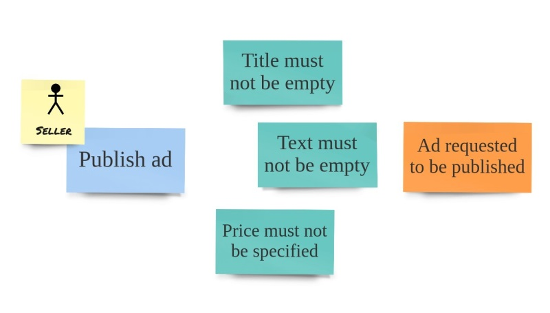

## Ensuring correctness

在上一节中，我们校验了实体的 *constructor* 参数是否有效，以确保新创建的实体对象也是正确的。我们应用了一个约束，不允许在参数值无效的情况下创建新实体。通过这样做，可以保护领域模型不会产生无效的对象。它是领域模型的基本功能之一，因为我们采用了 *行为优先（behavior-first ）* 的方式，这种类型的代码需要成为领域模型实现的一部分，而不是暴露给外部层（如 UI 或  application service 层）。当然，由于我们的领域模型是系统核心，数据从用户界面转移到领域对象需要几次跳跃。在进入领域模型之前，对试图进入领域模型的数据进行初步校验是一种有效的方式。由于反馈更快，它改善了用户体验。然而，最终的控制总是在领域模型本身内部执行，因为它永远不会进入无效状态。

## Constraints for input values

在前一节中，您可能已经认识到实体实现中的一些缺陷。目前有很多，但让我们看看最明显的一个。这里严重缺少的是 owner ID。很难相信会存在没有所有者的 ad 。如果存在的话，那应该如何理解谁可以修改 ad 的内容呢？另外，在这个 *class* 中我们已经有了 *_ownerId field* 。那么，让我们在 *constructor* 中再添加一个参数来执行这个约束：
```csharp
public ClassifiedAd(Guid id, Guid ownerId)
{
    if (id == default)
        throw new ArgumentException(
            "Identity must be specified", nameof(id));

    if (ownerId == default)
        throw new ArgumentException(
            "Owner id must be specified", nameof(ownerId));

    Id = id;
    _ownerId = ownerId;
}
```

<blockquote><p>
<font size=5>👉</font>&nbsp;&nbsp;&nbsp;从现在开始，我们不会列出整个 <i>class</i>，而只列出其中被改变的部分。
</p></blockquote>

我们不仅增加了一个参数，还增加了一个校验。所以现在，我们确保了实体在创建后是有效的，因为客户端必须同时提供 ad ID 和 owner ID。

创建 classified ad 实体的代码如下所示：
```csharp
public void CreateClassifiedAd(Guid id, Guid ownerId)
{
    var classifiedAd = new ClassifiedAd(id, ownerId);
    // store the entity somehow
}
```

请注意，我们向实体 *constructor* 中添加了更多的参数，而 *constructor* 本身也在增长，因为我们为这些参数添加了更多的校验。最后，要理解到底发生了什么并不容易，因为许多规则混合在一大块代码中。另外，很明显我们还没有校验涉及实体的多个 property 的复杂规则。在我们的例子中，所控制的是每个参数都有一个值。这种方法没有错，但也不理想。相反，我们可以使用 **value object** 来校验这些值，以防止无效的值到达实体 *constructor* 。

## Value objects

**值对象（value object）**模式并不是 DDD 独有的，但它可能是 DDD 社区中最流行的。这可能是由于值对象具有可表达性和强封装性的特点。基本上，值对象允许使用使用 Ubiquitous Language 显式的声明实体的类型和属性。此外，这些对象可以显式地定义如何创建它们，以及在它们内部可以执行哪些操作。这是一个将隐式转换为显式的完美例子。

让我们使用代码创建一个值对象来看看它是什么样的。以前，我们在实体 *constructor* 中使用 ownerId 参数，并检查它是否具有非默认的 GUID 。我们希望这是一个 用户ID,因为我们知道 ad 的所有者是我们的用户之一,因为人们首先需要在系统中注册，人后才能创建 classified ad 。这意味着我们可以使用类型系统，并通过使用一个称为 UserId 的新类型（而不是使用 Guid ）使隐式更显式。

在 Marketplace.Domain 项目中创建一个新 *class*，并称之为 UserId 。这个 *class* 的初始代码如下所示：
```csharp
using System;

namespace Marketplace.Domain
{
    public class UserId
    {
        private readonly Guid _value;

        public UserId(Guid value)
        {
            if (value == default)
                throw new ArgumentNullException(
                    nameof(value), "User id cannot be empty");

            _value = value;
        }
    }
}
```

如您所见，我们将校验移到了 UserId 的 *constructor* 中。这意味着我们可以将实体 *constructor* 更改为以下内容：
```csharp
public class ClassifiedAd
{
    public Guid Id { get; }
    private UserId _ownerId;

    public ClassifiedAd(Guid id, UserId ownerId)
    {
        if (id == default)
            throw new ArgumentException(
            "Identity must be specified", nameof(id));

        Id = id;
        _ownerId = ownerId;
    }

    // rest of the code skipped
}
```

我们的实体不需要不校验 ownerId 了，因为通过类型为 UserId 的参数，我们可以保证传入的值是有效的。当然，我们不会在这里检查提供的 GUID 是否指向有效用户，这不是我们的意图，至少目前是这样。

但是，还有一个参数需要做有效性的检查。让我们通过使用以下代码，添加 ClassifiedID *class*，使 id 也成为值对象：
```csharp
using System;
namespace Marketplace.Domain
{
    public class ClassifiedAdId
    {
        private readonly Guid _value;

        public ClassifiedAdId(Guid value)
        {
            if (value == default)
                throw new ArgumentNullException(
                    nameof(value), "Classified Ad id cannot be empty");

            _value = value;
        }
    }
}
```

现在我们的 *constructor* 再也没有校验了，但它会仍然生成一个有效的实体：
```csharp
public class ClassifiedAd
{
    public ClassifiedAdId Id { get; }
    private UserId _ownerId;

    public ClassifiedAd(ClassifiedAdId id, UserId ownerId)
    {
        Id = id;
        _ownerId = ownerId;
    }

    // rest of the code skipped
}
```

当我们移动到应用层（application layer），实体在那里被构造时，我们可以想象对 *constructor* 的调用是这样的（假设 id 和 ownerId 是Guid类型）：
```csharp
var classifiedAd = new ClassifiedAd(new ClassifiedAdId(id), new UserId(ownerId));
```
这行代码清楚地表明，我们将首先提供 classified ad ID ，然后是 owner ID 给实体 *constructor*。当我们使用 Guid 作为两个参数的类型时，如果我们意外地更改了参数的顺序，应用程序仍然会编译，但是当然，实体将被错误地构造，整个系统将在深不可测的某个地方崩溃。使用值对象类型的强类型参数迫使编译器进行类型检查，如果我们弄错了参数，代码将无法编译。

但是值对象不仅仅是充当基本类型的包装器类型。如前所述，**如果实体的标识（identity）相同，则认为它们是相等的。值对象不同，因为它们的相等性是通过值建立的，因此才有了值对象这个模式名**。值对象的一个经典例子是货币。如果我们拿两张5元的钞票，它们代表了两个不同的实体，因为它们实际上是两个截然不同的物体，甚至上面还印有唯一的序列号。但就付款而言，两者完全相同，因为它们价值相同，都是5元。

但是我们如何在代码中表示它呢？让我们创建 Money *class* 并尝试一下：
```csharp
namespace Marketplace.Domain
{
    public class Money
    {
        public decimal Amount { get; }
        public Money(decimal amount) Amount = amount;
    }
}
```
现在，让我们编写一个简单的测试来检查如果值相等，那么 Money 类型的两个对象是否相等：
```csharp
using Marketplace.Domain;
using Xunit;

namespace Marketplace.Tests
{
    public class MoneyTest
    {
        [Fact]
        public void Money_objects_with_the_same_amount_should_be_equal()
        {
            var firstAmount = new Money(5);
            var secondAmount = new Money(5);


            Assert.Equal(firstAmount, secondAmount);
        }
    }
}
```

当然的，这个测试会失败，因为一个 *class* 的实例是一个 reference object，而同一个 *class* 的两个实例是不同的对象，不管它们的属性和字段的值是什么。我们可以得出结论，无论是 Money ，还是 UserId 和 ClassifiedAdId 都不能表示值对象。

为了使 Money *class* 更接近正确的值对象类型，我们需要实现 IEquatable *interface* ：
```csharp
using System;

namespace Marketplace.Domain
{
    public class Money : IEquatable<Money>
    {
        public decimal Amount { get; }

        public Money(decimal amount) => Amount = amount;
        
        public bool Equals(Money other)
        {
            if (ReferenceEquals(null, other)) return false;
            if (ReferenceEquals(this, other)) return true;

            return Amount.Equals(other.Amount);
        }

        public override bool Equals(object obj)
        {
            if (ReferenceEquals(null, obj)) return false;
            if (ReferenceEquals(this, obj)) return true;
            if (obj.GetType() != this.GetType()) return false;

            return Equals((Money) obj);
        }

        public override int GetHashCode() => Amount.GetHashCode();
        
        public static bool operator ==(Money left, Money right) => 
            Equals(left, right);

        public static bool operator !=(Money left, Money right) => 
            !Equals(left, right);
    }
}
```
如果我们现在运行相同的测试，它会通过，  

因为，当我们调用 ```Assert.Equals(firstAmount, secondAmount)``` 时，前面的代码将比较两个实例的 Amount 字段的值，而这些值是相同的。同时我们还实现了隐式相等运算符，所以我们可以在代码中直接使用类似 ```if (firstAmount == secondAmount)``` 这样的比较。

通过使用 *base class*，我们可以减少样板代码的数量，并为相等比较方法提供动态的能力。至少有两种方式可以创建这样的 *base class*。一种方式包括使用反射来发现实现类型中的所有字段，并将所有字段用于相等目的。另一种方式涉及创建一个抽象方法，需要在每个实现中覆盖该方法，以提供用于相等性的特定值。第一种方式编写的代码更少，因为所有字段都是自动发现和使用的，而第二种方式允许我们选择将哪些属性用于相等性。

<blockquote><p>
<font size=5>👉</font>&nbsp;&nbsp;&nbsp;在 c# 的下一个版本 9.0 中（当您阅读本书时可能已经可以使用了），将引入名为 <b>record type</b> 的新特性。在较高的层次上，record type 类似于 f# 的 record。使用 record type，值对象的声明将变得非常简短，所有相等功能的样板代码将由编译器生成。例如，前面声明的 Money 类型将在一行中完成，如下所示：
<br/> <code class="language-csharp hljs">public record Money(double amount);</code><br/>
在本书中，我使用了 <i>class</i>，它们是引用类型，而不像值类型 <i>struct</i> 。这意味着这些值对象没有完全遵循不变性（immutable）原则。但是，我们将尽力确保这些对象不能被随意更改，但是对对象实例使用赋值操作符只会将引用分配给原始对象，这对于值类型是不同的。
</p></blockquote>

使用 Marketplace.Framework 项目中的 *abstract class*，我们现在可以将 Money 重构成以下内容：
```csharp
using Marketplace.Framework;

namespace Marketplace.Domain
{
    public class Money : Value<Money>
    {
        public decimal Amount { get; }

        public Money(decimal amount) => Amount = amount;
    }
}
```
如您所见，所有样板代码现在都移到了 *base class* 中，我们回到了和领域模型相关的内容。但是，由于 *base class* 中正确的相等实现，测试仍然能够通过。

到目前为止，我们在值对象中只有简单的规则，但是当我们使用 Money 时，我们应该添加一个有用的校验。如果我们谈论钱，我们很少指的是负数。是的，这样的金额存在于会计系统中，但我们不是在创建会计系统。在我们的领域， 需要有一个价格，classified ad 价格不能是负的，正如我们的领域专家解释的那样。因此，我们可以在一个新的值对象中表示该规则，如下面的代码所示：
```csharp
using System;

namespace Marketplace.Domain
{
    public class Price : Money
    {
        public Price(decimal amount) : base(amount)
        {
            if (amount < 0)
                throw new ArgumentException(
                    "Price cannot be negative",
                    nameof(amount));
        }
    }
}
```

因此，尽管我们的 *base class*—— Money， 仍然允许它的数额是负数或零；但是 Price 永远是正数，因此，在我们的领域内有效。

说到不可变性（immutable），我们必须确保值对象不公开任何可以更改对象内字段值的方法。如果我们想对值对象实例执行一些操作，那么它需要生成一个具有相同类型的新实例。通过这样做，我们可以确保原始对象能够保留它的值。

让我们看一下 Money 示例，并为其添加一些有用的操作，请记住不可更改性：
```csharp
using Marketplace.Framework;

namespace Marketplace.Domain
{
    public class Money : Value<Money>
    {
        public decimal Amount { get; }

        public Money(decimal amount) => Amount = amount;
        
        public Money Add(Money summand) => new Money(Amount + summand.Amount);

        public Money Subtract(Money subtrahend) => 
            new Money(Amount - subtrahend.Amount);

        public static Money operator +(Money summand1, Money summand2) => 
            summand1.Add(summand2);

        public static Money operator -(Money minuend, Money subtrahend) => 
            minuend.Subtract(subtrahend);
    }
}
```

如果我们有一枚1元硬币和两枚2元硬币，总价值是5元。如果把它和一张5元的钞票比较，它们的价值是一样的。由于我们对这些货币形式的形状、大小和重量不感兴趣，而只对价值感兴趣，因此我们可以得出结论，这两种货币形式具有相同的价值。我们前面的新的 Money *class* 可以在测试代码中表达出这个语句的意识，当运行它时，它将是绿色的：
```csharp
[Fact]
public void Sum_of_money_gives_full_amount()
{
    var coin1 = new Money(1);
    var coin2 = new Money(2);
    var coin3 = new Money(2);
    var banknote = new Money(5);


    Assert.Equal(banknote, coin1 + coin2 + coin3);
}
```

现在，终于可以对之前的 *class* 做一些重构， 使其成为正确的值对象：
```csharp
public class ClassifiedAdId : Value<ClassifiedAdId>
{
    private readonly Guid _value;
    public ClassifiedAdId(Guid value) => _value = value;
}

public class UserId : Value<UserId>
{
    private readonly Guid _value;
    public UserId(Guid value) => _value = value;
}
```

现在，让我们更深入地研究实例化值对象和实体的更高级的方法。

### Factories

现在，我们可以实现更多的值对象，这些对象将用于实体中的其他字段。还记得吗，实体中有三个表示其基本 *行为* 的方法—— SetTitle(string)、UpdateText(string) 和 UpdatePrice(double)。最容易处理的是最后一个，因为我们已经为它提供了一个值对象类型—— Price。让我们关注另外两个方法，看看我们可以使用值对象为 title 和 text 实现哪些约束，而不是简单的使用 string 来描述这两个属性。

title 的完整实现，如下所示：
```csharp
using System;
using Marketplace.Framework;

namespace Marketplace.Domain
{
    public class ClassifiedAdTitle : Value<ClassifiedAdTitle>
    {
        public static ClassifiedAdTitle FromString(string title) =>
            new ClassifiedAdTitle(title);

        private readonly string _value;

        private ClassifiedAdTitle(string value)
        {
            if (value.Length > 100)
                throw new ArgumentOutOfRangeException(
                    "Title cannot be longer that 100 characters",
                    nameof(value));

            _value = value;
        }
    }
}
```
来看看它是如何工作的。

我们有一个 *private constructor* ，它接受一个常规的字符串参数，其中强制执行 title 不能超过 100 个字符的约束。它不允许我们将此类型的校验扩展到应用程序的其他部分。

您可能会问：为什么将 *constructor* 弄成 *private* 的？这是因为 title 可能有不同的数据来源，并且在调用 *constructor* 之前，可能还需要进行一些额外的操作。在前面的代码片段中还没有这样做，但是我们稍后会添加这样的功能。

下一个问题是：如果 *constructor* 是 *private* 的，我们如何构造这个 *class* 的新实例？这就是 **工厂模式（factory pattern）** 发挥作用的地方。

工厂是用于创建领域对象实例的函数，这些实例根据定义是有效的。工厂函数可以执行一些逻辑来构造有效的实例，每个工厂的逻辑可能不同。这就是为什么我们期望在一个值对象 *class* 中有多个工厂方法，尽管这不是必需的。通过使用恰当的名称，工厂也有助于使隐式的东西更加明确。在 ClassifiedAdTitle *class* 中，我们只有一个工厂（FromString），它将字符串转换为值对象实例。根据名称可以很清楚的知道它所做的事情。

让我们看看如何使用工厂来处理不同的用例。假设我们有一个新需求—— title 需要支持 Markdown （实际上，我们只需要支持斜体和粗体）。我们就需要在工厂函数中校验参数了，因为任何字符串无论如何都是有效的 Markdown 字符串。但是，如果我们可以从只能生成纯 HTML 的在线编辑器获得输入，我们就可以在一个新的工厂函数中进行转换：
```csharp
public static ClassifiedAdTitle FromHtml(string htmlTitle)
{
    var supportedTagsReplaced = htmlTitle
            .Replace("<i>", "*")
            .Replace("</i>", "*")
            .Replace("<b>", "**")
            .Replace("</b>", "**");
    
    return new ClassifiedAdTitle(Regex.Replace(
        supportedTagsReplaced, "<.*?>", string.Empty));
}
```

我必须承认这个函数并不完美，因为它处理的标签数量不够。它也不能正确处理使用大写字母编写的 HTML 标记。但是出于演示目的来说，它已经足够好了，可以让您了解工厂函数中可以包含什么样的逻辑。

现在，让我们转到 Price *class* ，看看是否可以为它创建一些工厂并应用更多规则。既然 Price 继承自 Amount ，我们可以使 Amount *class* 更严格：
```csharp
using System;
using Marketplace.Framework;

namespace Marketplace.Domain
{
    public class Money : Value<Money>
    {
        public static Money FromDecimal(decimal amount) => 
            new Money(amount);
        
        public static Money FromString(string amount) =>
            new Money(decimal.Parse(amount));

        protected Money(decimal amount)
        {
            if (decimal.Round(amount, 2) != amount)
                throw new ArgumentOutOfRangeException(
                    nameof(amount),
                    "Amount cannot have more than two decimals");

            Amount = amount;
        }

        public decimal Amount { get; }

        // Public methods go here as before
    }
}
```

正如您在这里看到的，Money *class* 现在有一个 *protected constructor* ，除了像 Price 这样的 *inherited classe* 之外，不能从外部调用它。*constructor* 现在校验 amount 参数是否超过两个小数位，如果是这样，则抛出一个异常。最后，我们有两个工厂函数，它们从 decimal 或 string 类型的参数创建 Money 的实例。最有可能的是，我们将从 API 接收字符串，以便可以尝试在工厂内解析它们。当然，如果给定的字符串不代表一个有效的数字，它将抛出异常。

<blockquote><p>
<font size=5>👉</font>&nbsp;&nbsp;&nbsp;我们校验 price 是否有两位小数，通常，这就是我们需要做的。不过，请记住，并非所有货币都支持两位小数。例如，日元必须没有小数点。以日元计算的金额总是整数。您可能会惊讶地发现，Omani Rial 支持三位小数，所以如果您计划在 Oman 交付您的应用程序，您不应该使用这本书中的 Money class，或至少改变规则。<br/><br/>
看看你所应用的规则是否对你计划支持的所有市场都有效。货币、日期和时间格式、人名、银行账户和地址等在全球范围内都会有惊人的变化，如果你应用的规则是有意义的，那总是值得校验的。
</p></blockquote>

假设我们的应用程序需要支持不同的货币。我的意思是货币信息也需要包含在这个值对象中。在添加它之后，得到这样的代码：
```csharp
using System;
using Marketplace.Framework;

namespace Marketplace.Domain
{
    public class Money : Value<Money>
    {
        private const string DefaultCurrency = "CNY";

        public static Money FromDecimal(decimal amount, string currency = DefaultCurrency) =>
            new Money(amount, currency);

        public static Money FromString(string amount, string currency = DefaultCurrency) =>
            new Money(decimal.Parse(amount), currency);

        protected Money(decimal amount, string currencyCode = "CNY")
        {
            if (decimal.Round(amount, 2) != amount)
                throw new ArgumentOutOfRangeException(nameof(amount),
                    "Amount cannot have more than two decimals");
            Amount = amount;
            CurrencyCode = currencyCode;
        }

        public decimal Amount { get; }

        public string CurrencyCode { get; }

        public Money Add(Money summand)
        {
            if (CurrencyCode != summand.CurrencyCode)
                throw new CurrencyMismatchException("Cannot sum amounts with different currencies");

            return new Money(Amount + summand.Amount);
        }

        public Money Subtract(Money subtrahend)
        {
            if (CurrencyCode != subtrahend.CurrencyCode)
                throw new CurrencyMismatchException("Cannot subtract amounts with different currencies");
                
            return new Money(Amount - subtrahend.Amount);
        }

        public static Money operator +(Money summand1, Money summand2) =>
            summand1.Add(summand2)

        public static Money operator -(Money minuend, Money subtrahend) =>
            minuend.Subtract(subtrahend)
    }

    public class CurrencyMismatchException : Exception
    {
        public CurrencyMismatchException(string message) :
            base(message)
        {
        }
    }
}

```

首先，我们将币种信息传递给 *constructor* 和两个工厂方法。默认情况下，如果没有指定币种，工厂将使用 CNY 。我们还将 币种 信息保存在 *class* 中。其次，Add 和 Subtract 校验两个操作数是否具有相同的币种。如果操作数的币种不匹配，这些方法会抛出异常。

我们还添加了一个特定于领域的异常，它显式地告诉我们，对两个 Money 实例的操作无法完成，因为它们使用不同的货币。

想象一下，在一个多货币系统中，这种简单的技术可以防止多少 bug，在多货币系统中，开发人员经常忘记，根据发行的货币数量不同，相同的小数金额的货币价值可能会有很大的差异。例如，1美元大约等于6人民币，在这种情况下，在6的基础上加1不会得到正确的结果。

货币对象还有一个缺陷，我们可以提供任何字符串作为货币标识码，并且它将被接受。可以想象很容易失败：
```csharp
var firstAmount = Money.FromDecimal(10, "CNY");
var secondAmount = Money.FromDecimal(20, "Cny");
var thirdAmount = Money.FromDecimal(30, "¥");
```

查看 Money *class* 的代码，可以很快得出结论，无法对这些对象的组合执行任何操作。```firstAmount + secondAmount``` 将崩溃，因为我们 *class* 的校验确定了它们是不同的货币。thirdAmount 是完全无效的，因为 “¥” 不是有效的货币标识码，但我们的 *class* 仍然接受它。让我们看看怎么来修复它。

为了能够检查货币标识码的有效性，我们需要将所有有效的国家标识码保存在值对象的代码中，或者使用一些外部服务（external service）来进行检查。第一个选项是自包含的，因此对值对象 *class* 不会产生任何依赖关系。然而，这样做，我们将向值对象代码注入一个有点陌生的概念，每次在金融领域发生一些事情时，我们都需要更改这个概念。有人可能会说，并非每天都有新货币出现，但与此同时，过去几年欧元区一直在扩张，每当有新国家开始使用欧元，它们的旧货币就消失了，这一点需要考虑在内。这些因素完全是我们系统的外部因素，在代码中创建这样一个容易忘记的定时炸弹是不明智的。

### Domain services

我们可以依赖一些外部服务（external service），但是我们知道领域模型不应该有外部依赖，那么我们如何解决这个问题呢？我们可以使用被称为 **领域服务（domain service）** 的模式。在 DDD 中，领域服务可以执行不同类型的任务，在这里，我们将研究其中一种类型。

我们的领域服务需要校验给定的国家标识码是否有效。Money *class* 将把它作为一个依赖项，因此我们需要在我们的领域模型中声明领域服务。因为我们不希望依赖领域模型外部的任何东西，所以我们不应该将任何实现细节放在领域模型中。这意味着在 Domain project 中拥有的唯一东西是领域域服务的接口，如下面的代码所示：
```csharp
namespace Marketplace.Domain
{
    public interface ICurrencyLookup
    {
        CurrencyDetails FindCurrency(string currencyCode);
    }

    public class CurrencyDetails : Value<CurrencyDetails>
    {
        public string CurrencyCode { get; set; }

        public bool InUse { get; set; }

        public int DecimalPlaces { get; set; }

        public static CurrencyDetails
            None = new CurrencyDetails { InUse = false };
    }
}

```

新的 *interface* 将不仅仅校验给定的货币标识码是否可以与某种货币匹配。因为我们已经讨论过，不同的货币可能有不同的小数位数，所以服务将返回包含此信息的 CurrencyDetails *class* 的实例。如果没有找到给定标识码的货币，服务将返回 CurrencyDetails.None 。

在 c# 中很常见，如果一个函数被期望返回一个引用类型的实例，它也可以返回 null ，以表示函数不能产生有效的结果。虽然一开始，这种方法看起来很简单，但它造成了大量的问题。我们的代码充满了 null 检查，因为我们怀疑每个函数都可以返回 null，所以我们不相信有人可以避免 NullReferenceException。null 有一个特定的 null type，将 null 赋值给不应该为 null 的东西太容易了。

<blockquote><p>
<font size=5>👉</font>&nbsp;&nbsp;&nbsp;早在1965年，Sir Charles Antony Richard Hoare 就在Algol编程语言中引入了 null reference 。他记得这样做是因为它很容易实现。很久以后，在2009年伦敦的QCon会议上，他为引入 null reference 而道歉，说我把它称之为：我的十亿美元的错误。<br/><br/>
视频：<a href="https://www.infoq.com/presentations/Null-References-The-Billion-Dollar-Mistake-Tony-Hoare/">https://www.infoq.com/presentations/Null-References-The-Billion-Dollar-Mistake-Tony-Hoare/</a>
</p></blockquote>

在大多数函数式语言中，null reference 不存在，因为它很容易破坏函数的组合。相反，使用的是 optional type 。在前面的代码片段中，我们使用类似的技术来返回预定义的值，该值指示给定代码没有货币。这个常量有正确的类型和名称，所以我们不需要检查函数输出是否为 null。

<blockquote><p>
<font size=5>👉</font>&nbsp;&nbsp;&nbsp;为了缓解 null reference 问题，微软决定允许显式声明 nullable reference 类型。默认情况下，引用类型将被假定为 non-nullable，这个特性将一直保留到下一个版本的 c#，您可以在这里获得更多的细节：<a href="https://docs.microsoft.com/en-us/dotnet/csharp/language-reference/builtin-types/nullable-reference-types">https://docs.microsoft.com/en-us/dotnet/csharp/language-reference/builtin-types/nullable-reference-types</a>
</p></blockquote>

有了这个 *interface*，我们可以将 Money *class* 更改为如下所示：
```csharp
using System;
using Marketplace.Framework;

namespace Marketplace.Domain
{
    public class Money : Value<Money>
    {
        public static string DefaultCurrency = "CNY";

        public static Money 
        FromDecimal(
            decimal amount,
            string currency,
            ICurrencyLookup currencyLookup
        ) => new Money(amount, currency, currencyLookup);

        public static Money
        FromString(
            string amount,
            string currency,
            ICurrencyLookup currencyLookup
        ) => new Money(decimal.Parse(amount), currency, currencyLookup);

        protected Money(
            decimal amount,
            string currencyCode,
            ICurrencyLookup currencyLookup
        )
        {
            if (string.IsNullOrEmpty(currencyCode))
                throw new ArgumentNullException(nameof(currencyCode),
                    "Currency code must be specified");

            var currency = currencyLookup.FindCurrency(currencyCode);
            if (!currency.InUse)
                throw new ArgumentException($"Currency {
                        currencyCode} is not valid");

            if (decimal.Round(amount, currency.DecimalPlaces) != amount)
                throw new ArgumentOutOfRangeException(nameof(amount),
                    $"Amount in {currencyCode} cannot have more than {
                        currency.DecimalPlaces} decimals");

            Amount = amount;
            Currency = currency;
        }

        private Money(decimal amount, CurrencyDetails currency)
        {
            Amount = amount;
            Currency = currency;
        }

        public decimal Amount { get; }

        public CurrencyDetails Currency { get; }

        public Money Add(Money summand)
        {
            if (Currency != summand.Currency)
                throw new CurrencyMismatchException("Cannot sum amounts with different currencies");
            return new Money(Amount + summand.Amount, Currency);
        }

        public Money Subtract(Money subtrahend)
        {
            if (Currency != subtrahend.Currency)
                throw new CurrencyMismatchException("Cannot subtract amounts with different currencies");
            return new Money(Amount - subtrahend.Amount, Currency);
        }

        public static Money operator +(Money summand1, Money summand2) =>
            summand1.Add(summand2)

        public static Money operator -(Money minuend, Money subtrahend) =>
            minuend.Subtract(subtrahend)

        public override string ToString() =>
            $"{Currency.CurrencyCode} {Amount}";
    }

    public class CurrencyMismatchException : Exception
    {
        public CurrencyMismatchException(string message) :
            base(message)
        {
        }
    }
}

```

这里有一些新的东西，如下：
* 让值对象依赖于 ICurrencyLookup 领域服务。因为我们使用 *interface*，所以我们的领域模型仍然没有外部依赖关系。
* 由于没有使用 null reference 来表示指定货币标识码未找到，所以我们不必使用 null 校验。相反，我们校验返回的货币是否有效。因为 CurrencyDetails.None 的 InUse 属性设置为 false，我们抛出一个异常，就像我们对任何存在但不使用的货币所做的那样。
* 这里不再对小数的位数做校验。相反，我们从 ICurrencyLookup 服务中获得这个数字，因此值对象变得更加灵活。
* 为 Add 和 Subtract 这两个 *public method* 构建了一个简化的 *constructor*，因为这两个方法可以确保两个操作数具有相同的（有效的）货币。因为只信任内部方法来调用这个 *constructor* ，所以它需要是 *private* 的。
* 重载了 ToString ，以便产生可读的值对象的值，例如在测试结果中。

Money 这个值对象仍然是可测试的，因为可以 fake ICurrencylookup :
```csharp
using System.Collections.Generic;
using System.Linq;
using Marketplace.Domain;

namespace Marketplace.Tests
{
    public class FakeCurrencyLookup : ICurrencyLookup
    {
        private static readonly IEnumerable<CurrencyDetails>
            _currencies =
                new []
                {
                    new CurrencyDetails {
                        CurrencyCode = "CNY",
                        DecimalPlaces = 2,
                        InUse = true
                    },
                    new CurrencyDetails {
                        CurrencyCode = "USD",
                        DecimalPlaces = 2,
                        InUse = true
                    },
                    new CurrencyDetails {
                        CurrencyCode = "JPY",
                        DecimalPlaces = 0,
                        InUse = true
                    },
                    new CurrencyDetails {
                        CurrencyCode = "DEM",
                        DecimalPlaces = 2,
                        InUse = false
                    }
                };

        public CurrencyDetails FindCurrency(string currencyCode)
        {
            var currency =
                _currencies.FirstOrDefault(x => x.CurrencyCode == currencyCode);
            return currency ?? CurrencyDetails.None;
        }
    }
}

```
<blockquote><p>
<font size=5>👉</font>&nbsp;&nbsp;&nbsp;可以使用 Moq 之类的框架，不需要自己写这个 FakeCurrencyLookup
</p></blockquote>

有了这个实现，我们可以重构对 Money 的测试，如下所示：
```csharp
using System;
using Marketplace.Domain;
using Xunit;

namespace Marketplace.Tests
{
    public class Money_Spec
    {
        private static readonly ICurrencyLookup
            CurrencyLookup = new FakeCurrencyLookup();

        [Fact]
        public void Two_of_same_amount_should_be_equal()
        {
            var firstAmount = Money.FromDecimal(5, "CNY", CurrencyLookup);
            var secondAmount = Money.FromDecimal(5, "CNY", CurrencyLookup);
            
            Assert.Equal (firstAmount, secondAmount);
        }

        [Fact]
        public void Two_of_same_amount_but_differentCurrencies_should_not_be_equal()
        {
            var firstAmount = Money.FromDecimal(5, "CNY", CurrencyLookup);
            var secondAmount = Money.FromDecimal(5, "USD", CurrencyLookup);
            
            Assert.NotEqual (firstAmount, secondAmount);
        }

        [Fact]
        public void FromString_and_FromDecimal_should_be_equal()
        {
            var firstAmount = Money.FromDecimal(5, "CNY", CurrencyLookup);
            var secondAmount = Money.FromString("5.00", "CNY", CurrencyLookup);
            
            Assert.Equal (firstAmount, secondAmount);
        }

        [Fact]
        public void Sum_of_money_gives_full_amount()
        {
            var coin1 = Money.FromDecimal(1, "CNY", CurrencyLookup);
            var coin2 = Money.FromDecimal(2, "CNY", CurrencyLookup);
            var coin3 = Money.FromDecimal(2, "CNY", CurrencyLookup);
            var banknote = Money.FromDecimal(5, "CNY", CurrencyLookup);
            
            Assert.Equal(banknote, coin1 + coin2 + coin3);
        }

        [Fact]
        public void Unused_currency_should_not_be_allowed()
        {
            Assert
                .Throws<ArgumentException>(() =>
                    Money.FromDecimal(100, "DEM", CurrencyLookup));
        }

        [Fact]
        public void Unknown_currency_should_not_be_allowed()
        {
            Assert
                .Throws<ArgumentException>(() =>
                    Money.FromDecimal(100, "WHAT?", CurrencyLookup));
        }

        [Fact]
        public void Throw_when_too_many_decimal_places()
        {
            Assert
                .Throws<ArgumentOutOfRangeException>(() =>
                    Money.FromDecimal(100.123m, "CNY", CurrencyLookup));
        }

        [Fact]
        public void Throws_on_adding_different_currencies()
        {
            var firstAmount = Money.FromDecimal(5, "USD", CurrencyLookup);
            var secondAmount = Money.FromDecimal(5, "CNY", CurrencyLookup);
            
            Assert
                .Throws<CurrencyMismatchException>(() =>
                    firstAmount + secondAmount);
        }

        [Fact]
        public void Throws_on_substracting_different_currencies()
        {
            var firstAmount = Money.FromDecimal(5, "USD", CurrencyLookup);
            var secondAmount = Money.FromDecimal(5, "CNY", CurrencyLookup);

            Assert
                .Throws<CurrencyMismatchException>(() =>
                    firstAmount - secondAmount);
        }
    }
}

```
在这里可以看到，我们对不同的场景做了测试，以确保正确地完成那些有效的操作，并且不允许执行那些无效的操作。

### Entity invariants

我们已经讨论了如何使用*值对象*来校验无效值，使其不会被用作*实体* *constructor* 和 *method* 的参数。该方式将大量校验逻辑转移到*值对象*，提供了良好的封装，并确保了类型的安全。然后，当我们创建一个新的*实体*或使用*实体方法*执行一些*行为*时，我们需要做更多的校验。因为我们可以非常肯定所有的参数都已经包含了有效的单个值，所以我们仅需要确保给定的参数、当前*实体状态*、执行的*行为*的组合不会使*实体*处于某种无效状态。

来看看 classified ad 实体有哪些复杂的规则。要找到这样的规则，我们可以使用第3章 EventStorming 会话中的一些便签，并将它们像这样贴在上面：

<center>Analyzing constraints for a command</center>

将*命令*放在左侧，*事件*放在右侧，并尝试找出哪些因素会阻止命令以产生预期结果（事件）的方式执行。在我们的例子中，我们需要确保，在将 ad 放入审查队列之前，它必须有一个非空的标题、文本和价格。通过单独使用*值对象*，我们不能保证我们的*实体状态*总体上是正确的。实体状态的有效性可以根据实体在其生命周期的特定时刻的状态而改变。只有在执行一个给定的命令时，我们才需要检查这些约束是否得到满足。这就是我们所说的**实体的一致性（entity invariants）**——一个处于等待审查中的 ad 不能有空标题、空文本或零价格。

至少有两种方式可以确保实体永远不会进入无效状态。第一种也是最明显的方式是在 *操作（operation）* 的代码中添加校验。目前还没有方法来请求发布 ad，所以让我们添加它，并对实体状态进行一些更改：
```csharp
namespace Marketplace.Domain
{
    public class ClassifiedAd
    {
        public ClassifiedAdId Id { get; }

        public ClassifiedAd(ClassifiedAdId id, UserId ownerId)
        {
            Id = id;
            OwnerId = ownerId;
            State = ClassifiedAdState.Inactive;
        }

        public void SetTitle(ClassifiedAdTitle title) => Title = title;

        public void UpdateText(ClassifiedAdText text) => Text = text;

        public void UpdatePrice(Price price) => Price = price;

        public void RequestToPublish()
        {
            if (Title == null)
                throw new InvalidEntityStateException(this,
                    "title cannot be empty");
            if (Text == null)
                throw new InvalidEntityStateException(this,
                    "text cannot be empty");
            if (Price?.Amount == 0)
                throw new InvalidEntityStateException(this,
                    "price cannot be zero");

            State = ClassifiedAdState.PendingReview;
        }

        public UserId OwnerId { get; }

        public ClassifiedAdTitle Title { get; private set; }

        public ClassifiedAdText Text { get; private set; }

        public Price Price { get; private set; }

        public ClassifiedAdState State { get; private set; }

        public UserId ApprovedBy { get; private set; }

        public enum ClassifiedAdState
        {
            PendingReview,
            Active,
            Inactive,
            MarkedAsSold
        }
    }
}

```

在新的实体代码中，我们将所有属性类型化为值对象，并且我们为 ad 添加了一个表示当前状态的属性。在最初，它被设置为 Inactive，当 ad 被要求发布时，只在所有的校验都通过时，我们才将状态更改为 PendingReview。

当某些校验失败时，为了让调用者知道我们的实体是否准备好发布，我们使用定制的异常，它是这样实现的：
```csharp
using System;

namespace Marketplace.Domain
{
    public class InvalidEntityStateException : Exception
    {
        public InvalidEntityStateException(object entity, string message) :
            base(
                $"Entity {entity.GetType().Name} state change rejected, {message}"
            ){}
    }
}

```

这种在执行操作之前校验约束的方式，在*操作*方法（RequestToPublish）本身有一个缺点。如果我们现在将价格更改为零，它将通过，因为 UpdatePrice 方法没有校验 price 的值。

当然，我们也可以将 校验 price 的代码 复制到 UpdatePrice 方法中，但是可能还有更多的方法需要同样的校验，我们将继续复制代码块。这将导致这样一种情况，如果我们需要改变这些规则，我们需要去应用的原始规则的很多地方进行修改；这是非常容易出错的。

为了在一个地方组合这些规则，可以使用一种称为 **contract programming** 的技术。这种技术可以在值对象中看到，因为我们为操作方法的每个参数校验前置条件（pre-conditions）。当我们在不做任何额外校验的情况下执行操作时，就需要执行一个组合测试（**后置条件控制（post-condition control）**）。这个校验可以在整个实体的一个地方实现，每个操作都需要在方法的最后一行调用它。

对于 classified ad 实体，它可能是这样的：
```csharp

namespace Marketplace.Domain
{
    public class ClassifiedAd
    {
        public ClassifiedAdId Id { get; }

        public ClassifiedAd(ClassifiedAdId id, UserId ownerId)
        {
            Id = id;
            OwnerId = ownerId;
            State = ClassifiedAdState.Inactive;
            EnsureValidState();
        }

        public void SetTitle(ClassifiedAdTitle title)
        {
            Title = title;
            EnsureValidState();
        }

        public void UpdateText(ClassifiedAdText text)
        {
            Text = text;
            EnsureValidState();
        }

        public void UpdatePrice(Price price)
        {
            Price = price;
            EnsureValidState();
        }

        public void RequestToPublish()
        {
            State = ClassifiedAdState.PendingReview;
            EnsureValidState();
        }

        protected override void EnsureValidState()
        {
            var valid =
                Id != null &&
                OwnerId != null &&
                (State switch
                {
                    ClassifiedAdState.PendingReview =>
                        Title != null
                        && Text != null
                        && Price?.Amount > 0,
                    ClassifiedAdState.Active =>
                        Title != null
                        && Text != null
                        && Price?.Amount > 0
                        && ApprovedBy != null,
                    _ => true
                });

            if (!valid)
                throw new InvalidEntityStateException(
                    this, $"Post-checks failed in state {State}");
        }

        public UserId OwnerId { get; }

        public ClassifiedAdTitle Title { get; private set; }

        public ClassifiedAdText Text { get; private set; }

        public Price Price1 { get; private set; }

        public ClassifiedAdState State { get; private set; }

        public UserId ApprovedBy { get; private set; }

        public enum ClassifiedAdState
        {
            PendingReview,
            Active,
            Inactive,
            MarkedAsSold
        }
    }
}

```

如您所见，我们添加了一个名为 EnsureValidState 的方法，用于校验在任何情况下实体状态都是有效的，如果它是无效的，则会抛出异常。当从任何操作方法调用此方法时，我们可以确保，无论尝试做什么，实体将始终处于有效状态，否则调用者将得到一个异常。

此外，我们将所有私有字段转换为公共只读属性。我们需要公共属性来编写测试，尽管我们不一定需要公开内部实体状态。为了防止在操作方法之外设置这些属性的值，对于在 *constructor* 中设置的属性，都有更改为 private setter，或者没有 setter。

现在，编写一些测试来确保这些约束有效：
```csharp
using System;
using Marketplace.Domain;
using Xunit;

namespace Marketplace.Tests
{
    public class ClassifiedAd_Publish_Spec
    {
        private readonly ClassifiedAd _classifiedAd;

        public ClassifiedAd_Publish_Spec()
        {
            _classifiedAd =
                new ClassifiedAd(new ClassifiedAdId(Guid.NewGuid()),
                    new UserId(Guid.NewGuid()));
        }

        [Fact]
        public void Can_publish_a_valid_ad()
        {
            _classifiedAd.SetTitle(ClassifiedAdTitle.FromString("Test ad"));
            _classifiedAd
                .UpdateText(ClassifiedAdText.FromString("Please buy my stuff"));
            _classifiedAd
                .UpdatePrice(Price
                    .FromDecimal(100.10m, "CNY", new FakeCurrencyLookup()));
            _classifiedAd.RequestToPublish();

            Assert
                .Equal(ClassifiedAd.ClassifiedAdState.PendingReview,
                _classifiedAd.State);
        }

        [Fact]
        public void Cannot_publish_without_title()
        {
            _classifiedAd
                .UpdateText(ClassifiedAdText.FromString("Please buy my stuff"));
            _classifiedAd
                .UpdatePrice(Price
                    .FromDecimal(100.10m, "CNY", new FakeCurrencyLookup()));

            Assert
                .Throws<InvalidEntityStateException>(() =>
                    _classifiedAd.RequestToPublish());
        }

        [Fact]
        public void Cannot_publish_without_text()
        {
            _classifiedAd.SetTitle(ClassifiedAdTitle.FromString("Test ad"));
            _classifiedAd
                .UpdatePrice(Price
                    .FromDecimal(100.10m, "CNY", new FakeCurrencyLookup()));

            Assert
                .Throws<InvalidEntityStateException>(() =>
                    _classifiedAd.RequestToPublish());
        }

        [Fact]
        public void Cannot_publish_without_price()
        {
            _classifiedAd.SetTitle(ClassifiedAdTitle.FromString("Test ad"));
            _classifiedAd
                .UpdateText(ClassifiedAdText.FromString("Please buy my stuff"));

            Assert
                .Throws<InvalidEntityStateException>(() =>
                    _classifiedAd.RequestToPublish());
        }

        [Fact]
        public void Cannot_publish_with_zero_price()
        {
            _classifiedAd.SetTitle(ClassifiedAdTitle.FromString("Test ad"));
            _classifiedAd
                .UpdateText(ClassifiedAdText.FromString("Please buy my stuff"));
            _classifiedAd
                .UpdatePrice(Price
                    .FromDecimal(0.0m, "CNY", new FakeCurrencyLookup()));

            Assert
                .Throws<InvalidEntityStateException>(() =>
                    _classifiedAd.RequestToPublish());
        }
    }
}

```

这里的测试包含了针对一个操作（发布或提交审查）的不同前置条件的多个测试。在这里，测试了 *正常的场景（happy path）*，当所有必要的细节设置正确后，ad 可以发送审查；我们还测试了一些当缺少必要的信息时不允许发布的情况。测试 *异常的场景（negative case）* 更重要，因为很容易发现什么时候正常的场景不起作用——您的用户会立即抱怨。测试异常的场景可以防止在控制 *实体一致性（entity invariants）* 时出现错误，而控制 实体一致性 又可以防止实体状态失效。

到目前为止，您可能想知道为什么我们花了这么多时间讨论领域事件，却没有在代码中看到一行关于领域事件的代码？我们将在下一节讨论这个问题。