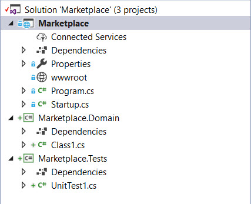

## Starting up the implementation

在本节中，我们将为领域模型创建一个新的项目。

由于我们计划实现一个 web 应用程序，我们将从一开始就考虑这个问题，并将使用一个 web application template 。我们还将为系统的不同部分分别创建项目，包括测试项目。

## Creating projects

我们将从一个空项目开始。您需要创建一个 .NET Core web application ，并且不要忘记启用 git ，这样它就可以保存您的更改历史记录。

解决方案应该如下面的截图所示：  

 
A glimpse of the solution structure

可以删除 wwwroot 和 Properties 文件夹、Class1.cs 和 UnitTest1.cs 文件 ，因为我们将从头开始创建新的类。

## The framework

我们需要在某个地方放置一些 *base class* 和 *interface*。你也许会争论这些东西是否有必要。Hello World 这样的简单项目当然不需要，但是，随着我们的深入，我们将需要创建更多的抽象。

另外，还需要一些操作 database、message bus、web server 的组件。根据 onion 架构原则，这些是 **适配器（adapter）**。之后，我们将为项目所需要的所有基础设施提供一组适配器。

你可能会问——我们要构建一个框架吗？框架不是被认为是邪恶的吗？不是应该避免吗？好吧，我们应该小心谨慎，为我们的领域对象和基础设施建立一套有用的抽象将大大有助于我们继续前进。另外，我们肯定需要构建一些适配器，尽管这些适配器可以在它们自己的库中分开，这些库将连接到我们的抽象（因此是端口和适配器），为了简单起见，我们将把这些东西大部分放在一个项目中，,这个项目将被称为 Marketplace.Framework 。如果您不喜欢 Framework 这个名称，您可以为这个项目选择任何其他名称，但在本书中，我们将大量引用它，所以我希望您不要感到困惑。

在本书结束时，这个框架中的大多数抽象和实现都是生产环境可用的。与第三方框架不同的是，您可以完全控制框架内部的内容及其工作方式，因此，即使您根本不喜欢框架，这也会让它变得不那么糟糕。

许多 DDD 从业者一直念叨着你不需要 DDD 框架，这在一定程度上是正确的，但是人们总是需要为他们的应用程序准备一些用来加速开发的基本工具。我们使用Microsoft 构建的 .net 框架，而不是为每个项目从头创建所有这些类。当我们在框架中拥有一组有用的抽象和组件时，我们就可以在其他项目中重用它或类似的东西，并完全控制它。

因此，要完成本部分，请向相同的解决方案添加一个 class library 项目。把这个新项目命名为 Marketplace.Framework 。