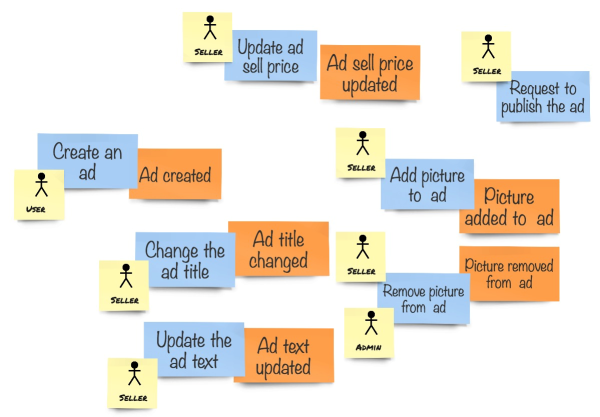
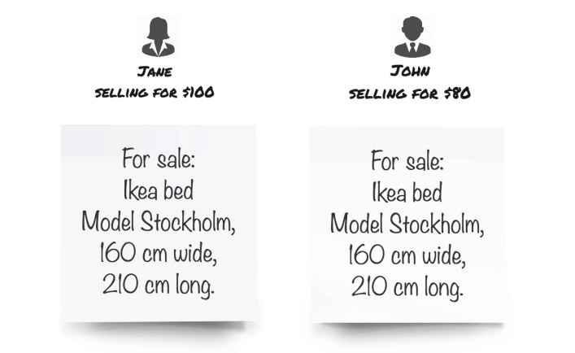

## Transferring the model to code

我们不是做 Hello World 的练习，所以暂时不会使用可执行项目。相反，我们将专注于编写 Marketplace.Domain 项目的内容，向 Marketplace.Framework 添加一些 class 和 interface ，以及编写测试。

首先，我们需要确定实现将基于哪些构建块。这些构建块通常被称为 Domain-Driven Design (DDD) 的战术模式，而不是 DDD 战略模式。有人甚至说，可以忽略战术模式而倾向于战略模式。虽然我同意 Ubiquitous Language 、Bounded Context 和 Context Map 是 DDD 的基本组成部分，但我仍然相信一些战术模式是有用的，可以为实现带来清晰和通用的语言。本书并不是 DDD 战术模式的集合，只在必要时使用相关概念来实现模型。

## Entities

让我们回到 EventStorming 会话环节，看看我们的部分模型，如下所示：

<center>The core domain modeled with sticky notes</center>

所有命令都是在一个被称为 **Classified Ad** 的东西上执行的。另外，如果你还记得那些与领域专家的对话，我们的团队成员在谈论业务和模型时经常提到这个术语。

主要是，我们这里有一个 *实体（entity）*。实体表示同一类型的唯一对象。除了 classified ad，我们可能还期望系统保存关于卖家和买家的信息，这些可能也是实体，而不仅仅是系统中的角色。这是因为我们需要识别这些人，所以我们需要一些特别的信息，比如用户名或电子邮件，以了解谁是谁。这同样适用于 classified ad。
想想一下 ad 像下面这样：

<center>Draft sketch of the user interface</center>

如果我们忽略销售员和价格，那么这两个广告就是一样的。但是，最可能的是，这是两个不同的物体。由于宜家的批量生产，很有可能会同时出售多个类似的物品，但对我们来说，这些物品是不同的。这是因为我们没有使用对象属性（如型号和大小）来确定两个对象是否相同。在我们的系统中，这些对象将在两个不同的 classified ad 中表示，并且具有不同的 *标识（identity）*。

### Identities

我们提到了用户名或电子邮件是系统中用户的身份标识，但是什么可以作为对象的 *标识（identity）* 呢？在现实生活中，许多物体已经被标识了。最常见的标识是产品序列号。智能手机、电视机、电脑和汽车等复杂对象具有唯一标识符，帮助制造商了解这些对象是以何种配置生产的，因此，他们可以提供更好的售后支持。此外，由于这类物品价格昂贵，它们通常被单独跟踪。

然而，对于我们的系统，大多数时候我们需要使用我们自己的 *标识*。实际上，**唯一重要的规则是所有实体都需要惟一标识**。获得这种标识的方式有很多，其中一些您可能已经熟悉了。现在获得惟一标识（稍后称为 **IDs**）最常用的方式是使用数据库的主键。这是因为大多数系统都是面向数据的，并且在设计时首先考虑了持久性。如果不将数据持久化到特定的数据库，这样的系统将无法工作。这样的方式至少有一个明确的优点——这样的 ID 通常是数字和自增的，因此，通过电话口授这样一个 ID 是很简单的。但是，最明显的缺点来自 ID 源——数据库必须存在才能获得这样的标识，即使稍后数据库正常运行了，系统也会决定不接受该对象并将其删除，因此它永远不会被持久化。多数经验丰富的开发人员都看到过这样奇怪的代码构造：将一个空的或假的行插入到某个表中以获得对象ID，然后需要用实际值填充或删除这样的行。这样的方式会产生一大堆问题，我们不会使用。

相反，我们将使用生成的惟一 IDs。因为我们不希望使用任何基础设施来创建 IDs，所以我们将使用一种可靠的方法和标识类型——**globally unique identifier(GUID)**，更常见的名称是 **universally unique identifier(UUID)**。这样的 ID 可以使用当前时间和计算机的一些信息来生成。这样的ID 全局唯一的可能性非常高。使用 guid ，我们便可以在构建任何基础设施之前为对象生成标识，例如，创建对仅存在于内存中的对象的引用。

### Classified ad entity

正如我们从 EventStorming 模型中了解到的，我们很可能需要一个实体来表示 classified ad 。这似乎是我们系统的核心概念之一。我们花了很多时间与领域专家讨论我们的模型，这个术语在对话中不断出现。这是一个很好的指示，说明我们已经确定了一些重要的领域概念，因为当一个命令导致一个事件时，会得到一个重复的模式，并且我们一直将 classified ad 作为一个对象。

实体在代码中表示为对象，因此，我们需要一个类，以便创建类的实例。下面是我们第一次尝试创建一个类来表示一个 classified ad ：
```csharp
namespace Marketplace.Domain
{
    public class ClassifiedAd
    {
        public Guid Id { get; private set; }

        private Guid _ownerId;
        private string _title;
        private string _text;
        private decimal _price;
    }
}
```

您可能对这个类感到困惑，并且质疑这样的实现是否正确。它看起来像一个属性包，这里与 **DTO** (data transfer object) 的唯一区别是这个类只有一个属性，其他所有细节都由私有字段表示。这个类可以编译，但是它实际上是不可用的，因为即使是单个公共属性也只能在类内部进行设置，但是我们没有公开任何这样做的方法。

然而，尽管这个实现毫无用处，但它展示了我们在进行下一步时需要牢记的两个基本原则。首先，所有实体都需要有一个ID，并且它必须能够从实体外部访问。其次，因为我们使用的是面向对象的语言，所以我们应该尽可能地进行封装，并保持内部的安全，最好是对外部世界不可见。

为了能够正确地实例化这个类，让我们创建一个构造函数，它至少允许我们设置实体 id：
```csharp
using System;
namespace Marketplace.Domain
{
    public class ClassifiedAd
    {
        public Guid Id { get; }

        public ClassifiedAd(Guid id)
        {
            if (id == default)
                throw new ArgumentException(
                    "Identity must be specified", nameof(id));

            Id = id;
        }
        
        private Guid _ownerId;
        private string _title;
        private string _text;
        private decimal _price;
        
    }
}
```
这里添加了以下内容：
* 因为只在构造函数中设置 Id 的值，所以可以将其设置为只读属性。
* 在创建 ClassifiedAd 实例时，必须提供 id，因为没有无参数的构造函数。
* 提供的 id 必须是有效的。否则，构造函数将抛出一个 argument exception 。

在这里，我们执行了这样的规则：实体只能通过一组有效的参数（目前只有一个）来创建，并且根据定义，创建的任何给定类型的实体都是合法的。您可能会担心，classified ad 没有一些可读的属性（如 title，price）实际上是不正确的，但这不是技术问题。业务上可能会认定这确实是一个有效的实体。

## Adding behavior

我们要做的下一件事是弄清楚我们可以告诉实体做什么。记住，我们需要先设计（和实现）*行为*。我们将这些*私有字段*添加到实体的唯一原因实际上是为了支持 *行为*。如前所述，在系统中执行的每个操作都修改了系统 *状态*，而那些私有字段仅表示该 *状态*。但是，再次强调，封装被强制执行，我们不允许在实体外部改变实体状态；如果对每个属性都实现 get set，那么这将把我们引向 CRUD 这个尘土飞扬的肮脏之地。让我们看看如何将生命注入实体：
```csharp
namespace Marketplace.Domain
{
    public class ClassifiedAd
    {
        public Guid Id { get; }

        public ClassifiedAd(Guid id)
        {
            if (id == default)
                throw new ArgumentException(
                    "Identity must be specified", nameof(id));

            Id = id;
        }

        public void SetTitle(string title) => _title = title;
        public void UpdateText(string text) => _text = text;
        public void UpdatePrice(decimal price) => _price = price;
    
        private Guid _ownerId;
        private string _title;
        private string _text;
        private decimal _price;
    }
}
```

我们添加了三个简单的方法，您可能会感到有些失望，因为它们都是 property setter 。但是，在这里我们所做的是要表达在代码中使用 Ubiquitous Language 的想法，并将单词从便利贴（在本例中是*命令*）转换为方法。

当然，这只是一个开始。在下一节中，我们将深入研究实体的实现，并找出表示行为的这些 *方法（method）* 是如何变得更加有用的。