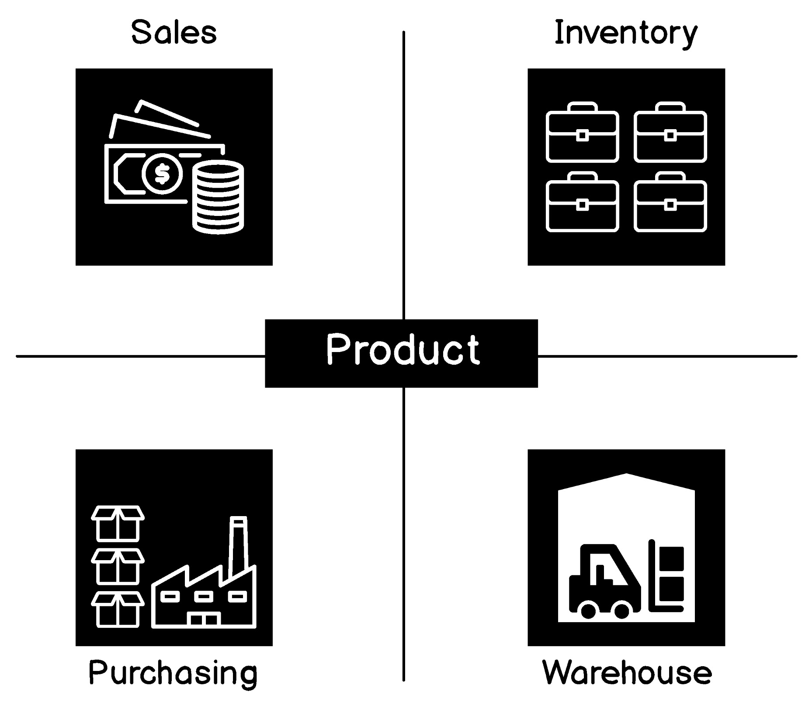
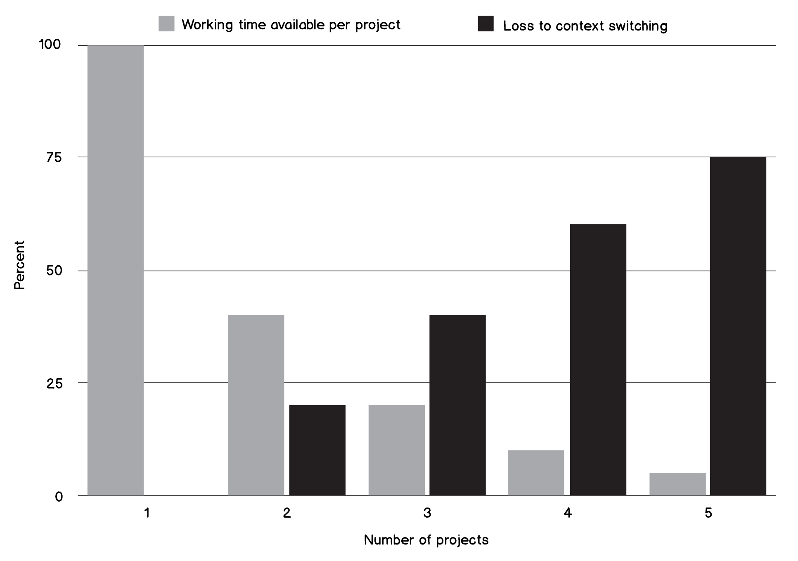

## Language and context

在本章的引言中，我们已经谈到了同一种语言的语言差异这个话题。同一种语言因为地域的不同，所以会产生不同的表述方式。我们之前用了英式英语和美式英语作为例子，当然，像这样的例子还有很多。比利时人说的荷兰语经常被称为一种独立的语言，佛兰德语，它听起来不同，这主要是因为日常物品和行为使用了不同的词汇。在一些专业的群体中，也可以观察到同样的情况，我们也看了一些例子。

给出的这些例子是为了说明定义单词的精确含义是多么重要。避免混淆确实是寻找和识别 Ubiquitous Language 的目标之一。

重要的是要认识到 Ubiquitous Language 只在一个上下文中有效。不同的上下文由不同的语言定义。认为 Ubiquitous Language 之所以被称为*ubiquitous*，是因为它是整个业务、组织或领域的单一语言，这是对 Ubiquitous Language 的一种误解。它无处不在，不是水平方向，而是垂直方向上的。每个上下文可能都有自己的语言，但是这个上下文中的所有层共享一种 Ubiquitous Language ——与业务、模型、代码、测试、UI概念、数据结构等共享。

来看一个经典的例子， Product 在 e-commerce 领域的不同上下文中是如何使用的：

Product in different contexts

虽然是在同一个领域中，但显然 Product 在每个确定的上下文中都有不同的含义：
* **Sales**：对销售人员来说，Product 意味着销售价格，可能还有利润。这是公司盈利的地方，Product 的其他特性并不那么重要。
* **Purchasing**：对于批发商来说，最感兴趣的是 Product 的价格，给定 Product 的供应商有多少库存，以及它们能多快交货。
* **Inventory**：这里主要感兴趣的是有多少现货。此上下文会预估进货日期，以防止缺货。还可以定义 Product 的一些内部属性，例如项目编号。
* **Warehouse**：它需要管理存储 Product 所需的空间，因此在这种情况下，人们需要知道 Product 批次何时到达、何时向客户发货、Product 如何包装以及它们存储在何处。

尽管有一个流行的术语，比如 **Product**，但是在同一个领域或组织中的不同部门又有各不同的表述，并且在它们的属性子集中拥有更深入的知识。

另一个例子是保险领域的术语**保单（policy）**。对于非保险行业从业者来说，它不太为人所知，但总的来说，我们知道保险推销员对钱和获得新客户最感兴趣。所以，对他们来说，*保单*意味着销售业绩。对于审批阶段来说，以汽车保险为例，*保单*意味着风险。即使在出售了*保单*之后，风险评估部门也有可能要求提供额外的文档，并在进行一些内部检查之后有可能拒绝接受该*保单*。最后，当涉及到处理现有*保单*上的索赔时，对于理赔处理部门来说，这是一笔成本，因为保险公司在赔钱。

这两个例子都表明，即使对于同一领域，语言也会发生不同的变化，有时甚至会发生显著的变化。如果我们在上下文中一直使用相同的意思，会发生什么?事情变得不那么明确了。歧义的程度随着每一个新的不能识别和分离的上下文的增加而增加。它导致模型不清晰，结果导致代码模糊，我们需要明确使用这个和那个词时的确切含义。

在一个工作环境中混合不同的上下文也会导致所谓的**上下文切换（context switching）**。在 *Quality Software Management: Systems Thinking* 一书中，Gerald Weinberg 提出，由于上下文切换，随着个人参与的项目数量的增加，会显著导致生产力的损失：

Productivity loss due to context switching

在当前任务中再增加一个项目意味着20%的生产力损失。因此，当上下文数量达到5个时，花在实际工作上的时间就会非常少。然后，大部分时间都花在了确定当前任务属于哪个上下文中。

这不仅对项目有效。根据经验，您可能知道，更大的项目中，泛化多于精确和明确，上下文切换现象同样会影响性能。在我们的 **Product** 示例中，如果我们要将产品的不同逻辑视图的所有属性放在一个地方，那么处理这样一个对象将涉及一些额外的工作——试图理解我们目前正在处理产品的哪个部分。因此，尽管这仍然是一件事，隐藏上下文切换和生产力将受到影响。

假设集中化和泛化是好的，许多软件系统创建了所谓的上帝类，比如 Customer 或 Product，它包含一个物理对象的所有可能视图的所有可能属性。除了上下文切换之外，这种方式还有更多的缺点。

其中的一个缺点是很明显的，在系统中此对象的特定生命周期中，并非所有属性都需要值。例如，被淘汰的 Product 不会有与销售相关的功能。但是由于所有属性都在一个类中，所以我们必须为所有这些属性赋空值。这种方式导致了高度的混乱，因为我们很难理解为什么这些属性是空的——要么是系统中出现了错误，要么这只是由于对象状态造成的典型情况。

另一个缺点是，这样的类不可避免地会吸引很多依赖项。您可能已经见过这样的一些数据模型，整个系统有一个大型SQL数据库，其中的表有许多交叉引用。可以想象，诸如 Product 可以通过 Order、ShoppingCart、Catalogue、Invoice、PurchaseInvoice、Return、CreditNote 等来引用。模型变得复杂，很难维护。有时，情况会变得更糟，因为引用依赖关系有时完全错误。例如，在过去的某个订单上显示更新的产品描述是不正确的。订单应该包含在购买产品时的快照。

已经有足够的理由促使我们在构建领域语言时要小心谨慎，不要抛离上下文。Ubiquitous Language 总是明确的、明确的和特定于上下文的。当感觉到或观察到单词的意思在系统的不同部分之间开始发生变化时，就应该有所警觉了，你可能已经跨越了上下文的界限。

**不要脱离上下文讨论用户（Context emerges when discussing users）**。开发人员喜欢把人当作用户。这个术语是如此的含糊，以至于当我们谈论用户时，几乎可以保证我们会在不同的上下文之间切换。

回到我们的示例（classified ads）领域，团队开发人员讨论了他们的用户会如何评价他们的交易。他们认为，如果人们能够给彼此打分，有助于在社区中建立信任，这将是非常有用的。在讨论中，他们中的一些人注意到，他们把 *用户、那些卖东西的人、卖方、那些买东西的人和买方* 这几个词交替使用。当使用通用术语 *用户* 时，几乎总是需要作解释：该用户在特定时刻扮演什么角色。与此同时，当他们将用户指定为买家和卖家时，没有歧义，也不需要进一步解释。

在注意到这一点之后，该小组意识到他们发现了 Ubiquitous Language 的新元素，并开始使用这些术语。这为在他们，在讨论模型和消除代码中的模糊性时节省了很多时间。

与此同时，在系统的认证授权部分将人划分为 *卖家* 和 *买家* 是没有任何意义的。这些只是 *用户*，他们可以登录到系统并做一些操作，比如更新他们的个人资料，而不用明确他们是要在网站上出售东西还是购买东西。这样之后，*用户* 这个词在认证授权这个领域是明确的。

后来，他们在为后台办公系统建模时，发现了 *用户* 一词也是有区别的。在那里，用户开始有角色，在他们确定这些角色并开始使用诸如 *管理员、助理和审查者* 等术语之后，歧义便不存在了。一个新的上下文被发现，并且为这个上下文产生了一个新的模型，这个上下文被单词的含义从其他上下文中分离了出来。