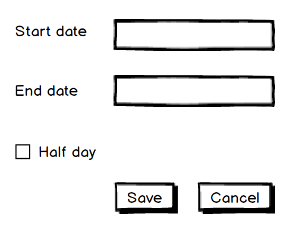

## Ubiquitous Language

DDD书籍的作者 Eric Evans 的网站位于 [https://www.domainlanguage.com/](https://www.domainlanguage.com/)，这并不是个巧合。DDD的基本概念，如 Ubiquitous Language 和 Bounded Context，的灵感是来自于语言的。对于那些还没有什么经验的软件开发人员来说，这可能听起来很奇怪，因为对于缺乏经验的开发人员来说，唯一重要的语言就是编程语言。我们学习编程通常是先学习一些概念，然后在实践中通过使用一种编程语言来应用这些概念。我们认为我们工作的本质就是把人类语言翻译成程序语言。一定程度上确实是这样的。然而，到目前为止，这还不是开发人员日常工作的基本部分。

两个人只有在使用相同的语言时才能互相理解。不一定要用口语；很可能是手语或音乐语言。但对话者需要对这一通用语言有相同的理解。否则，就会有麻烦。他们不仅需要说同一种语言，而且这种语言必须在一个上下文中。

在本节中，我们将深入探讨语言和上下文，这些概念对于软件项目的成功至关重要。

### Domain Language

几乎每个行业都发展出一种只有该行业的人才能完全理解的语言。其中一些词汇传播到了世界各地，比如汽车世界，这些词汇丰富了我们的语言，比如变速箱、点火开关、内燃机，甚至4S店。最后一个术语（4S店）在领域之外是不明确的。但一旦指定了这个领域，就会清楚，我们指的不是美容产品的精品店，也不是软件外包公司，而是汽车出现事故后维修的地方。

当然，汽车行业并不是唯一的。其他行业也发展了他们的术语，他们的语言对于外行人来说可能不那么为人所知，而且更加神秘。

当然是软件行业就是这样的一个例子。当两个程序员讨论一些相当复杂的系统的实现细节时，他们周围的非程序员不会理解其中的大部分内容，通常会感到无聊。缺乏理解总是导致缺乏兴趣：

<center>The world, as seen by a programmer (based on the original work by Manu Cornet)</center>

从某种意义上说，软件行业是独特的，因为它服务于任何其他行业，往往用来处理行业中的各种业务问题。现在几乎所有的行业都希望某种程度的自动化，这意味着需要软件。这也意味着业务人员会去找他们的开发人员或外部软件公司，试图用他们的语言来表达他们的问题。如果不能正确理解这种语言，就会出现问题。

功能需求由既不是业务人员也不是软件开发人员的专业人员编写，被视为软件成功的圣杯。软件交付后，客户不满意，我们归咎于需求。我们说，下一次，我们将写更好的需求和更详细的规格说明，并解释开发人员需要做的每一个小细节。当每个人都互相指责，没有人愿意为任何事情负责的时候，很快我们就会互相踢皮球，没完没了。

除了在第1章中讨论过的，*Why Domain-Driven Design?（What went wrong with requirements? 这一小节里）*，另一个值得一提的就是语言。需求不仅关注解决方案和隐藏的问题，而且还倾向于将业务语言**转换**为更技术的语言，这被视为**对开发人员友好**。实际上，这更像是一台坏了的电话。传输线上增加的翻译水平越高，到达接收者而不受到难以辨认的干扰的相关信息就越少。

这种*翻译*的另一个影响是，它减缓了相互间的交流。如果开发人员需要从业务部门获得更多信息，但在他们发言时却不能理解业务部门的意思，那么就不可避免地需要翻译人员的参与。通常，这些翻译人员与编写需求的是同一个，但并不总是如此。我已经听过很多这样的例子：只有架构师才被允许与客户交谈；然后，他们将自己的理解转化为业务分析人员，业务分析人员将需求最后抛给可怜的开发人员，然后在转换过程中迷失了方向。

这就是为什么对于那些致力于为真正的业务问题创建一个好的解决方案的人来说，理解业务是非常重要的。不需要翻译就能理解业务，沟通，不仅缩短了沟通时间，而且大大提高了沟通的质量。

与此同时，我们都知道，通常扮演客户角色的业务人员总体上要比我们希望的少得多。为了使系统执行它应该执行的操作，最终你可能只需要与真正掌握关键信息的人进行几次会话，就可以获得你需要的信息。有时他们不愿意与开发人员进行讨论。这可能与一些个人问题、过去的负面经历或害怕自己像个傻子似的对牛弹琴。

在这种情况下，如果能有一个非常敬业的、受企业信任的、能说他们的语言的人，会很有帮助。我们的目标是确保这个人也受到开发团队的信任。您可以将此角色称为业务分析师或产品负责人，这其实并不重要。我所认识的这个职位上最优秀的人都能够用他们的语言与每个人交谈，就像世界领导人背后的高级翻译，能够精准的将一种语言翻译成另一种语言。与此同时，最好的办法仍然是完全避免这样的翻译。

例如，London City 的银行家们因聘用那些已经接触过银行业、理想情况下曾在金融城工作过的开发商而臭名昭著。他们重视自己的时间，希望缩短花在交流和讨论上的时间。因此，对于这些银行家们来说，那些接触过他们的语言，并且对他们的业务和语言表现出相当程度的理解的人，会比，那些可能是更好的开发人员，但在真正开始工作之前，需要接受培训并了解他们的语言的人来说更有价值。

同一个词汇在行业内可能是个术语，但是在日常用语中又有一个完全不同的意思。下面是上述金融领域的一些例子：
* **Call**：这是看涨期权的简称，是对贷款或未付资本的支付要求。
* **Security**：用于证明与可交易衍生品有关的信用、产权或股票或债券的所有权。
* **Swap**：在两个借款人中，如果他们每个人都能获得所需的资金，或者将固定利率改为浮动利率，就被视为互换。

学习领域语言，对于在领域专家和开发人员之间建立有效的沟通至关重要。

### Sample application domain

在本书中，将开发一个示例程序来实践我们所获得的知识和技能。本节中，将简述一下业务领域，本书的后面会添加更多细节。

我们要做的领域是，个人在网上卖东西。我们将构建一个应用程序来发布分类广告以及支持此类活动可能需要的一些东西。

如果你还不熟悉这些术语，想想你的储藏室或地下室里的一堆东西，你想要把它们搬走。你可以在网上发布一个小广告，其他人可能会购买你不再需要的东西。你也可以免费赠送。像是淘宝一样。

### Making implicit explicit

当我们开始开发一个新系统时，需要学习很多东西。我们在第一章讨论了和无知相关的悖论。你可能还记得，无知的最高层次，也就是知识的最低层次，是当我们对未来的系统做出很多决策的时候。

我们不仅要忍受对业务领域知识的缺乏，还被迫在一个高度模糊的环境中工作。在学习领域语言之前，我们基于假设来理解领域。

设想这样一种情况，在项目开始时，您与领域专家开会。领域专家试图解释他们的问题，而你慢慢地开始学习他们的语言，在某个时候，你认为你有了想法，或多或少知道该做什么。这里，重要的是要记住在前一章讨论过的认知偏见及其对决策的影响。第一个也是最明显的风险是——**你看到的就是全部（what you see is all there is (WYSIATI)）**，或可用性启发式。你把你有限的知识运用到过去的经验中，然后觉得自己已经理解了领域专家们的问题。在这一点上，我们通常被要求做出估计，但逻辑上我们失败了，因为偏见欺骗了我们的头脑，给了我们理解的错觉。这时，我们被要求对项目做评估，从而导致项目失败，因为偏见欺骗了我们的大脑，让我们有了已经理解了问题的错觉。


在这样的会议上，我们经常会达成一致意见。然后，每个人都离开房间直到再次见面，也许在几周后讨论一些规格说明甚至原型。随着时间的流逝，我们仍然在同一间屋子里，没有人高兴，因为我们发现我们在完全不同的事情上达成了一致，这让我们彼此不满。每个人心中都有一幅画，而所有的画都不一样。

<center>We agree on different things if we don't visualize</center>

人们会花几个小时来争论他们认为不同但其实是一样的事情。
人们也会在一些他们没有共同理解的事情上达成一致，而这永远不会顺利进行。

要解决这个问题，我们需要去除假设。需要把*隐式的（implicit）*变成*显式的（explicit）*。

看看这个来自现实生活中的人力资源管理系统的示例表单。在这里，员工可以请病假：

<center>Sick leave registration form</center>

这时一个很典型的表单，它是由程序员创建的。我们甚至可以设想有一个SQL表用来存储表单中的数据。SQL表可能会有 StartDate、EndDate 和 HalfDay 列以及员工 id 。注意这里还有一个 Save 按钮，在这样的表单中很常见。

尽管这个表单看起来好像不错，但最好还是想一下我们究竟看到了什么。在花费了一些时间分析这个表单之后，可以看到以下问题：
* **Start date** 不明确。它可能是病假登记的日期，也可能是员工因为生病而不来上班的日期。
* **End date** 也不明确。它可能代表病假的最后一天，或者员工回到工作岗位的那天。
* **Half day** 可能应用于以上两个字段，但没有明确的指示它意味着什么。
* **Save** 按钮没有告诉我们接下来会发生什么。也许只会在表中增加一条记录，我们需要告诉其他人查看它，或者可能有一个自动启动的审批流程。员工填写完表格后是否需要打电话或发送电子邮件给经理？

如您所见，即使在这样一个只有两个字段、一个复选框和两个按钮的小表单中，也有许多内容是隐式的。所有那些隐式的和模糊的概念也将在代码中体现。SQL表中的列，域模型类、数据模型对象和其他代码构件中的所有属性都是隐式的。每件事都需要一个解释，比如*这个日期指的是员工回来工作的日子*，如果没有这样一个解释，最终的结果可能是完全错误的。

同另一个例子来比较，这个例子也是来自于一个真实的人力资源管理系统，假设这时竞争对手做的：

<center>The sick leave registration form that makes sense</center>

在这个表单中，字段对于普通人来说更有意义，因为他们不需要去阅读帮助文档来理解在这些字段中输入什么。第一个例子中*隐式的*东西在这里是*显式的*。每件事都有更好的含义。我们也可以想象，实现的代码：
```csharp
SickLeaveApplication.Handle(new SendSickLeaveForApproval
{
    EmployeeId = context.User.EmployeeId,
    DateRegistered = request.DateRegistered,
    FirstDayNotAtWork = request.FirstDayNotAtWork,
    LeftDuringWorkday = request.LeftDuringWorkday,
    CameBackToWork = request.CameBackToWork,
    CameBackAfterLunch = request.CameBackAfterLunch
});
```

此代码表示出与用户界面相同的含义和术语。因此，不仅最终用户可以轻松地填写此表单，而且其他开发人员也会很乐意阅读此代码，其中意图清楚地表达了出来，所有概念都很明确。

将隐式转换为显式的另一个方式是，使用代码表达领域中的概念。上面的代码中，SendSickLeaveForApproval command 描述了一个精确的领域概念。

### Domain language for classified ads

程序员正在讨论发布分类广告（classified ads）的流程。首先完成了创建的过程，然后是发布的流程。程序员和域名专家一起讨论后发现，广告不能立即发布，因为广告可能包含恶意内容。他们决定加入一些审批流程，在用户点击发布之后，广告才可以在网站看到。

开发人员很快决定为他们的 ClassifiedAd domain class 创建一个 property ，称为 Status 。它应该是一个 enum ，表示审查和发布过程中的不同阶段。它还可以用于将来未知的状态。开发人员希望在域模型中有行为，所以他们向 class 中添加了 UpdateStatus method，它看起来像这样：
```csharp
public class ClassifiedAd
{
    private ClassifiedAdStatus _status;
    public void UpdateStatus(ClassifiedAdStatus newStatus)
    {
        _status = newStatus;
        DomainEvents.Publish(
        new ClassifiedAdStatusUpdated(_id, newStatus));
    }
}
```

该方法也发布了一个域事件，系统的其他部分可以订阅该事件并执行其他一些重要的操作。

<blockquote><p>
<font size=5>❗</font>&nbsp;&nbsp;&nbsp;在本书的后面，我们将花更多的时间来讨论 domain events and commands。此刻，示例代码中使用的 event，与我们在 EventStorming 章节中使用的事件和命令非常相似。
</p></blockquote>

因此，在用户单击 **Publish** 之后，将发生以下情况：
```csharp
ad.UpdateStatus(ClassifiedAdStatus.Published);
```
审查完成后，广告将被激活，像这样：
```csharp
ad.UpdateStatus(ClassifiedAdStatus.Activated);
```
似乎这是可以接受的。ClassifiedAd class 是一个状态机，其中该 class 的实例在 ad 的生命周期中从一个状态转移到另一个状态。然而，原本的意图却丢失了。我们的语言变得有点奇怪——不是说我们要发布广告吗，怎么变成更新状态了。说好的激活广告，也变成了再次更新状态！

即使在系统中添加了更多的行为之后，一切似乎都能正常工作，代码是这样的：
```csharp
public void UpdateStatus(ClassifiedAdStatus newStatus)
{
    if (newStatus == ClassifiedAdStatus.Published
        && (string.IsNullOrEmpty(_title)
        || _price == 0 || string.IsNullOrEmpty(_text))
        throw new DomainException("Ad can't be activated because some mandatory fields are empty");

    if (newStatus == ClassifiedAdStatus.Activated
        && _status == ClassifiedAdStatus.ViolationReported)
        throw new DomainException("Reported ads can't be activated");

    if (newStatus == ClassifiedAdStatus.Deactivated
        && _status != ClassifiedAdStatus.ViolationReported)
        throw new DomainException("Only a reported ad can be deactivated");

    _status = newStatus;
    DomainEvents.Publish(new AdStatusUpdated(newStatus));
}
```

一个简单的方法中承担了太多的责任，这不是我们期望的，并且这个方法中的逻辑块之间几乎没有关联。当涉及到域事件处理时，情况变得更糟了：
```csharp
public void Handle(ClassifiedAdStatusUpdated @event)
{
    // controlling the ad visibility based on it's reported status
    if (_status == ClassifiedAdStatus.ViolationReported
        && @event.Status == ClassifiedAdStatus.MaliciousContentDetected)
        CommandDispatcher.Send(new UpdateAdVisibility(@event.Id, false));
}
```
流控制操作符的数量在增长，现在大多数行为都是由状态的更新所驱动的，最开始的时候，这种更新被认为是对域对象的单个属性的小而简洁的操作。而此刻，更新操作的变得越来越复杂，每个调用都需要小心控制以避免副作用。在添加新特性时破坏现有行为的风险现在是真实存在的。

与领域专家的讨论也失去了意义。原本我们使用的话术是： *如果发现恶意内容，我们会隐藏广告并通知审核组*，现在却变成了： *查询状态等于 MaliciousContentDetected 的所有广告*，*并使用通知服务向所有拥有审核权的用户发送消息*。领域语言所表达的意义被乱杂的技术上名词所掩盖，混杂着一些笼统的词，如 **status** 和 **message**。

团队决定重构代码并使用正确的领域语言。以下代码表达的他们的想法：
```csharp
public class ClassifiedAd
{
    private ClassifiedAdStatus _status;
    public void Publish()
    {
        _status = ClassifiedAdStatus.Published;
        DomainEvents.Publish(new ClassifiedAdPublished(_id));
    }
}
```
将域事件处理重构为如下内容：
```csharp
public void Handle(ClassifiedAdPublished @event) =>
    CommandDispatcher.Send(new ShowClassifiedAd(@event.Id));    
```
然后，为了处理带有恶意内容的情况，可以编写新的事件处理程序：
```csharp
public void ReportViolation(User reportedBy, string reason)
{
    _violationReports.Add(reportedBy, reason);
    DomainEvents.Publish(new ViolationReported(reportedBy, reason));
}

public void Handle(ViolationReported @even) =>
    CommandDispatcher.Send(new InformModerators(@event.Id, @event.Reason));

public void Handle(MalicionsAdDetected @event) =>
    CommandDispatcher.Send(new InformModerators(@event.Id, @event.Reason));
```

这个小示例还表明，不能通过使用一个名词词汇表来构建领域语言。存在着一种误解，这就是将大量的名词收集到一个列表中，并将其称为领域语言。使用名词词汇表通常会导致贫血模型的问题，这被认为是一种反模式。贫血模型中的类只有属性，属性总是用名词来命名。但是每个领域中同样重要的部分是行为。名词表示操作的是哪个领域，而动词则描述正在进行的操作。如果没有动词，当属性值在没有任何特殊原因的情况下改变时，我们的领域看起来像是一组魔术，不可预测。我们前面的代码通过引入动词作为领域语言的一部分，清楚地表达了领域行为。这些动词是精确的，显示了意图，并描述行为。这些动词是命令式的，在描述历史（当我们从代码中发布域事件时）时使用过去时态。

前面的例子中，我们不仅改进了代码，并且更好地理解了要解决的问题和包含的概念，而且我们还发现了一些新的术语和概念，这些术语和概念将使我们的领域模型受益。我们可以在与领域专家交谈时开始使用这些术语，看看他们是否理解它。有时，领域专家可能会用奇怪的眼神看着开发人员，试图理解这些专家的兴奋之情，因为专家们早已知道了这些新概念——它是他们语言的一部分，但是这些新概念却从来没有在业务人员和开发人员的对话中表达出来过。这些突破不仅使代码更好、更接近实际的业务模型，而且还改善了开发人员和领域专家之间的交流。

通过将隐式的转换为显式的，我们不仅发现了代码中缺失的概念，而且还将它们放入到了领域模型中。这部分非常重要，因为该语言在整个模型范围内使用——业务模型和心智模型、概念模型和可视化模型，以及图表和代码中的领域模型。我们把这种，跨系统中的多个部分使用相同概念和相同的语言的模式，称为**Ubiquitous Language**。