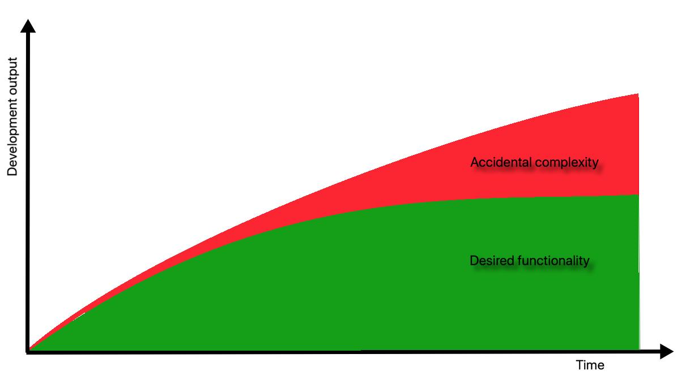
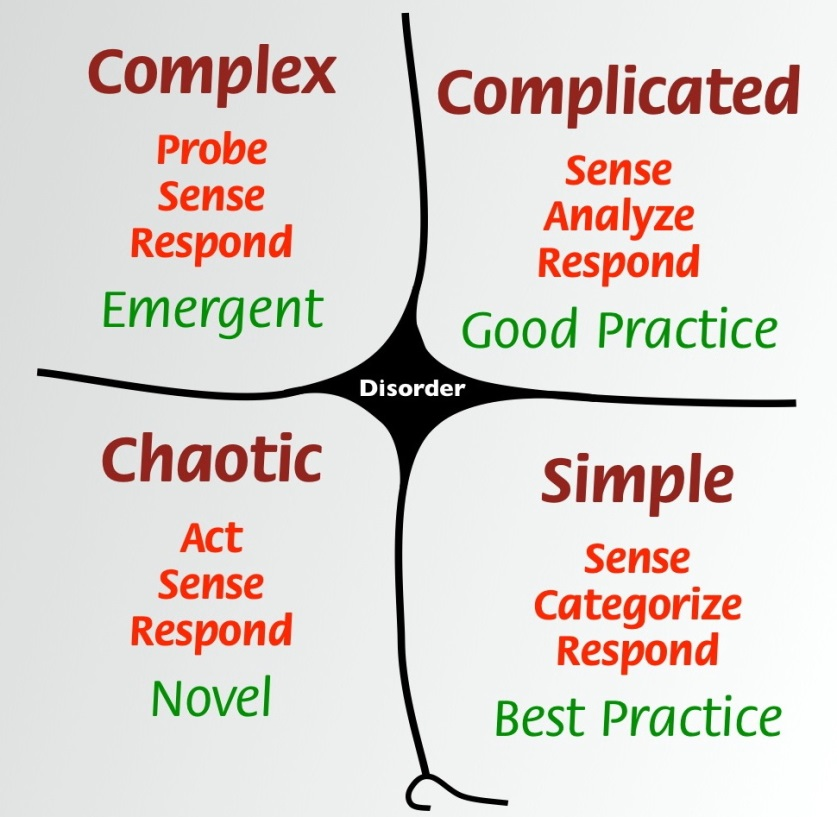
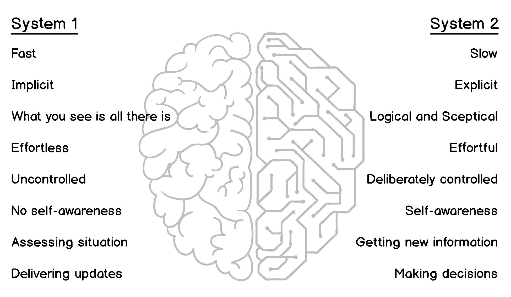

## Dealing with complexity

在写关于复杂性的文章之前，我试图为这个词本身找到一些奇特的、引人注目的定义，但它本身似乎是一项复杂的任务。韦氏词典将**复杂性**定义为复杂的质量或状态，这个定义很显而易见，甚至听起来很傻。因此，我们需要更深入地研究这个主题，并对复杂性有更多的了解。

在软件领域，复杂性的概念与现实世界并没有太大区别。大多数软件都是为处理现实世界的问题而编写的。这些问题听起来可能很简单，但本质上却是复杂的，甚至是邪恶的。毫无疑问，问题空间的复杂性会在试图解决这类问题的软件中体现出来。因此，意识到我们在创建软件时所处理的复杂性就变得非常重要。

### Types of complexity

1986年，图灵奖获得者 Fred Brooks 写了一篇名为 *“No Silver Bullet – Essence and Accident in Software Engineering"* 的论文，在文中他对复杂性的两种类型进行了区分——本质复杂性和意外复杂性（essential and accidental）。本质复杂性来自于领域，来自于问题本身，如果不减少问题的范围，就不能消除它。相反，意外复杂性是由解决方案本身带来的——这可以是一个框架、数据库或其他一些基础设施，具有不同类型的优化和集成。

Brooks 认为，当软件行业变得更加成熟时，意外复杂性将大大降低。高级编程语言和有效的工具为程序员提供了更多的时间来处理业务问题。然而，如你所见，30多年后的今天，该行业仍在努力与意外复杂性作斗争。事实上，我们已经拥有了强大的工具，但是大多数工具都需要花费时间来学习工具本身。每年都会出现新的JavaScript框架，每个框架都不一样，所以在编写有用的代码之前，我们需要学习如何高效地使用所选的框架。多年前我写了一些JavaScript代码，我把Angular看作是一种恩赐，直到我意识到我花在与它斗争上的时间比写任何有意义的东西的时间都多。或者，举一个容器的例子，它为我们提供一种简单的方式来独立地托管我们的应用程序，而不需要为物理或虚拟机而烦恼。但后来我们又需要 orchestrator 来编排容器，我们得到了一些，花时间学习如何使用它们，直到我们得到Kubernetes来管理它们，现在我们花更多的时间编写YAML文件，而不是实际的代码。我们将在下一节讨论造成这种现象的一些可能的原因。

您可能注意到，本质复杂性与问题空间有很强的关系，而意外复杂性则倾向于解决方案空间。然而，我们得到的对问题的陈述经常似乎比问题本身更复杂。通常，这是由于我们前面讨论过的将问题与解决方案混在一起，或者由于缺乏理解而造成的。

Gojko Adžić，是一位软件交付顾问，著有一些有影响力的书，如：*Specification by Example and Impact Mapping*，在他的研讨会举了个例子：
> 一家 SaaS 公司收到了一个要求实时提供特定报告的功能请求，这在以前是按计划每月执行一次的。经过几个月的开发，销售人员试图获得预计的交付日期。开发部门随后报告说，该功能至少还需要6个月的时间才能交付，总成本约为100万英镑。这是因为该报告的数据源位于事务数据库中，实时运行它将意味着显著的性能下降，因此需要额外的措施，如数据复制、地理分布和分片。
>
> 该公司随后决定分析需要此功能的客户的实际需求。结果是，客户希望执行与以前相同的操作，但他们希望每周执行，而不是每月执行。当问到对整个特性的期望结果时，客户说，每周批量运行一次相同的报告就可以解决问题。与重新设计整个系统相比，重新调度数据库作业要简单得多，而对最终客户的影响是相同的。

这个例子清楚地表明，不理解问题可能会导致严重的后果。作为开发者，我们喜欢 DRY 这样的原则。我们寻求使我们的代码更优雅和简洁的抽象。然而，这通常是完全没有必要的。有时我们会陷入使用某些工具或框架的陷阱，这些工具或框架声称可以轻松解决世界上的所有问题。作为一名.NET开发人员，当我看到当前社区中对依赖注入的痴迷时，我就能清楚地看到这一点。

的确，微软最终做出了一个有意义的DI容器，但当我看到它被用于一个小控制台应用程序来仅仅只是初始化日志程序时，我很不高兴。有时候，为了满足工具、框架和环境而编写的代码比交付实际有价值的代码要多。在这个例子中，看似基本的复杂性被证明是一种浪费:

Complexity growth over time

上面的图表显示，随着系统复杂性的不断增长，本质复杂性被推低，而意外复杂性取而代之。您可能会怀疑，当所需的功能几乎完全满足时，意外复杂性会随着时间的推移而不断增长。这是怎么发生的，我们肯定不能将时间只用在创造更多的意外复杂性上？当系统变得更加重要时，需要做很多工作来使系统作为一个整体工作并管理大型数据模型(大型系统往往具有这些模型)。支持性代码不断增长，并且花费了大量的精力来保持系统的运行。又会使用 cache, optimize queries, split and merge databases, the list 等等。最后，我们实际上可能会决定缩小所需功能的范围，只是为了让系统在没有太多故障的情况下运行。

DDD 帮助您专注于解决复杂的领域问题，并集中于本质复杂性。当然，使用新的花哨的前端工具或使用云文档数据库是很有趣的。但如果不理解要解决的问题，这一切都可能是白费功夫。对于任何企业来说，首先获得一些有用的东西并进行尝试，比获得一个完全没有抓住重点的完美的最先进的软件更有价值。为此，DDD 提供了一些有用的技术来管理复杂性，方法是将系统分解为更小的部分，并使这些部分专注于解决一组相关问题。本书后面将介绍这些技术。

处理复杂性时的经验法则是——理解本质复杂性，或者也可以称之为领域复杂性，并消除或减少意外复杂性。作为开发人员，您的目标是不要产生太多的意外复杂性。因此，意外复杂性往往是由过度工程化引起的。

### Categorizing complexity

在处理问题时，我们并不总是知道这些问题是否复杂。如果是复杂的，有多复杂?有没有衡量复杂性的工具?如果存在，那么在开始解决问题之前，对问题的复杂性进行评估，或者至少对其进行分类，将是有益的。这种度量还将有助于调节解决方案的复杂性，因为复杂的问题也需要复杂的解决方案，这一规则很少有例外。如果你不同意，我们将在下一节深入讨论这个话题。

2007年，Dave Snowden 和 Mary Boone 在《Harvard Business Review》上发表了一篇名为《A Leader’s Framework for Decision Making》的论文。该论文获得了 Academy of Management's Organizational Behavior 部门 颁发的 **Outstanding Practitioner-Oriented Publication in OB** 这一奖项。它有什么独特之处?它描述的是哪个框架?

框架是**Cynefin**。这个词是威尔士语，意思是栖息地，习惯，熟悉。1999年，斯诺登在IBM工作时就开始从事这方面的工作。这项工作非常有价值，IBM因此建立了组织复杂性中心(Cynefin Center)，戴夫·斯诺登(Dave Snowden)是该中心的创始人和主管。

Cynefin将所有问题分为五类。通过描述属于每个领域的问题的属性，它为任何给定的问题提供了位置感。在将问题分类到其中一个领域后，Cynefin 还提供了一些处理这类问题的实用方法:  

Cynefin framework, image by Dave Snowden

这五个领域具有特定的特征，框架为每个领域提供了属性，确定了您的问题属于哪个领域，以及需要如何解决问题。

**第一个领域是 Simple, or Obvious** 。在这里，您的问题可以描述为 *已知风险（known knowns）*，其中有最佳实践和一套已建立的规则，并且在原因和结果之间存在直接联系。这个领域的操作顺序是 *sense-categorize-response* —— Establish facts(sense)，identify processes and rules (categorize)，and execute them (response)。

然而，斯诺登警告说，人们有把问题错误地归类为 *simple* 的倾向。他列举了三种情况:
* **简化（Oversimplification）**：这与下面部分描述的一些认知偏差有关。
* **成见（Entrained thinking）**：当人们盲目地使用他们在过去获得的技能和经验，从而对新的思维方式视而不见时。
* **自满（Complacency）**：当事情进展顺利时，人们往往会放松，高估自己应对变化世界的能力。这种情况的危险在于，当一个问题被归类为简单问题时，它可能会由于未能充分评估风险而迅速升级为混乱的领域。请注意图表底部从简单到混沌的快捷方式，这经常被那些研究框架的人所忽略。

对于这本书来说，重要的是要记住两件事:
* 如果您认为问题是显而易见的，那么您可能不想建立一个复杂的解决方案，甚至可能会考虑购买一些现成的软件来解决问题(如果需要任何软件的话)。
* 但是，要注意，错误地对该领域中更复杂的问题进行分类，会导致使用错误的最佳实践，为了避免这种情况需要行更彻底的探索和研究。

**第二个领域是 Complicated**。在这里，您会发现需要专门知识和技能才能找到问题的因果关系，因为对这些问题没有单一的答案。这些是 *可预测风险（known unknowns）* 。这个领域的操作顺序是 *sense-analyze-respond* 。正如我们所看到的，*analyze* 取代了 *categorize*，因为在这个领域中没有事实明确的分类。需要进行适当的分析，以确定应采用哪种良好实践。在这里也可以进行分类，但您还需要进行更多的选择并分析后果。这就需要经验。工程问题通常属于这一类，其中一个清晰易理解的问题需要成熟的技术解决方案。

在这个领域中，分配优质的人员预先做一些设计，然后执行实现是非常有意义的。当进行了彻底的分析后，实现时失败的风险就很低了。在这里，将 DDD 模式应用于战略和战术设计以及实现是有意义的，可能可以在这里避免探索更高级的技术，比如：EventStorming。此外，如果你彻底理解了问题，你可以花更少的时间在学习知识上。

**Cynefin 中的第三个复杂度域是 Complex**。在这里，我们遇到了一些以前没有人做过的事情。即使是粗略的估计也是不可能的。有些行为很难在事前预测，我们只能在事后发现这些行为所造成的影响。这个领域的操作顺序是 *probe-sense-respond* 。这里的问题没有正确的答案，也没有可以依赖的实践经验。以前的经验无济于事。这些是 *不可预测风险（unknown unknowns）* ，这是能够产生新技术的地方。在这里，我们将找核心领域，概念，我们将在书的后面讨论。

复杂领域的行动过程是由实验和原型主导的。因为我们不知道它将如何工作，也不知道世界将如何对我们所做的事情作出反应，所以预先创建一个大的设计是很没有意义的。这里的工作需要在小的迭代中完成，并有连续和密集的反馈。

能够快速响应更改的高级建模和实现技术非常适合这个领域。特别的，在这个 complex 领域中使用 EventStorming 建模和 event-sourcing 做具体实现是非常常见的。详尽的战略设计是必要的，但是在做原型时，可以安全地忽略DDD的一些战术模式，以节省时间。然而，event-sourcing 可能是你最好的朋友。EventStorming 和 event-sourcing 在本书的后面都有描述。

**第四个领域是 Chaotic**。这是地狱之火燃烧的地方，也是地球自转速度超过预期的地方。没人想待在这里。这里适当的动作是 *act-sense-respond*，因为没有时间出现在峰值。这可能不是使用DDD的最佳位置，因为在这个阶段没有时间或预算用于任何类型的设计。

**第五个领域是 Disorder**，在正中间。其原因是，在这个阶段，不清楚哪个复杂性上下文适用于这种情况。摆脱混乱的唯一方法是尝试将问题分解为更小的部分，然后将这些小部分分类为这四个复杂性上下文，然后相应地处理它们。

这只是对复杂性分类的一个简要概述。它还有更多内容，我希望您去搜寻关于这个主题的示例、视频和文章。这正是我将其引入的原因，所以现在请随意停止阅读并进一步探索关于复杂性3的话题。对于这本书来说，最重要的结果是DDD几乎可以应用到任何地方，但是在 *Simple* 和 *Chaotic* 这两个复杂性领域里它几乎没有用处。在设计复杂的系统时，针对 *complicated* 和 *complex* 这两个复杂性领域，使用 EventStorming 作为一种设计技术，并且使用 event-sourcing 来做具体的实现，是很有益处的。

### Decision making and biases

人类的大脑每秒钟都要处理大量的信息。我们大部分的日常生活都是这样的。大脑活动的其他区域包括思考、学习和决策。与自动化操作相比，这些操作的执行速度要慢得多，并且需要更多的能量。

心理学中的双重过程理论表明，这两种类型的大脑活动实际上是完全不同的，两种思维有两种不同的过程。一个是内隐的，自动的，无意识的过程，另一个是外显的意识过程。无意识过程是长期形成的，也是很难改变的，因为要改变这样一个过程就需要养成一种新的习惯，而这不是一件容易的事情。然而，意识过程可以通过逻辑推理和教育来改变。

这些过程共存于一个大脑中，但它们的运作方式却截然不同。Keith Stanovich 和 Richard West 创造了“隐式系统”或“系统1”、“外显系统”或“系统2”。Daniel Kahneman 在他的获奖著作《hinking Fast and Slow》中为每个系统指定了几个属性:

System 1 and System 2

这一切与DDD有什么关系？这里的重点是我们如何做决策。科学证明，所有的人都带有偏见意识。作为开发人员，我们有自己的方式来解决技术问题，当然，当我们的方式受到挑战时，我们已经准备好开始反抗了。在另一方面,我们的客户也偏向他们的方式来看待问题。我想说的是，我们应该努力减少自己的偏见，更开放地接受他人的建议，但不要陷入他人偏见的陷阱。

Cynefin复杂性模型要求我们至少对我们在问题空间(有时也在解决方案空间)中处理的复杂性进行分类。但要划分正确的类别，需要做很多决策，通常让 System
1 根据我们的偏见意识和过去的经验做出反应和假设，而不是让 System 2 做推理和思考。当然，我们都遇到过这样同事大喊着: yeah, that' t easy! 甚至在你描述完问题之前。我们也经常看到人们组织没完没了的会议和电话会议来讨论一些我们认为可以直接做出决策的事情。

认知偏差在这里起着至关重要的作用。有些偏见会深刻地影响决策，这是 System 1 所定义的说法。以下这些偏见意识可能会影响你对系统的设计:

* **选择支持性偏差（Choice-supportive bias）**：如果你选择了某样东西，你会对这个选择保持积极的态度，即使它可能已经被证明含有明显的缺陷。通常情况下，当我们提出第一个模型并试图不惜一切代价坚持使用它时，这种情况就会发生，即使很明显该模型不是最佳的，需要进行更改时。此外，当选择使用某种技术（如数据库或框架）时，可以明显的感觉到这种偏见意识。
* **确认偏差（Confirmation bias）**：与前一个非常相似，确认偏差使你只听到支持你的选择或立场的论点，而忽略那些与支持你选择的论点相矛盾的论点，尽管这些论点可能表明你的观点是错误的。
* **从众效应（Band-wagon effect）**：当屋子里的大多数人都同意一件事时，这件事开始对之前不同意的少数人产生影响。如果抛开有趣的 System 2，大多数人的意见在没有任何客观理由的情况下将获得更多的信任。记住，大多数人的决定并不是默认的最佳选择!
* **过度自信（Overconfidence）**：人们往往对自己的能力过于自信。这种偏见可能会导致他们冒更大的风险，做出完全基于自己的观点而没有客观依据的错误决定。最明显的例子是估算过程。人们总是低估而不是高估他们将要花费在一个问题上的时间和精力。
* **可得性启发（Availability heuristic）**：我们所拥有的信息并不总是所能得到的关于一个特定问题的全部信息。人们倾向于只根据手头的信息来做决定，而不去尝试获得更多的细节。这常常导致对领域问题的过度简化和低估基本复杂性。当我们在做技术决策时，这种启发式也会欺骗我们，在没有分析需求的情况下选择过去一直有效的技术，然而这些需求可能比我们选择的技术所能处理的问题要更复杂。

了解我们的决策过程是如何运作的，难以评价这些知识的重要性。引用的书籍中包含了更多关于人类行为和对我们认知能力有负面影响的各种因素的信息。我们需要记住的是切换到 System 2 以便做出更好的决定，而不是基于情绪和偏见。