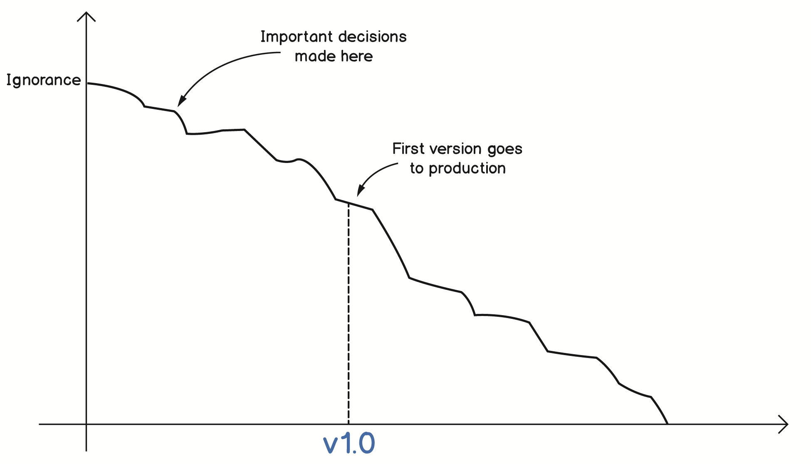

## Knowledge

许多初级开发人员倾向于认为软件开发只是编写代码，当他们在编码方面更有经验，了解了更多IDE的快捷方式，并熟记框架和库时，他们将成为忍者级开发人员，能够在几天内编写Instagram之类的东西。

然而，现实却截然不同。事实上，在获得一些经验之后，在有意的花几个月甚至几年时间向不可能的和不现实的目标前进之后，人们通常会放慢速度。他们开始明白，在收到需求规范后立即编写代码可能不是个好主意。如果您阅读了前面的所有章节，或许你可能已经知道出现这种情况的原因了。沉迷于解决方案而不是理解问题，忽视本质复杂性并遵从偏见——当我们开发软件时，所有这些因素都会影响我们。一旦我们从自己的错误（最好是从别人的错误）中获得更多的经验和教训，就会意识到编写有用的、有价值的软件最关键的部分是如何获得和理解问题空间的知识，我们以此为基础来构建解决方案。

### Domain knowledge

在构建软件系统时，并不是所有的知识都是有用的。当您开始创建一个用于房地产管理的iOS app 时，了解在金融领域编写Java代码是没有什么意义的。当然，不管您使用那种编程语言，诸如 clean code、DRY 等原则都是有帮助的。但是一个领域的知识可能与你所需要的另一个领域的知识有很大的不同。

这就是我们需要了解领域知识概念的地方。你所使用的软件处理的是那个领域的问题，如果你正在建立一个交易系统，你的领域是金融交易，你需要获得一些关于交易的知识，以了解你的用户在谈论什么和他们想要什么。这就是领域知识。

这一切都将进入问题空间。如果您不能理解问题空间的术语，那么与未来的用户交谈都将非常困难。如果您缺乏领域知识，那么您唯一的信息源就是**需求规格文档**。当你至少有一些领域的知识时，你和用户的对话会变得更有成效，因为你可以理解他们在说什么。从而使客户和开发人员之间建立信任。这种信任是很有价值的。一个值得信任的人会更有洞察力，错误也更容易被原谅。使用*领域语言*与*领域专家(你的用户和客户)*进行交流，你也会获得信任，他们会把你和你的同事视为更有能力的人。

获取领域知识不是一件容易的事。人们专攻他们的领域很多年，他们成为了这个领域的专家，他们以从事这类工作为生。软件开发人员和业务分析人员需要获得领域知识时，特定的问题领域可能很少为人所知或完全不为人所知。

如何获得领域知识是门艺术，这可以通过有效的协作来实现。领域专家是最终知识的来源(至少，我们希望他们足够专业)。然而，它们可能不是。一些组织拥有碎片化的知识;有些人可能就是错的。在这样的环境中，知识处理更加困难，但在一些低级职员的办公桌上，可能会有一些零散的信息等着你去发现，而你的任务就是去发现它们。

一般建议是与来自领域内部、整个组织的管理人员以及邻近领域的许多不同的人进行交流。以下是其中的一些获得领域知识的方法：
* 对话是最流行的方式，更正式一点可以使用会议的方式。然而，谈话往往会变得一团糟，没有任何可见的结果。尽管如此，还是有一些价值的，但你需要仔细倾听，问很多问题来获得有价值的信息。
* 观察是一种非常强大的技术。软件人员需要克服他们的内向，离开象牙塔，去交易大厅，去仓库，去酒店，去一个商业运作的地方，然后和人们交谈，看看他们是如何工作的。Jeff Patton 在 [DDD Exchange 2017 的演讲](https://skillsmatter.com/skillscasts/10127-empathy-driven-design)中给出了很多很好的例子。
* 领域故事，这是由 Hamburg University 的 Stefan Hofer 和他的同事们提出的一项技术。，提倡使用象形图、箭头和少量文本，再加上顺序地对操作编号，以描述域内的不同交互。这种技术很容易使用，并且在人们开始参与知识交付之前，通常不需要做什么额外的解释。
* EventStorming 是 Alberto Brandolini 发明的。他在他的著作 *Introducing EventStorming*（2017,Leanpub）中解释了这种方法，我们也会在本书稍后分析示例领域时进行更详细的介绍。EventStorming 用便利贴和一个纸卷以一种简单的方式模拟各种活动。参加研讨会的同学把过去发生的事情写在便利贴上，并把它们贴在墙上，试着做一个时间线。它允许发现活动、工作流、业务流程等。很多时候，它还揭示了含糊不清、假设、隐含的术语、困惑，有时还会揭示冲突和愤怒。简而言之，就是领域知识所包含的一切。

### Avoiding ignorance

早在2000年，Philip Armour 就发表了一篇名为 *Five Orders of Ignorance（五个无知指令）* 的文章（Communications of the ACM, Volume 43 Issue 10, Oct. 2000），副标题是 *Viewing software development as knowledge acquisition and ignorance reduction（将软件开发视为获取知识和减少无知）* 。这篇文章与 Alberto 在上一节中引用的内容非常相似，虽然它没有那么吸引人，但它的力量绝对没有减弱。这篇文章认为，增加领域知识和减少无知是创建和交付有价值的软件的两个关键。

这篇文章中为讨论的无知，确定了五个层次：
* The zero ignorance level is the *lack of ignorance（零无知）*，是最低的。在这个层面上，你没有无知，因为你有大部分的知识，知道做什么和怎么做。
* The first level is the *lack of knowledge*。就是当你不知道某事，但你意识到并接受了这个事实。你想要获得更多的知识，把你的无知程度降到零，这样你就有了获取知识的渠道。
* The second level also called the *lack of awareness（缺少意识）*。你不知道你不知道。最常见的情况是，当您获得一个描述解决方案的规范，但这个规范却没有指明解决方案试图解决哪个问题时，就会发生这种情况。当人们假装拥有自己并不具备的能力，同时又对其一无所知时，也会出现这个层级的无知。这些人可能缺乏业务和技术知识。很多错误的决定都是在这种无知的情况下做出的。
* The third level is the *lack of process*。在这个层级上，你甚至不知道如何发现自己缺少意识。字面上讲，你没有办法知道到你不知道你不知道，这听起来像盗梦空间，但这就是它。在这个层次上做任何事情都是困难的，因为显然没有办法访问终端用户，甚至无法询问您是否理解他们的问题，以便进入第二级。实际上，由于缺少方法，几乎不可能发现您试图解决的问题是否存在。在这种情况下，构建一个系统可能是唯一的选择，因为这是获得任何反馈的唯一途径。
* The fourth and last level is *meta-ignorance*。这出现在，当你不知道 *五个无知指令* 的存在的时候。

正如你所看到的，无知是知识的反面。减少无知的唯一方法是增加理解。无论是有意识的还是潜意识的，高度的无知都会导致知识的缺乏和对问题的误解，从而增加建立错误解决方案的机会：

Ignorance is highest at the earliest stages

DDD之父 Eric Evans 将前期设计描述为 *locking in our ignorance（锁定我们的无知）*。前期设计的问题在于我们是在项目的开始阶段进行的，这是我们最缺乏知识和最无知的时候。在项目刚开始的时候，当几乎没有什么可以作为决策的基础时，就做出关于软件设计和架构的大多数重要决策已经成为一种规范。这种做法显然不是最佳的。

这篇文章 *[Introducing Deliberate Discovery](https://dannorth.net/2010/08/30/introducing-deliberate-discovery/)* 中，Dan North 建议，当我们开始任何项目时，我们至少要意识到自己处于无知的第二层次。特别需要考虑以下三种风险：
* 项目过程中会发生一些*不可预测的糟糕的事情*。
* 因为*不可预测的*，所以这些*事情*，事先是不知道的。
* 因为*糟糕的*，这些*事情*将对项目产生负面影响。

为了降低这些风险，Dan 建议使用 *INTRODUCING DELIBERATE DISCOVERY*，也就是说，从一开始就寻求知识。因为并非所有的知识都是同等重要的，我们需要努力找出那些由于无知而造成最大障碍的敏感领域。通过提高这些领域的知识水平，我们能够不断的进步。同时，我们也要关注新的问题，并加以解决，这个过程是持续的，迭代的。