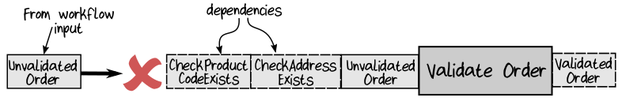
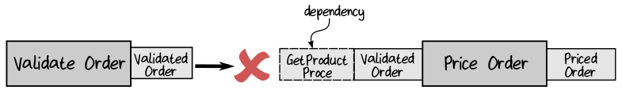
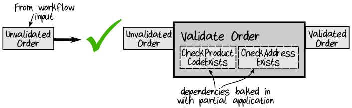
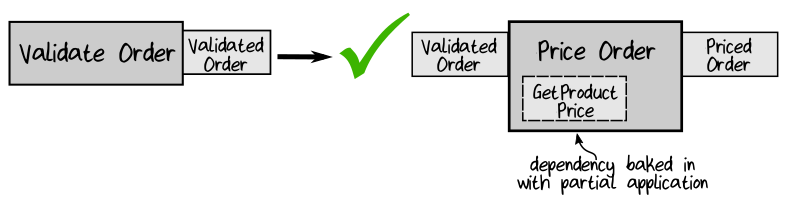

## Composing the Pipeline Steps Together

现在，pipeline 中的各个步骤都已经实现了，然后可以将它们组合在一起，完成整个 workflow 。我们希望代码看起来像这样：
```
let placeOrder : PlaceOrderWorkflow =
    fun unvalidatedOrder ->
        unvalidatedOrder
        |> validateOrder
        |> priceOrder
        |> acknowledgeOrder
        |> createEvents
```

但是有一个问题, validateOrder 除了 UnvalidatedOrder 之外还有两个额外的输入参数。目前，没有简单的方法将 placeOrder workflow 的输入连接到 validateOrder function，因为输入和输出不匹配。  
  

类似的，priceOrder 有两个输入参数，因此它不能连接到 validateOrder 的输出上：  
  

就像在第7章 Composing the Workflow From the Steps 这一节中提到的，组合这些输入和输出类型不匹配的 function 是 functional programming 中的主要挑战之一，已经有了很多技术来解决这个问题。大多数解决方案都使用可怕的 “monad” ，目前我们使用 *partial application* 这种简单的方式。我们要做的是，仅应用 validateOrder function 的三个参数中的两个 ( two dependencies )，从而得到一个只有一个输入参数的新的 function 。   
  

代码是这样的：
```
let validateOrderWithDependenciesBakedIn =
    validateOrder checkProductCodeExists checkAddressExists

// new function signature after partial application:
// UnvalidatedOrder -> ValidatedOrder
```
当然，名称太长太可怕了!OK，F# 中，在局部定义的 function 可以使用相同的名称 ( validateOrder ) ，这被称为 “shadowing”：
```
let validateOrder =
    validateOrder checkProductCodeExists checkAddressExists
```

或者，您可以在名称加一个标记 ( validateOrder' ) 来显示它是原始 function 的变体，如下所示:
```
let validateOrder' =
    validateOrder checkProductCodeExists checkAddressExists
```

使用同样的方式来处理 priceOrder 和 acknowledgeOrder 的依赖项，因此它们也变成了只有一个输入参数的 function 。  
  

The main workflow function, placeOrder ，现在看起来像这样：
```
let placeOrder : PlaceOrderWorkflow =
    // set up local versions of the pipeline stages
    // using partial application to bake in the dependencies
    let validateOrder =
        validateOrder checkProductCodeExists checkAddressExists
    let priceOrder =
        priceOrder getProductPrice
    let acknowledgeOrder =
        acknowledgeOrder createAcknowledgmentLetter sendAcknowledgment

    // return the workflow function
    fun unvalidatedOrder ->
        // compose the pipeline from the new one-parameter functions
        unvalidatedOrder
        |> validateOrder
        |> priceOrder
        |> acknowledgeOrder
        |> createEvents
```

有时，即使这样做，function 也会不匹配。我们的例子中，acknowledgeOrder 的输出是 event ，而不是 priced order ，所以它不能匹配 createEvents 的输入类型。

我们可以为此编写一个小小的 adapter ，或者可以简单地切换到一个更命令式的代码风格，其中每个步骤的输出显式地分配一个值，就像这样：
```
let placeOrder : PlaceOrderWorkflow =
    // return the workflow function
    fun unvalidatedOrder ->
        let validatedOrder =
            unvalidatedOrder
            |> validateOrder checkProductCodeExists checkAddressExists
        let pricedOrder =
            validatedOrder
            |> priceOrder getProductPrice
        let acknowledgementOption =
            pricedOrder
            |> acknowledgeOrder createAcknowledgmentLetter sendAcknowledgment

        let events =
            createEvents pricedOrder acknowledgementOption

        events
```
它不像 pipeline 那么优雅，但仍然很容易理解和维护。

接下来的问题是： checkProductCodeExists ，checkAddressExists ，priceOrder 这些依赖项，要怎么 inject 到程序中去？把它们定义成全局变量，哦，不。下一节将解释如何 “inject” 这些依赖项。