## Chaining Result-Generating Functions

在处理具体问题之前，我们应该先后退一步，从更抽象的角度来看一下问题。如果有那么一些 result-generating function ，如何以一种简洁的方式组合它们？

接下来以一种直观的方式来看一下问题。一个正常的 function 好比一块铁轨：
    

输出 Result 的 function 可以表示为一分为二的铁路轨道：  
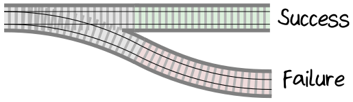   

在和铁路类比之后，类似这样的 function ，我将它们叫做 switch function 。它们也常常被叫做
 “monadic” function 。

 那么，该如何连接这样的两个 switch function 。好吧，如果输出是成功的，就继续序列中的下一个 function ，但如果输出的是一个错误，就绕过它：  
 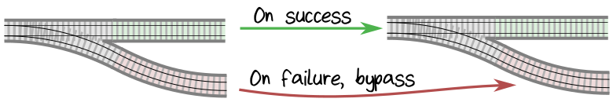  

 如何组合这样的两个 switch ，以使两个故障的轨道也连接在一起？很显然——像这样：  
 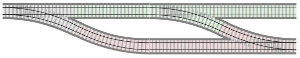  

如果你用这种方式连接 pipeline 中的所有步骤，就会得到我所说的关于 error handling 的 “two-track” 模型，或者 “railroad oriented programming”。如下图：  
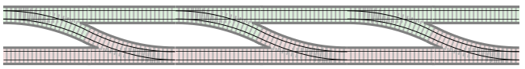  

使用这种方式，上面的轨道是 ”happy path“ ，下面的轨道是 ”failure path“ 。从成功的轨道开始，如果幸运的话，会一直从这条轨道到最后。但是如果出现错误，你将被转移到故障轨道上，并绕过 pipeline 中的其余步骤。

这看起来很好，但还是有一个问题：我们不能组合这样的 result-generating function ，因为输出类型是 two-track ，输入的类型是 one-track ，类型并不相同。  
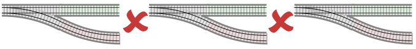  

怎么解决这样的问题？怎么将 two-track 的输出和 one-track 的输入连接起来？仔细观察一下，如果第二个 function 有两条轨道的输入那么连接它们就没有问题了：  
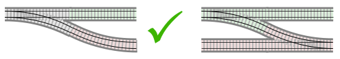    

因此，需要将某个拥有一个输入和两个输出的 “switch” function 转换一下，变成 two-track function 。要做到这一点，需要创建一个特别的 “adapter block” ，它有一个插槽，这个插槽用于 将 switch function 转换为 two-track function ：  
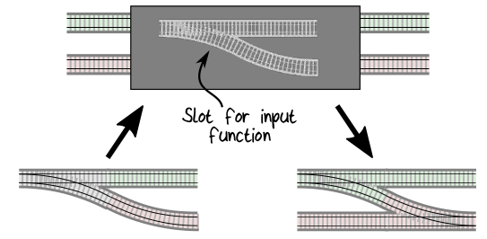    

如果将所有的步骤都转换成 two-track function，就可以很方便的组合它们了：  
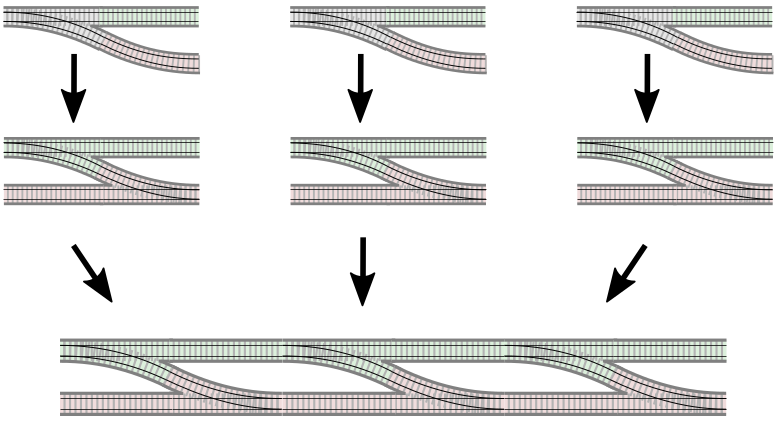    

组合之后便是一个带有 "success" track 和 "failure" track 的 two-track pipeline 了。这就是我们想要的。

### Implementing the Adapter Blocks

在第9章 Creating Function Adapters 这一节中讨论过 adapter function 。adapter 将 switch function 转换成 two-track function ，这是 functional programming 工具箱里比较重要的一个——在 FP 术语中通常把它叫做 bind 或 flatMap 。实现很简单，逻辑如下：
* 输入是一个 switch function 。输入是一个新的 two-track function ，这个 two-track function 被表示成一个拥有 two-track 输入 和 two-track 输出 的 lambda 。
* 如果 two-track 输入是成功的，则将此输入传递到 switch function 。而原本 switch function 的输出就是一个 two-track ，所以不需要对它做任何进一步的操作。
* 如果 two-track 输入是失败的，则跳过 switch function ，并返回失败。

实现的代码如下：
```
let bind switchFn =
    fun twoTrackInput ->
        match twoTrackInput with
        | Ok success -> switchFn success
        | Error failure -> Error failure
```

一个等价但更常见的实现是，带有两个输入参数的 bind ：一个参数是 switch function，另一个是 two-track ( Result type ) 类型的值，然后去掉 lambda ，如下：
```
let bind switchFn twoTrackInput =
    match twoTrackInput with
    | Ok success -> switchFn success
    | Error failure -> Error failure
```
以上两个 bind 的实现是等价的：第二个实现，curried (可理化后), 和第一个是一样的 (见第8章 Currying 一节) 。

另一个非常有用的 adapter block 是将 one-track function 转换成 two-track function 。  
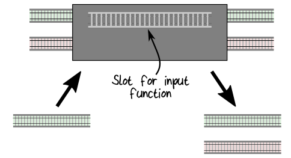    

在 FP 术语中通常称为 map 。逻辑是这样的：
* 输入是一个 one-track function 和一个 two-track ( Result type ) 类型的值。
* 如果输入的 Result 是成功的，则输入传递到 one-track function ，并将输入用 Ok 包装一下 (因为输出必须是 two-track 类型的)。
* 如果输入的 Result 是失败的，则跳过 one-track function 。

实现代码，如下：
```
let map f aResult =
    match aResult with
    | Ok success -> Ok (f success)
    | Error failure -> Error failure
```

使用 bind、map 和其他一些类似的 function ，我们将拥有一个强大的工具包，可以使用它组合各种不匹配的 function 。

### Organizing the Result Functions

应该将这些新的 function 放在那里？标准的做法是将它们放在一个和 type 名称相同的 module 里，对于这个例子就是 Result 。module 的代码如下：
```
/// Define the Result type
type Result<'Success,'Failure> =
    | Ok of 'Success
    | Error of 'Failure

/// Functions that work with Result
module Result =
    let bind f aResult = ...
    let map f aResult = ...
```

由于 Result 及其相关的 function 在 domain 中随处可见，我们通常会创建一个新的 utility module (e.g. Result.fs ) 。并将其放在项目结构中 domain type 之前。

### Composition and Type Checking

前面通过将 switch function 转换成 two-track function ， 重点解决了 function 的匹配问题。当然，type check 也是必要的，所以我们需要确保 type 也能相匹配，这样最终才能组合 function 。

在成功的分支上，类型可以沿着轨道改变，只要一个步骤的输出类型与下一个步骤的输入类型匹配。比如，下面的三个 function 可以使用 bind 组合，这是因为：FunctionA 的输出 ( Bananas ) 和 FunctionB 的输入相匹配，FunctionB 的输出 ( Cherries ) 和 FunctionC 的输入相匹配。
```
type FunctionA = Apple -> Result<Bananas,...>
type FunctionB = Bananas -> Result<Cherries,...>
type FunctionC = Cherries -> Result<Lemon,...>
```
像这样使用 bind functon ：
```
let functionA : FunctionA = ...
let functionB : FunctionB = ...
let functionC : FunctionC = ...

let functionABC input =
    input
    |> functionA
    |> Result.bind functionB
    |> Result.bind functionC
```  
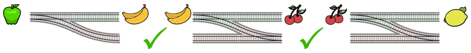    

还句话说，即使使用 bind ，FunctionA 和 FunctionC 也不能直接组合在一起，因为 type 是不同的：  
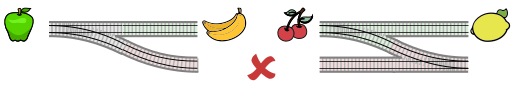    

### Converting to a Common Error Type

与成功轨道不同，成功轨道的类型在每一步都可能改变，而失败轨道在整个轨道中都具有相同的统一类型。也就是说，pipeline 中的每个 function 都必须具有相同的 error type 。

在许多情况下，这意味着我们需要调整 error type ，使它们彼此兼容。为此，创建一个类似于 map 的 function ，但是它作用于失败轨道中的值。把这个 function 称作 mapError ：
```
let mapError f aResult =
    match aResult with
    | Ok success -> Ok success
    | Error failure -> Error (f failure)
```

比如，AppleError 和 BananaError ，分别有 function 使用它们作为 error type 。
```
type FunctionA = Apple -> Result<Bananas,AppleError>
type FunctionB = Bananas -> Result<Cherries,BananaError>
```
不相匹配的 error type 说明 FunctionA 和 FunctionB 不能组合。我们需要一个新的 type ，并且 AppleError 和 BananaError 都能将自己转换成这个 type ——包含二者的一个 choice type 。以下是这个 type 的实现，把它称作 FruitError ：
```
type FruitError =
    | AppleErrorCase of AppleError
    | BananaErrorCase of BananaError
```
然后转换 functionA 的 Resut type ，使它变成 FruitError ：
```
let functionA : FunctionA = ...

let functionAWithFruitError input =
    input
    |> functionA
    |> Result.mapError (fun appleError -> AppleErrorCase appleError)
```
可以简写成：
```
let functionAWithFruitError input =
    input
    |> functionA
    |> Result.mapError AppleErrorCase
```
这是这种转换的图示：  
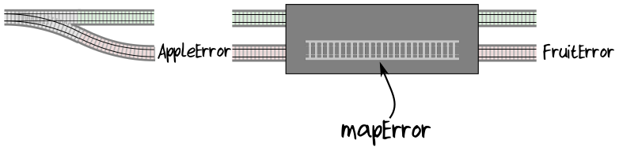  

查看 function signature ，可以看到 functionA 和 functionAWithFruitError 使用了不同的 error type ，这是我们所期望的：
```
// type of functionA
Apple -> Result<Bananas,AppleError>

// type of functionAWithFruitError
Apple -> Result<Bananas,FruitError>
```

可以对 functionB 做类似的转换，当把它们放在一起时，代码看起来像这样：
```
let functionA : FunctionA = ...
let functionB : FunctionB = ...

// convert functionA to use "FruitError"
let functionAWithFruitError input =
    input |> functionA |> Result.mapError AppleErrorCase

// convert functionB to use "FruitError"
let functionBWithFruitError input =
    input |> functionB |> Result.mapError BananaErrorCase

// and now we can compose the new versions with "bind"
let functionAB input =
    input
    |> functionAWithFruitError
    |> Result.bind functionBWithFruitError
```
functionAB 的 signature ：
```
val functionAB : Apple -> Result<Cherries,FruitError>
```

