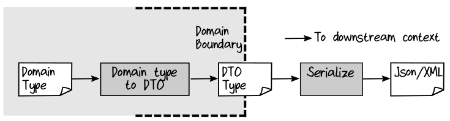
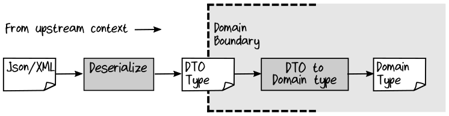

## Designing for Serialization

就像在第3章 Transferring Data Between Bounded Contexts 这一小节中看到的，我们的复杂 domain type (包含 choice type 和深度嵌套在一起的约束) 不太适合使用序列化器。因此，一个可以轻松的实现 serialization 的诀窍是将 domain object 转换为专门为 serialization 而设计的类型—— Data Transfer Object ——然后序列化这个 DTO 而不是 domain type 。  
  

对于 deserialization ，反向而行：  
  

通常，希望 deserialization 尽可能的简洁。这意味着反序列化到 DTO 应该总是成功的，除非底层数据在某种程度上损坏了。任何对特定 domain 的校验 (如，OrderQty 的整数值的边界限制，ProductCode 的有效性 ) 都应该在 DTO 到 doamin type 转换过程中完成，这个转换过程在 bounded context 之内，在此过程中可以更好地控制 error handling 。