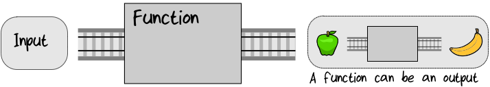
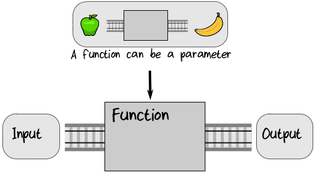

## Functions Are Things

在函数式编程范式中，函数本身就是事物。因为函数是事物，所以它可以作为其它函数的输入：  
  

作为其他函数的输出：  
  


作为参数传递给函数以控制其行为：  
   

把 function 当作事物来对待打开了一个充满可能性的世界。一开始可能会让你困惑，但是你已经看到了，即使只有这个基本原则，您也可以相当迅速地构建复杂的系统。  

> **术语：“Higher Order Functions”**  
> 输入或输出其他函数，或以函数作为参数的函数称为高阶函数，通常缩写为HOFs。

### Treating Functions as Things in F#
来看看 “functions as things” 在 F# 中是如何表现的。以下是四个 function 定义：  
```
let plus3 x = x + 3           // plus3 : x:int -> int
let times2 x = x * 2          // times2 : x:int -> int
let square = (fun x -> x * x) // square : x:int -> int
let addThree = plus3          // addThree : (int -> int)
```

前两个定义之前已经见过了。在第三个定义中，let 关键字用于为匿名函数(也称为 lambda 表达式) 分配名称(square)。在第四个定义中，let 关键字用于为前面定义的函数(plus3)分配名称(addThree)。这些函数都是 int -> int 类型的函数，它接受一个 int 作为输入并输出一个新的 int 。  

因为 functions are things， 所以可以将他们放入 list 中：
```
// listOfFunctions : (int -> int) list
let listOfFunctions = [addThree; times2; square]
```
> **! 提示：**  
> 在f#中，list 使用分号(不是逗号!)作为元素分隔符。

我们现在可以遍历列表并依次对每个 function 求值：  
```
for fn in listOfFunctions do
    let result = fn 100 // call the function
    printfn "If 100 is the input, the output is %i" result

// Result => 
// If 100 is the input, the output is 103
// If 100 is the input, the output is 200
// If 100 is the input, the output is 10000
```

let 关键字不仅仅用于 function 定义——它通常用于为值分配名称，例如，以下使用 let 为 “hello” 分配一个名称：
```
// myString : string
let myString = "hello"
```

使用相同的关键字 let 定义 function 和 sample value 并不是偶然的。以一个例子来说明为什么是这样。在第一个代码片段中，我定义了一个名为 square 的 function ：
```
// square : x:int -> int
let square x = x * x
```
在第二个代码片段中，我将名称 square 分配给一个匿名函数。这里 let 定义的是一个 sample value，还是一个 function ？
```
// square : x:int -> int
let square = (fun x -> x * x)
```
答案是：两者都是！funtion 是一种事物，可以分配一个名称。所以 square 的第二个定义本质上和第一个定义是一样的，它们可以互换。


