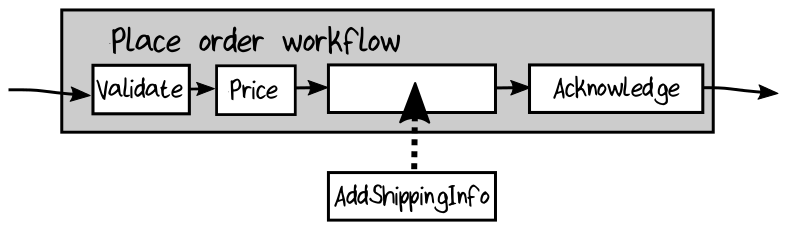

## Change 1: Adding Shipping Charges

对于我们的第一个需求变更，来看看如何计算运输费和送货费用（shipping and delivery charges）。假如公司想要通过一种特殊的计算方式向客户收取运费。我们如何集成这个新需求？

首先，需要一个 function 来计算运输成本（shipping cost）。假设这家公司总部位于加州，那么运送到当地各州是一种价格（假设5美元），运送到偏远一点的州是另一种价格（假设10美元），运送到另一个国家是又是另一种价格（假设20美元）。

这里是实现这个计算的第一步：
```rust
/// Calculate the shipping cost for an order
let calculateShippingCost validatedOrder =
    let shippingAddress = validatedOrder.ShippingAddress
    if shippingAddress.Country = "US" then
        // shipping inside USA
        match shippingAddress.State with
        | "CA" | "OR" | "AZ" | "NV" ->
        5.0 //local
        | _ ->
        10.0 //remote
    else
        // shipping outside USA
        20.0
```

很不幸，像这样的一种条件逻辑，带有多个分支，并且每个分支也带有特殊的条件逻辑，是很难理解和维护的。

### Using Active Patterns to Simplify Business Logic

使逻辑更具可维护性的一个解决方案是，将 domain-centric “categorization” 与实际的定价逻辑分离开来。在 F# 中，有一个特性叫做 *active patterns*<sup>1</sup>，它可用于将条件逻辑转换为一组可进行模式匹配的 named choice，就像为每个 choice 显式地定义了 discriminated union type 一样。active patterns 非常适合这种 “categorization”。 

> **！ 我的提示**  
> 例子中 ，我们根据实际的 domain 将运送的目的地划分成了三类，这叫做： domain-centric “categorization”  
> 上面说的意思也就是 将这种 分类的逻辑 与 定价逻辑 分离。

使用 active pattern 实现这个需求，首先定义一组模式来匹配我们的每个运输类别（shipping category）：
```rust
let (|UsLocalState|UsRemoteState|International|) address =
    if address.Country = "US" then
        match address.State with
        | "CA" | "OR" | "AZ" | "NV" ->
            UsLocalState
        | _ ->
            UsRemoteState
    else
        International
```

然后，在 calculateShippingCost 本身，可以模式匹配这些类别：
```rust
let calculateShippingCost validatedOrder =
    match validatedOrder.ShippingAddress with
    | UsLocalState -> 5.0       // active pattern case
    | UsRemoteState -> 10.0     // active pattern case
    | International -> 20.0     // active pattern case
```

像这样将 分类的逻辑 与 业务逻辑 分离，代码变得更加清晰，active pattern case 的名称也可以充当文档（代码即文档）。

当然，定义 active pattern 本身仍然很复杂，但是这样的代码只是进行分类，没有业务逻辑。如果分类的逻辑发生变化（比如 “UsLocalState” 中增加或减少某个州），只需要改变 active pattern ，而不需要改变定价的 function 。我们把关注点很好地分开了。


### Creating a New Stage in the Workflow

接下来，在 order-placing workflow 中增加这个运输成本计算的逻辑。一种做法是将运输成本计算的逻辑加入到 pricing 步骤 中。但这会改变已经正常工作的代码，使其更加复杂，也有可能会导致 bug 。与其改变稳定的代码，不如充分利用 composition ，在 workflow 中添加一个新的 步骤 来进行计算和更新 PricedOrder ：
```rust
type AddShippingInfoToOrder = PricedOrder -> PricedOrderWithShippingInfo
```

这个新的 步骤 可以插入到 PriceOrder 和 下一个步骤 AcknowledgeOrder 的之间。  
  

通常，随着设计的不断变化，会发现更多的需要被关注的细节。比如，客户可能想要知道运输方法（如 Fedex 或 UPS）以及价格（当然这些很简单，实际上可能会出现很复杂的细节）。所以需要一些新的 type 来捕获这些额外的信息：
```rust
type ShippingMethod =
    | PostalService
    | Fedex24
    | Fedex48
    | Ups48

type ShippingInfo = {
    ShippingMethod : ShippingMethod
    ShippingCost : Price
}

type PricedOrderWithShippingInfo = {
    ShippingInfo : ShippingInfo
    PricedOrder : PricedOrder
}
```

注意，现在已经创建了另一个 order type —— PricedOrderWithShippingInfo ——它包含新的发货信息（ShippingInfo）。你可能会认为这有点过头了，可以考虑重用 PricedOrder type ，而不是为ShippingInfo 添加一个字段。创造一种全新的 type 也有一些好处：
* 如果将 AcknowledgeOrder 步骤 的输入修改为 PricedOrderWithShippingInfo ，那么在每个步骤中就不会得到错误的 order type 了。
* 如果将 ShippingInfo 作为一个字段添加到 PricedOrder 中，那么在发货（ShippingInfo）计算完成之前，它应该初始化为什么呢？ 简单地将其初始化为默认值，可能会产生一个将要发生的 bug 。

最后一个问题： ShippingInfo 应该如何存储？   
应该是将其作为 PriceOrder 的一个字段 ？
```rust
type PricedOrder = {
    ...
    ShippingInfo : ShippingInfo
    OrderTotal : Price
}
```
还是应该应该将其看成是一种新的 order line？
```rust
type PricedOrderLine =
    | Product of PricedOrderProductLine
    | ShippingInfo of ShippingInfo
```

第二种方式意味着 order 的总和 可以直接从其所包含的 order line item 计算得出，而不需要特殊的逻辑从 PricedOrder 获取相关的字段后再进行计算。 缺点是可能会不小心错误地创建了两个 ShippingInfo line ，而我们不得不担心是否将它们正确的关联到 order 了。

现在将 ShippingInfo 存储在 PricedOrder 中之后，我们就拥有了完成 AddShippingInfoToOrder 步骤所需的一切。只需要编写一个符合以下要求的 function ：
* 它实现上面定义的 AddShippingInfoToOrder function type 。
* 它接受一个依赖项——上面设计的 calculateShippingCost function 。
* 它将 ShippingCost 添加到 PricedOrder 中，从而生成 PricedOrderWithShippingInfo 。

因为所有的需求都由 type 表示，所以要创建不正确的实现是非常困难的！ 实现如下：
```rust
let addShippingInfoToOrder calculateShippingCost : AddShippingInfoToOrder
    fun pricedOrder ->
        // create the shipping info
        let shippingInfo = {
            ShippingMethod = ...
            ShippingCost = calculateShippingCost pricedOrder
        }
        
        // add it to the order
        {
            OrderId = pricedOrder.OrderId
            ...
            ShippingInfo = shippingInfo
        }
```

然后将这个实现加入到 top level workflow 中：
```rust
// set up local versions of the pipeline stages
// using partial application to bake in the dependencies
let validateOrder unvalidatedOrder = ...
let priceOrder validatedOrder = ...
let addShippingInfo = addShippingInfoToOrder calculateShippingCost

// compose the pipeline from the new one-parameter functions
unvalidatedOrder
|> validateOrder
|> priceOrder
|> addShippingInfo
...
```

### Other Reasons To Add Stages To The Pipeline

这个例子中，因为需求的改变，所以我们在 workflow 中新增了一个组件。但是像这样添加和删除组件方式可应用于添加任何的特性。只要一个步骤与其他步骤相隔离，并且符合所需的类型，就可以确保安全地添加或删除它。以下这些情况你可以采用这种方式：
* 可以添加一个透明的步骤，以便更轻松地了解 pipeline 内部执行的情况。 日志，性能指标，审计等都可以通过这种方式轻松添加。
* 可以添加一个校验授权的步骤，如果该步骤失败，将执行失败路径，跳过 pipeline 的其余部分。
* 甚至可以根据输入参数或配置在 composition root 中动态地添加和删除步骤。