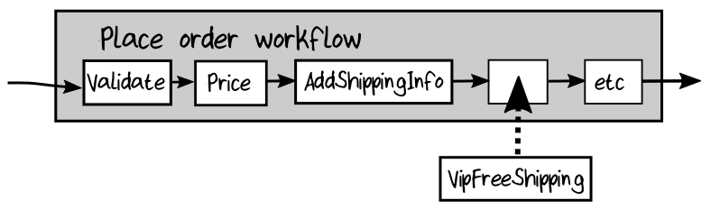

## Change 2: Adding Support for VIP Customers

现在让我们看一下会影响 workflow 整体输入的需求变更。假设业务上希望支持 VIP 客户——获得特殊待遇的客户，如免费送货和免费升级为夜间送货服务。

该如何对此建模呢？

不应该做的一件事就是， 在 domain 中对业务规则的输出建模（例如，在订单中添加“免费送货”标志）。相反，应该将输入存储到业务规则中（“客户是VIP”），然后让业务规则处理该输入。这样，如果业务规则发生变化（肯定会！），我们就不必改变我们的 domain model 。

所以我们假设，VIP身份与他们在网站上的登录信息是相关的，所以我们不需要自己在 order-taking domain 中确定身份信息。但是该如何对 VIP的状态 建模呢？ 是否应该在 CustomerInfo 中将 VIP身份 作为一个标志，像这样：
```rust
type CustomerInfo = {
    ...
    IsVip : bool
    ...
}
```
或者将其建模为一组客户状态中的一个，就像这样：
```rust
type CustomerStatus =
    | Normal of CustomerInfo
    | Vip of CustomerInfo

type Order = {
    ...
    CustomerStatus : CustomerStatus
    ...
}
```

将其建模为客户状态的缺点是，可能存在与此正交的其他客户状态，如 新客户 vs 回头客，持有会员卡的客户，等等。

最好的方式是采取折衷方案，即使用一种 choice type 来表示 “VIP”维度上的状态，而与其他客户信息无关。
```rust
type VipStatus =
    | Normal
    | Vip

type CustomerInfo = {
    ...
    VipStatus : VipStatus
    ...
}
```

如果我们需要其他类型的状态，用同样的方式可以很容易地添加它们。例如：
```rust
type LoyaltyCardId = ...
type LoyaltyCardStatus =
| None
| LoyaltyCard of LoyaltyCardId

type CustomerInfo = {
    ...
    VipStatus : VipStatus
    LoyaltyCardStatus : LoyaltyCardStatus
    ...
}
```

### Adding a New Input to the Workflow

让我们假设使用了一个新的 VipStatus 字段。像往常一样，更新 domain model，然后看看它会把我们引向何方。

首先为状态定义类型，然后将其添加为 CustomerInfo 的一个字段：
```rust
type VipStatus = ...

type CustomerInfo = {
    ...
    VipStatus : VipStatus
}
```

但是，当我们这样做时，在构造 CustomerInfo 的代码中会出现编译器错误：
```
No assignment given for field 'VipStatus' of type 'CustomerInfo'
```

这说明了 F# 中的 record 类型的一个优点： 所有字段必须在构造时提供。如果添加了一个新字段，在构造时没有提供该字段，将得到一个编译器错误。

那么从哪里获取 VipStatus 呢？ 它来自工作流的输入项 UnvalidatedCustomerInfo 。这个输入项又是从哪里来的呢？ 从用户填写的订单表单中—— DTO 。因此，我们还需要在 UnvalidatedCustomerInfo 和 DTO 中添加相应的字段。对于这两种情况，它可以是一个简单的 string ，使用 null 表示缺少值。
```rust
module Domain =
    type UnvalidatedCustomerInfo = {
        ...
        VipStatus : string
    }

module Dto =
    type CustomerInfo = {
        ...
        VipStatus : string
    }
```

最后，我们可以使用 UnvalidatedCustomerInfo 中的 status 字段以及所有其他字段来构造 ValidatedCustomerInfo：
```rust
let validateCustomerInfo unvalidatedCustomerInfo =
    result {
        ...
        // new field
        let! vipStatus =
            VipStatus.create unvalidatedCustomerInfo.VipStatus

        let customerInfo : CustomerInfo = {
            ...
            VipStatus = vipStatus
        }

        return customerInfo
    }
```

### Adding the Free Shipping Rule to the Workflow

其中还有一个要求是给 vip 免费送货，所以我们需要在 workflow 的某个地方添加这个逻辑。同样，我们不会修改稳定的代码，而是将另一个步骤添加到 pipeline 中：  
  

和之前一样，从定义一个表示新的步骤的类型开始：
```rust
type FreeVipShipping =
    PricedOrderWithShippingMethod -> PricedOrderWithShippingMethod
```

然后创建实现该类型的代码，并将其插入到 wrokflow 中。没有必要展示代码——我想你现在知道这是如何工作的了。