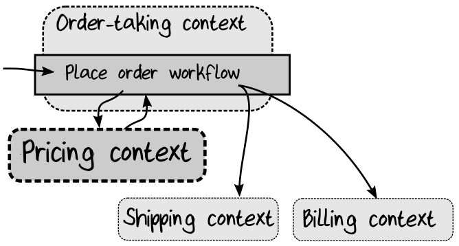

## Change 3: Adding Support for Promotion Codes

来看看另一个场景： 销售团队想要做一些促销活动，所以他们想要提供一个“促销码”，以便在下单时获得折扣价格。

经过与销售团队的讨论，我们有了以下新的需求：
* 在下单时，客户可以提供一个可选的促销码。
* 如果促销码存在，某些产品将被给予不同（更低）的价格。
* 订单应显示应用了促销折扣。

其中一些更改很容易，但最后一个需求看起来很简单，它将在整个 domain 中产生令人惊讶的强大波动。


### Adding a Promotion Code to the Domain Model

让我们从新的促销码字段开始。像往常一样，更新 domain model，然后看看它会把我们引向何方。

首先为促销码定义一个 type ，然后将其添加为订单的可选字段：
```rust
type PromotionCode = PromotionCode of string

type ValidatedOrder = {
    ...
    PromotionCode : PromotionCode option
}
```

PromotionCode 并没有特殊的校验，但是使用 type 而不仅仅是 string 是个好主意，这样我们就不会将其与 domain 中的其他 string 混淆了。

与前面的 VipStatus 字段一样，添加新字段将触发一系列编译器错误。在本例中，还需要向 UnvalidatedOrder 和 DTO 添加相应的字段。注意，即使 ValidatedOrder 中的字段被显式标记为可选的，我们也可以在 DTO 中使用非可选的 string ——使用 null 表示缺少的值。
```rust
type OrderDto = {
    ...
    PromotionCode : string
}

type UnvalidatedOrder = {
    ...
    PromotionCode : string
}
```

### Changing the Pricing Logic

如果有促销码，需要一种计算价格方式，如果没有，需要做另一种计算价格方式。我们如何在 domain 中对此建模呢？

好了，我们已经用 function type 对价格进行了建模：
```rust
type GetProductPrice = ProductCode -> Price
```

但是现在需要根据促销码提供不同的 GetProductPrice function ：
* 如果促销码存在，则提供一个 GetProductPrice function，该 function 返回与该促销码关联的价格。
* 如果促销码不存在，则提供原始的 GetProductPrice function 。

我们需要的是一个 “factory” function ，给定一个可选的促销码，返回适当的 GetProductPrice function ，如下所示：
```rust
type GetPricingFunction = PromotionCode option -> GetProductPrice
```

传入这样的 option 似乎有点不清晰，所以也许我们应该创建一个更好的能够自描述的新类型？
```rust
type PricingMethod =
    | Standard
    | Promotion of PromotionCode
```

从逻辑上讲，它相当于一个 option ，但是在 domain model 中使用它会更清晰一些。ValidatedOrder type 现在看起来是这样的：
```rust
type ValidatedOrder = {
    ... //as before
    PricingMethod : PricingMethod
}
```

然后是 GetPricingFunction ：
```rust
type GetPricingFunction = PricingMethod -> GetProductPrice
```

还有一件事需要改变。在最初的设计中，我们在 workflow 的 pricing 步骤 注入了 GetProductPrice function 。作为代替，现在需要将 GetPricingFunction “factory” function 注入到 pricing 步骤 中。
```rust
type PriceOrder =
    GetPricingFunction      // new dependency
        -> ValidatedOrder   // input
        -> PricedOrder      // output
```

一旦对 domain model 进行了这些更改，实现的代码将再一次得到一堆编译错误。但是，请把这些编译错误当作你的朋友! 它们将指导您需要做什么来修复实现。这是一个冗长但简单的过程。一旦完成，实现的代码能够再次编译通过，这时就可以非常自信地认为一切工作正常。


### Implementing the GetPricingFunction

让我们快速看看 GetPricingFunction 是如何实现的。假设每个促销代码都是成对的（ProductCode， Price）字典项。在这种情况下，实现可能是这样的：
```rust
type GetStandardPriceTable =
    // no input -> return standard prices
    unit -> IDictionary<ProductCode,Price>

type GetPromotionPriceTable =
    // promo input -> return prices for promo
    PromotionCode -> IDictionary<ProductCode,Price>

let getPricingFunction
    (standardPrices:GetStandardPriceTable)
    (promoPrices:GetPromotionPriceTable)
    : GetPricingFunction =
    
    // the original pricing function
    let getStandardPrice : GetProductPrice =
        // cache the standard prices
        let standardPrices = standardPrices()
        // return the lookup function
        fun productCode -> standardPrices.[productCode]

    // the promotional pricing function
    let getPromotionPrice promotionCode : GetProductPrice =
        // cache the promotional prices
        let promotionPrices = promoPrices promotionCode
        // return the lookup function
        fun productCode ->
            match promotionPrices.TryGetValue productCode with
            // found in promotional prices
            | true,price -> price
            // not found in promotional prices
            // so use standard price
            | false, _ -> getStandardPrice productCode 
    
    // return a function that conforms to GetPricingFunction
    fun pricingMethod ->
        match pricingMethod with
        | Standard ->
            getStandardPrice
        | Promotion promotionCode ->
            getPromotionPrice promotionCode
```

我们不会对这段代码进行详细的解释，因为它是自描述的。可以看到，我们使用我们的许多很好的 functional programming 技术： 
* 使用 type 建模，确保代码是正确的（GetProductPrice），保证 domain 的逻辑清晰（PricingMethod 中的 math 语句 ）。
* function 作为参数（promoPrices 的类型是 GetPromotionPriceTable），
* function 作为输出（返回值的类型是 GetPricingFunction）。


### Documenting the Discount in an Order Line

还有一个需求是 “订单应该显示是否应用了促销折扣”。该怎么做呢？ 

为了回答这个问题，我们需要知道下游系统是否需要知道促销信息。如果答案是不需要，那么最简单的方式就是在订单列表中添加“注释行”。我们不需要在注释中添加任何特殊的细节，只需描述关于折扣的一些文字即可。

这意味着需要更改 “order line” 的定义。到目前为止，我们一直假设一个订单项总是关联到一个特定的产品。但是现在我们需要指出的是，有一种新的订单项，它不和产品关联。这是对 domain model 的一个更改。改变 PricedOrderLine 的定义来反映这一点变化，使它成为一个 choice type ：
```rust
type CommentLine = CommentLine of string

type PricedOrderLine =
    | Product of PricedOrderProductLine
    | Comment of CommentLine
```

CommentLine type 不需要任何特殊的验证，除非要确保字符不要太长。如果确实需要跟踪更多的细节，而不仅仅是一条注释，那么可以定义一个 DiscountApplied case ，其中包含折扣金额等数据。使用 Comment 的好处在于，Shipping 上下文和 Billing 上下文根本不需要了解任何促销信息，因此如果促销逻辑发生变化，它们不会受到影响。

因为我们已经将 PricedOrderLine 更改为一个 choice type ，所以还需要一个新的 PricedOrderProductLine type ，它包含面向产品的项的细节，比如价格、数量等。

最后，很明显 ValidatedOrderLine 和 PricedOrderLine 在设计上已经分离开来了。这说明在为 domain 建模期间保持类型的分离是一个好主意——你永远不知道什么时候会需要这种类型的更改，如果两个都使用了相同的类型，我们将无法保持模型的整洁。

要添加注释项，需要修改 priceOrder function ：
* 首先，从 GetPricingFunction“ factory” 获取 定价 function 。
* 接下来，对于每一个订单项，使用 定价 function 设置价格。
* 最后，如果使用了促销码，则在 订单项列表 中添加一个特殊的 注释项 。
```rust
let toPricedOrderLine orderLine = ...

let priceOrder : PriceOrder =
    fun getPricingFunction validatedOrder ->
        // get the pricing function from the getPricingFunction "factory"
        let getProductPrice = getPricingFunction validatedOrder.PricingMethod

        // set the price for each line
        let productOrderLines =
            validatedOrder.OrderLines
            |> List.map (toPricedOrderLine getProductPrice)
            
        // add the special comment line if needed
        let orderLines =
            match validatedOrder.PricingMethod with
            | Standard ->
                // unchanged
                productOrderLines
            | Promotion promotion ->
                let promoCode = promotion|> PromotionCode.value
                let commentLine =
                    sprintf "Applied promotion %s" promoCode
                    |> CommentLine.create
                    |> Comment // lift to PricedOrderLine
                List.append productOrderLines [commentLine]

        // return the new order
        {
        ...
        OrderLines = orderLines
        }
```

### More Complicated Pricing Schemes

在许多情况下，定价方案可能变得更加复杂，包括多种促销、优惠券、针对老顾客的优惠等等。如果出现这种情况，这也许是个信号——表明定价需要成为一个独立的 bounded context 。还记得第1章 [Getting the Contexts Right]() 这一节讨论的内容吗？ 这里有些线索，帮你回忆一下：
* 一个独特的词汇（术语，如 “BOGOF”<sup>2</sup>）。
* 有一个专门的团队来管理定价。
* 特定于此上下文的数据(如购买记录，优惠券的使用)。
* 自治能力。

如果定价是业务的重要组成部分，那么应该让它能够独立演进，并与订单，配送和账单，这些领域保持解耦。这里的图表显示的是将定价作为一个独特的 bounded context ，之前和订单关联在一起，但现在逻辑上分开了：  
  

### Evolving the Contract Between Bounded Contexts


--- 
2.  https://en.wikipedia.org/wiki/Buy_one,_get_one_free