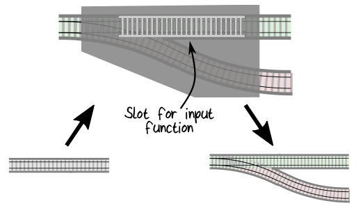
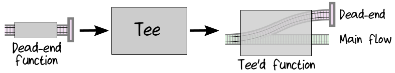
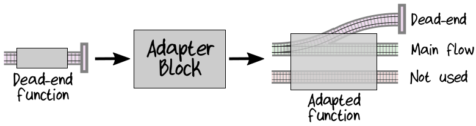

## Adapting Other Kinds of Functions to the Two-Track Model

至此，已经见识了两种 “shape” 的 function ： one-track function 和 switch function 。当然还会有其它的样子的 function ，以下就有两种：
* 抛出 exception 的 function 。
* “Dead-end” function ，不返回任何东西。

### Handling Exceptions

我们避免在 *自己* 的代码中抛出 exception ，但是还会有一些抛出 exception 代码并不由我们控制，比如，library 或 service 中的。早先，我们建议不属于 domain design 中的 exception ，在 top-level 捕获就行了，并不需要在其他地方处理。但是如果我们确实想要将一些 exception 作为 domain 的一部分。要怎样处理这种情况？

很简单——创建另一个 ”adapter block“ function 将 exception-throwing function 转换成 Result-returning function 。  
  

例如，假设希望捕获 remote service 的超时错误，并将其转换成 RemoteServiceError 。将来肯定会调用很多 service ，因此首先定义一个 ServiceInfo 来跟踪会导致 error 的 service：
```rust
type ServiceInfo = {
    Name : string
    Endpoint: Uri
}
```

然后，在此基础上，定义一个 error type ：
```rust
type RemoteServiceError = {
    Service : ServiceInfo
    Exception : System.Exception
}
```
将 service info 和 原来的 service function 传入 “adapter block” ，这个 “adapter block” 里会捕获一些 exception ，并返回相应的 Result 。这里假如原来的 service function 有一个参数 x ：
```rust
/// "Adapter block" that converts exception-throwing services
/// into Result-returning services.
let serviceExceptionAdapter serviceInfo serviceFn x =
    try
        // call the service and return success
        Ok (serviceFn x)
    with
    | :? TimeoutException as ex ->
        Error {Service=serviceInfo; Exception=ex}
    | :? AuthorizationException as ex ->
        Error {Service=serviceInfo; Exception=ex}
```
注意这里并没有捕获所有可能的 exception ，只是捕获了那些与 domain 有关的 。

如果 service function 需要两个参数，创建的 “adapter block“ 就应该带有两个参数：x 和 y ，以此类推。
```rust
let serviceExceptionAdapter2 serviceInfo serviceFn x y =
    try
        Ok (serviceFn x y)
    with
    | :? TimeoutException as ex -> ...
    | :? AuthorizationException as ex -> ...
```

以上是更一般化的 “adapter block” ，适用于任何 function 。某种情况下，也许会想要一个，只用于某个特定的 service 的 “adaoter block” 。比如，将 database exception 转换成 DatabaseError choice type ，而这个 choice type 可以带有对 domain 更友好的 error 信息——如，“record not found” 和 “duplicate key” 。

现在我们应用这个 adapter ，创建一个 ServiceInfo ，将它传入到 service function 。例如，如果 service function 是一个校验 address 的 function ，代码如下：
```rust
let serviceInfo = {
    Name = "AddressCheckingService"
    Endpoint = ...
}

// exception throwing service
let checkAddressExists address = ...

// Result-returning service
let checkAddressExistsR address =
    // adapt the service
    let adaptedService =
        serviceExceptionAdapter serviceInfo checkAddressExists
    // call the service
    adaptedService address
```

为了清楚地说明返回 Result 的这个新的 function 只是原始 function 的一个变种，我们将其命名为 checkAddressExistsR，并在末尾加上一个 “R” 。(在实际代码中，你可能只需要给它与原始 function 相同的名称——“shadowing”) 。

检查 signature 以确定这是我们所期望的。原始 function 表明它总是返回 CheckedAddress ：
```rust
checkAddressExists :
    UnvalidatedAddress -> CheckedAddress
```
但我们知道这个 signature 是有误导性的。而新的 function 的 signature，更具描述性。它标识出可能会出现错误并且返回 error 。
```rust
checkAddressExistsR :
    UnvalidatedAddress -> Result<CheckedAddress,RemoteServiceError>
```
error type 是 RemoteServiceError ，如果想要在 pipeline 中使用这个 function ，则必须在 PlaceOrderError 里增加一个 case ：
```rust
type PlaceOrderError =
    | Validation of ValidationError
    | Pricing of PricingError
    | RemoteService of RemoteServiceError // new!
```
然后，当创建 “R” 版本的 function 是，必须将 RemoteServiceError 转换成共享的 PlaceOrderError ，就像之前做的那样：
```rust
let checkAddressExistsR address =
    // adapt the service
    let adaptedService =
        serviceExceptionAdapter serviceInfo checkAddressExists
    // call the service
    address
    |> adaptedService
    |> Result.mapError RemoteService // lift to PlaceOrderError
```

### Handling Dead-End Functions

另外一种比较常见的 function ，常常被叫做 “dead-end” 或 “fire-and-forget” function ：接受输入但什么都不返回的 function 。

这类 function 大多都会以某种方式写 I/O 。比如，logging function ：
```rust
// string -> unit
let logError msg =
    printfn "ERROR %s" msg
```
其他的例子包括：写数据库 ，发布消息到消息队列 ，等等。

为了在 two-track pipeline 中使用 dead-end function ，需要创建另外的 “adapter block” 。可以这样构造这个 “adapter block”：使用输入参数调用 dead-end function ，然后返回原始的输入参数—— ”pass-through“ function 。如下，tee 就是这样的一个 function ：  


代码在这里：
```rust
// ('a -> unit) -> ('a -> 'a)
let tee f x =
    f x
    x
```

signature 表明它接受任何 unit-returning function ，返回 one-track function 。

> *！我的提示：*  
> unit-returning function ,即不返回任何东西的 function 。unit 记住这个术语，在很多语言中都用它来表示： function 不返回任何东西。  
> unit-returning function 这是作者的行文风格，类似的还有 Result-returning service 和 exception-throwing service ，等等。

然后就可以使用 Result.map 将 tee 的输出转换成 two-track function ：
```rust
// ('a -> unit) -> (Result<'a,'error> -> Result<'a,'error>)
let adaptDeadEnd f =
    Result.map (tee f)
```

好了，我们有了一种方式可以将 dead-end function ( e.g. logError ) 转换成 two-track function ，这样就可以将其组合进 pipeline 了。  
  

