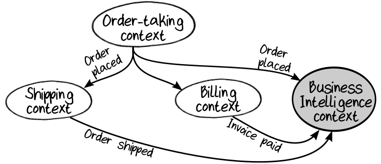

## Bounded Contexts Must Own Their Data Storage

persistence 的另一个关键原则是，每个 bounded context 在数据存储方面必须与其他的 bounded context 隔离。这意味着：
* bounded context 必须拥有自己的 data store 和 schemas ，并且在任何时候都可以更改它们，这种更改也不依赖于其它的 boundex context 。
* 任何系统都不能直接访问 bounded context 的 data store 。相反，客户端应该使用 bounded context 开放出来的 API ，或者使用 data store 的某种副本。

所有的这些，都是为了确保 bounded context 保持解耦并能够独立演化。如果 系统A 访问 系统B 的data store ，那么即使代码库完全独立，由于数据共享，两个系统在实践中仍然是耦合的。

现在，“隔离” 的实现可以根据设计需求和运维团队的需求而有所不同。一种极端情况是，每个 bounded context 可能具有一个物理上完全不同的 data store ，这些 data store 的部署彼此完全独立。另一种极端情况是，所有 bounded context 的数据都存储在同一个物理上的 data store ( 使部署容易一些 )，但是使用某些命名空间的机制，来保持每个 bounded context 的数据是逻辑上分离的。

### Working with Data from Multiple Domains

那么报表和业务分析系统呢？ 它们需要从多个 bounded context 问数据，但我们刚刚说过，这不是一个好主意。

解决方案是将 “Reporting” 或 “Business Intelligence” 视为单独的 domain ，并将其它 bounded context 的数据复制到为报表而设计的单独系统中。这种方式虽然需要更多的工作，但是 源系统 和 报表系统 可以独立地演进，并且每个系统可以针对自己的关注点进行优化。当然，这种方式并不是全新的—— OLTP2 和 OLAP3 系统之间的区别已经存在了几十年。

有很多方式可以将数据从其他 bounded context 弄到  Business Intelligence context 。一种简单一点的方式是让它订阅其他系统发出的 event 。比如，每当一个新的 order 被创建了，就会触发一个 event ，然后 Business Intelligence ( BI ) context 监听到这个 event 并在自己的 data store 中添加一条与之对应的数据。这种方式的优点是，Business Intelligence context 只是另一个 domain ，在设计中不需要做任何特殊处理。  
  

另一种方式是使用传统的 ETL4 将数据从源系统复制到 BI 系统。这种方式的优点是在开始时更容易实现，但是可能会带来额外的维护负担，因为当源系统更改其 database schemas 时，可能也需要修改 ETL 。

请注意，在 Business Intelligence domain 中，几乎不需要规范的 domain model 。更重要的可能是开发一个 multidimensional database ( 俗称 “cube” )，该 database 有效地支持 ad-hoc query 和 许多不同的访问路径。

同样，我们也可以使用类似的方式处理运维所需的数据。我们将 “Operational Intelligence” 视为一个独立的 domain ，然后将 log ，metrics 和其它类型的数据发送给相关的 IT 部门进行分析和报告。

---
2.  https://en.wikipedia.org/wiki/Online_transaction_processing
3.  https://en.wikipedia.org/wiki/Online_analytical_processing
4.  https://en.wikipedia.org/wiki/Extract,_transform,_load

