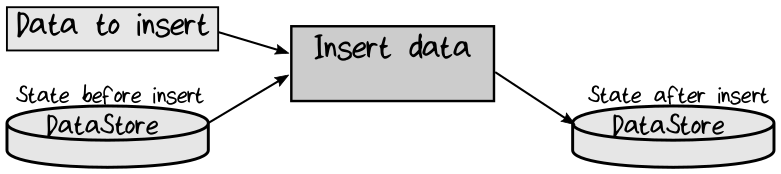
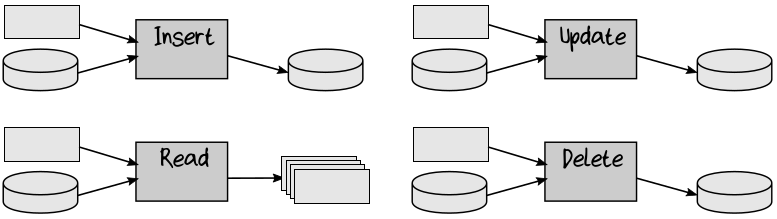
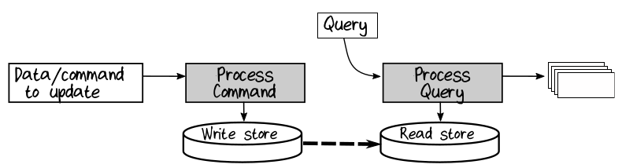

## Command-Query Separation

我们要研究的下一个原则是 Command-Query Separation ( CQS ) 。

以 functional 的方式对 domain 建模，所有的 object 都被设计成 immutable 的。让我们把 data store 也看作是某种 immutable object 。也就是说，每次改变 data store 中的数据时，它都会变成一个新的版本。

例如，如果以 functional 的方式对 “添加数据” 这个操作建模，可以考虑使 insert function 带有两个输入参数：待添加的数据 和 data store 的原始状态。在添加操作完成后，function 返回的是添加了数据的新的 data store 。  
  

在代码中，可以使用以下 type signature 对其建模：
```rust
type InsertData = DataStoreState -> Data -> NewDataStoreState
```

有四种基本的方式和 data store 交互： Create ( insert ) ，Read ( query ) ，Update ，Delete 。刚刚看到了 Insert ，我们把其它的也画出来：  
  

代码如下：
```rust
type InsertData = DataStoreState -> Data -> NewDataStoreState
type ReadData = DataStoreState -> Query -> Data
type UpdateData = DataStoreState -> Data -> NewDataStoreState
type DeleteData = DataStoreState -> Key -> NewDataStoreState
```

其中一个和其他的不一样。很明显，有两种不同的操作：
* insert ，update ，delete 会改变 database 的状态。
* read ( query ) 不改变 database 的状态，而且它是四个 function 中唯一的一个，会返回有用的结果的 function 。

Command-Query separation 是根据这种不同点而构建的设计原则，它指出，返回数据的代码 (“query”) 不应该与更新数据的代码 (“comand”) 混淆。或者简单点： asking a question should not change the answer 。

将这些应用于 functional programming 时， CQS 原则建议：
* 返回数据的 funciton 不应该带有 side-effect 。
* 带有 side-effect ( 更新状态 ) 不应该返回数据。也就是说，它们是 unit-returning function 。

没什么新鲜的——在整个设计过程中，我们一直在这样做——但现在让我们将此专门应用到 database 中。

让我们稍微研究一下这些 function signature 。
* 在输入端，可以使用某种 data store 的 handle ( 比如，DbConnection ) 替换 DataStoreState 。
* 输出 ( NewDataStoreState ) 与实际的 data store 无关，因为 data store 是 mutable 的，不返回新的状态。因此将输出替换为 Unit type 。

现在，signature 应该变成这样：
```rust
type InsertData = DbConnection -> Data -> Unit
type ReadData = DbConnection -> Query -> Data
type UpdateData = DbConnection -> Data -> Unit
type DeleteData = DbConnection -> Key -> Unit
```

DbConnection 特定于某个 data store ，因此我们使用 partial application 或类似的技术 ( 参见第8章 [Partial Application]() 这一节 ) ，将这种依赖关系对调用者隐藏，这意味着从实现 domain 的代码看，与 persistence 相关的功能将是 database-agnostic ( database 无感知 ) 的，然后它们的签名变成这样：
```rust
type InsertData = Data -> Unit
type ReadData = Query -> Data
type UpdateData = Data -> Unit
type DeleteData = Key -> Unit
```
这正是我们在前几章中看到过的。当然，由于需要处理 I/O 和可能的 error ，因此实际的 signature 需要包含一些 effect 。通常会创建一个别名，比如，DataStoreResult 或 DbResult，这个别名包装的是 Result type ，也可能是 Async 。然后 signature 看起来会是这样的：
```rust
type DbError = ...
type DbResult<'a> = AsyncResult<'a,DbError>

type InsertData = Data -> DbResult<Unit>
type ReadData = Query -> DbResult<Data>
type UpdateData = Data -> DbResult<Unit>
type DeleteData = Key -> DbResult<Unit>
```

### Command-Query Responsibility Segregation

常常，重用相同的对象进行读写操作是很吸引人的。比如，假设有一个 Customer record ，我们可能会使用 side-effect function 将它保存到 database 中，或从 database 中加载它，如下：
```rust
type SaveCustomer = Customer -> DbResult<Unit>
type LoadCustomer = CustomerId -> DbResult<Customer>
```
然而，由于各种原因，在读写中重用相同的 type 并不是一个好主意。

首先，查询返回的数据通常与写入时所需的数据不同。比如，一个查询操作有可能返回 非规范化的数据或计算过的值，但是在执行写入操作时不会使用这些值。另外，做新增操作时不需要提供 id 或 version 等字段的值，但查询时会返回这些字段的值。与其试图使一种 data type 服务于多种用途，不如将每种 data type 设计为一种特定用途。在 F# 中，根据需要可以很容易的创建 data type ，就像我们之前看到的那样。

避免重用的第二个原因是 query 和 command 往往是独立演进的，因此不应该耦合。比如，随着时间的推移，你可能会发现需要对同一数据进行三到四个不同的查询，而只有一个更新操作。这时如果强制 query 和 command 使用一样的 type 。事情将变得很尴尬。

最后，出于性能需要，有些查询也许会一次返回多个实体。比如，当读取一个订单数据时，可能还希望读取与该订单关联的客户数据，而不是再次访问 database 以获取客户信息。当然，保存订单的时候，仅需要客户的一个引用 ( CustomerId ) ，而不需要整个客户的信息。

根据这些观察，很明显，从 domain 的角度来看，query 和 command 几乎总是不同的，因此应该使用不同的 type 进行建模。这种 query type 和 command type 的分离，很自然地形成了这样的一种设计——即将它们分离到不同的 module ，以便它们真正解耦并能够独立演进。一个 module 负责 query ( 称为 “read model” )，另一个 module 负责 command ( 称为 “write model” )，因此形成了“Command-Query Responsibility Segregation” 或 CQRS 。

例如，如果为 Customer 提供分离的 read model 和 write model ，可以定义 WriteModel.Customer type 和 ReadModel.Customer type ，以及数据访问的 function ，如下所示：
```rust
type SaveCustomer = WriteModel.Customer -> DbResult<Unit>
type LoadCustomer = CustomerId -> DbResult<ReadModel.Customer>
```

### CQRS and Database Segregation

CQRS 原理也可以应用于 database 。在这种情况下，你将拥有两个不同的 data store ，一个通过优化更适合用于 write ( 没有索引，事务，等 ) ，另一个通过优化更适合用于 read ( 非规范化，大量的索引，等 ) 。  
    

当然，上面是个“逻辑”视图——你并不需要有两个独立的物理的 database 。例如，在 relational database 中，“write” 模型可以是 table ，而 “读” 模型可以是这些 table 上预先定义的 view 。

如果确实需要物理分离的 data store ，那么你必须实现一个特殊的过程，将数据从 “write store” 复制到 “read store” 。这需要做点额外的工作，因此你需要考虑，独立 data store 的设计优势是否值得。更重要的是，与写端数据相比，读端数据可能已经过时，这意味着 read store 是 “eventually consistent ( 最终一致的 )”，而不是立即一致。这会不会成为一个问题，取决于你的 domain ( 参见第6章 [Consistency Between Different Contexts]() 这一节 )。

然而，一旦决定读写分离，你就可以灵活地使用许多不同的 read store ，每个 read store 针对特定的 domain 进行了优化。比如，将多个 bounded context 的数据聚合到一个的 read store 中，这个 data store 对于报表和数据分析非常有用。

### Event Sourcing

CQRS 通常与 event-sourcing<sup>1</sup> 相结合。使用 event-sourcing 的方式，程序运行的状态不会持久化为一个单独的对象。相反，每当状态改变时，会持久化一个事件，该事件携带了这些状态变化的信息 ( 如，InvoicePaid )。使用这种方式，捕获状态的变化信息，有点像是版本控制系统。要在 workflow 开始时恢复当前的状态，需要重播之前的所有事件。这种方法有很多优点，尤其是对于那种所有的内容都要被审计的 domain 。正如他们所说：“会计不用橡皮”。event-sourcing 是一个很大的主题，篇幅所限，这里就不做过多的讨论了。

---
1.  http://microservices.io/patterns/data/event-sourcing.html


