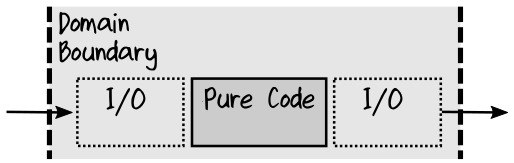
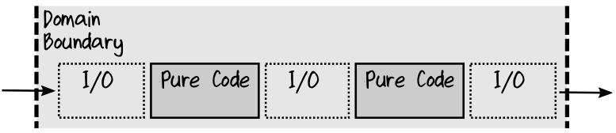

## Pushing Persistence to the Edges

正如在第三章 [Keep I/O at the Edges]() 这一节中提到的，我们希望尽可能的使用 pure function ，因为这样的 pure function 更容易理解和测试。读取或写入外部数据的 function 不可能是 pure function ，因此，在设计 workflow 时，要避免在 workflow 内部 出现任何与 I/O 或 persistence 相关的逻辑。也就是说，workflow 通常分为两部分：
* domain-centric ，以 domain 为中心的部分，这部分包含业务逻辑。
* edge ，边界部分，这部分包含 I/O 相关的代码。

例如，假设某个 workflow 实现了 支付发票 ( paying an invoice ) 的逻辑。 在一个混合了 domain 和 I/O 的模型中，实现可能被设计成这样：
* 从 database 中加载发票。
* 申请付款。
* 如果发票已全额支付，在 database 中将其标记为已全额支付，并发送一个 InvoicePaid event 。
* 如果发票没有全额支付，则将其标记为部分支付，不发送任何 event 。

代码如下：
```rust
// workflow mixes domain logic and I/O
let payInvoice invoiceId payment =
    // load from DB
    let invoice = loadInvoiceFromDatabase(invoiceId)

    // apply payment
    invoice.ApplyPayment(payment)
    
    // handle different outcomes
    if invoice.IsFullyPaid then
        markAsFullyPaidInDb(invoiceId)
        postInvoicePaidEvent(invoiceId)
    else
        markAsPartiallyPaidInDb(invoiceId)

```
问题是上面的这个 function ，不是 pure function ，因此很难对它进行测试。

我们新建一个 applyPayment function ，将纯业务逻辑分离出来放入到这个 function 中 ，applyPayment 不操作 database ，而是返回一个 InvoicePaymentResult ，这个 Result 描述了下一步该如何做：
```rust
type InvoicePaymentResult =
    | FullyPaid
    | PartiallyPaid of ...

// domain workflow: pure function
let applyPayment unpaidInvoice payment :InvoicePaymentResult =
    // apply payment
    let updatedInvoice = unpaidInvoice |> applyPayment payment

    // handle different outcomes
    if isFullyPaid updatedInvoice then
        FullyPaid
    else
        PartiallyPaid updatedInvoice
    // return PartiallyPaid or FullyPaid
```
applyPayment 是个 pure function 。它没有加载任何数据——需要的数据都是作为参数传入的。它也不保存任何数据。它只是做了一个判断，将该判断的结果作为 choice type 返回，而不是立即对其进行操作。因此，很容易对这个 function 中的逻辑进行测试。

完成这个 function 之后，我们在 command handler 内调用它， 这个 command handler 位于 bounded context 的边界 ( 允许 I/O 操作的地方 ) ， 像这样：
```rust
type PayInvoiceCommand = {
    InvoiceId : ...
    Payment : ...
}

// command handler at the edge of the bounded context
let payInvoice payInvoiceCommand =
    // load from DB
    let invoiceId = payInvoiceCommand.InvoiceId
    let unpaidInvoice =
        loadInvoiceFromDatabase invoiceId  // I/O

    // call into pure domain
    let payment =
        payInvoiceCommand.Payment          // pure
    let paymentResult =
        applyPayment unpaidInvoice payment // pure

    // handle result
    match paymentResult with
    | FullyPaid ->
        markAsFullyPaidInDb invoiceId       // I/O
        postInvoicePaidEvent invoiceId      // I/O
    | PartiallyPaid updatedInvoice ->
        updateInvoiceInDb updatedInvoice    // I/O

```
注意以上这个 payInvoice function ，它自己不做任何的判断逻辑，判断逻辑是由 以 domain 为中心的那些 function 所做出的，payInvoice 只是处理这些判断的结果——即根据判断的结果执行相应的操作 ( match 语句 ) 。因此，这个 function 真的不必做 unit test ，因为通常 persistence 的逻辑不是那么的重要。当然，这并不意味着不应该对其进行测试，但最好将其作为 end-to-end integration test 的一部分进行测试。

可以把类似这样的 composite function ( 复合函数 ) 想象成一个三明治—— I/O 在边缘，pure code 在中心：  
  

然而，如果就是想单独测试这个 function ，那么可以给它添加额外的 function-parameter ，用这些 function-parameter 表示我们调用的所有 I/O 操作，如下所示：
```rust
// command handler at the edge of the bounded context
let payInvoice
    loadUnpaidInvoiceFromDatabase   // dependency
    markAsFullyPaidInDb             // dependency
    updateInvoiceInDb               // dependency
    payInvoiceCommand =

    // load from DB
    let invoiceId = payInvoiceCommand.InvoiceId
    let unpaidInvoice =
        loadUnpaidInvoiceFromDatabase invoiceId

    // call into pure domain
    let payment =
        payInvoiceCommand.Payment
    let paymentResult =
        applyPayment unpaidInvoice payment

    // handle result
    match paymentResult with
    | FullyPaid ->
        markAsFullyPaidInDb(invoiceId)
        postInvoicePaidEvent(invoiceId)
    | PartiallyPaid updatedInvoice ->
        updateInvoiceInDb updatedInvoice
```
现在，你可以像往常一样，为每个 function-parameter 提供 mock 的版本，从而轻松地测试这个 function 。

类似这样的需要执行 I/O 操作的 composite function ，当然应该位于应用程序的 top level —— “composition root” 或 controller 。


### Making Decisions Based on Queries

上面的示例假设所有数据都可以在 domain function 之外加载，然后传递给它。但是，如果你的决策依赖于从数据库中读取的数据，而这些读取数据的逻辑又位于 pure code 的中间，会发生什么呢？

解决方案是保持 pure function 不变，但是将它们夹在 不纯的 I/O function 之间，就像这样。  
    

包含业务逻辑的 pure function 作出判断， I/O function 根据判断的结果读写数据。

例如，假如需要扩展 workflow ： 付款后，计算欠款总额，如果金额过大，则向客户发出警告信息。

有了这个额外的需求，pipeline 中的步骤将如下所示：
```rust
--- I/O---
Load invoice from DB

--- Pure ---
Do payment logic

--- I/O ---
Pattern match on output choice type:
    if "FullyPaid" -> Make invoice as paid in DB
    if "PartiallyPaid" -> Save updated invoice to DB

--- I/O ---
Load all amounts from unpaid invoices in DB

--- Pure ---
Add the amounts up and decide if amount is too large

--- I/O ---
Pattern match on output choice type:
    If "OverdueWarningNeeded" -> Send message to customer
    If "NoActionNeeded" -> do nothing
```
如果有太多的 I/O 逻辑夹杂在其中，简单的“三明治”可能会变成一个“多层蛋糕”。这种情况下，将 workflow 分割成更小的 workflow ( 参见第7章 [Long Running Workflows]() 这一节 ) ，这样，每个 workflow 都可以保持为一个小而简单的“三明治”。


### Where’s the Repository Pattern?

在最初的有关 Domain-Driven Design 的书籍中，有一种用于访问 database 的模式，称为 “Repository Pattern” 。你可能会问：如何以 functional 的方式实现该模式？ 答案是不需要。
在依赖于可变性的 object-oriented design 中，repository pattern 是一种隐藏 persistence 的好方法。

但是，当我们将所有东西建模为 function ，并将 persistence 推迟到边界时，就不再需要 repository pattern 了。

这种方式还有利于维护，因为在单个 I/O interface 中定义几十个 method ，而其中大部分的 method 在某个特定的 workflow 中并不会用到，我们为每个特定的 I/O 操作定义不同的 function ，并仅在需要时使用它们。