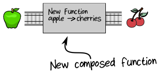
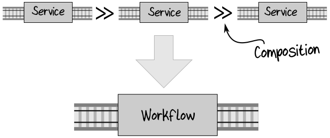
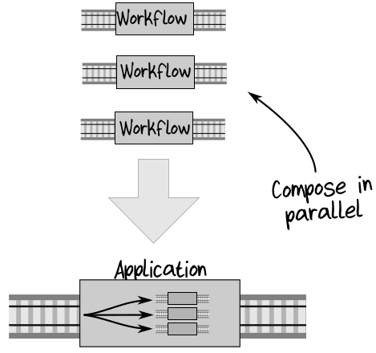

## Composition

在之前的章节 creating new types by combining other types 已经讨论过 “composition” ，不过那是在 type 的上下文语境里讨论的。现在我们来说说 ***function composition*** ，通过将第一个 function 的输出连接到第二个 function 的输入来组合 function 。

例如，有两个 function 。第一个 输入是 apple，输出 banana 。第二个输入是 banana ，输出 cherries 。第一个 function 的输出和第二个 function 的输入类型是相同的，因此将这两个 function 组合起来：  
  

组合之后，得到一个新的 function ：   
  

这种组合的一个重要特征是 *information-hiding* 。 你不知道这个 function 是由较小的 function 组合成的，也不知道这些较小的 function 是干什么用的。香蕉去哪了? who care 。使用这个新 function 的用户不需要知道曾经有过香蕉。我们成功地向最终用户隐藏了这些信息， composed function ， 封装细节。

### Composition of Functions in F#

F# 是如何实现 function compsoition 的？

在 F# 中，只要一个 function 的输出类型与另一个 function 的输入类型相同，那末这两个函数就可以粘合在一起。这通常使用一种称为 “piping” 的方法来完成。

F# 中的 piping 和 Unix 的 piping 很像。从一个值开始，将其输入到第一个函数，然后获取第一个函数的输出并将其输入到下一个函数，以此类推。最后一个函数的输出是整个 pipeline 的输出。

F# 中的 pipe operation 的操作符是 |> 。来看一个例子：
```rust
let add1 x = x + 1        // an int -> int function
let square x = x * x      // an int -> int function
let add1ThenSquare x = 
    x |> add1 |> square

// test
add1ThenSquare 5          // result is 36
```
add1ThenSquare 有一个参数 x ，x 被输入到第一个 function (add) 中，以启动通过 pipeline 的数据流。  
  

再看一个例子，第一个 function 的 signature 是 int -> bool ，第二个的 signature 是 bool -> string ，然后将二者组合的结果是 int -> string ：
```rust
let isEven x = 
    (x % 2) = 0                 // an int -> bool function
let printBool x = 
    sprintf "value is %b" x     // a bool -> string function
let isEvenThenPrint x = 
    x |> isEven |> printBool

// test
isEvenThenPrint 2               // result is "value is true"
```

### Building an Entire Application from Functions

可以使用这种组合的方式构建完整的应用程序。  
例如，我们可以从应用程序底层的一个基本 function 开始 ：  
  

然后将其组合起来，以创建一个 service function ，  
  

然后将这些 service function 粘合在一起，以构建一个处理完整 workflow 的 function 。  
  

最后，通过并行的组合这些 workflow 来构建一个应用程序，创建一个 controller/dispatcher ，根据输入选择要调用的 workflow 。  
  

这就是构建函数式应用程序的方法。每一层所包含的 function 都有一个输入和输出。这就是使用 function 的方式。

第9章，Implementation: Composing a Pipeline , 我们会将其应用到实践中——通过组合一系列小的 function，为 order-placing workflow 实现一个 pipeline 。

### Challenges in Composing Functions 

当输出和输入的类型匹配时，很容易组合 function 。但是如果输入和输出的类型不匹配时会发生什么呢?

一种常见的情况是，底层类型适合，但 function 的 “shapes” 不同。

例如，某个 function 的输出也许是 Option<int> ，但是另一个需要底层的 int 。或者反过来，第一个 function 输出 int ，但第二个需要 Option<int> 。
  

在处理 lists, the success/failure Result type, async, 等类型时也会出现类型不匹配的问题。

使用 composition 时遇到的许多挑战包括，调整输入和输出以使它们匹配，允许 function 连接在一起。最常见的方法是将两者转换为相同的类型，也就是所谓的“highest common denominator（最大公分母）”。

例如，如果输出是 int ，输入是 Option<int> ，最大公分母是 Option 。可以使用 Some 将 functionA 的输出转换为 Option ，转换后的值可以作为 functionB 的输入，然后可以将二者组合在一起了。  
  

以下用代码演示该示例：
```rust
// a function that has an int as output
let add1 x = x + 1

// a function that has a Option<int> as input
let printOption x =
    match x with
    | Some i -> printfn "The int is %i" i
    | None -> printfn "No value"
```
为了连接它们，可以使用 Some 将 add1 的输出转换为一个 Option ，然后通过 pipeline 将其输入到 printOption ：
```rust
5 |> add1 |> Some |> printOption
```

这是一个很简单的例子。在第7章的 Composing the Workflow From the Steps 这一节中，当为 order-placing workflow 建模并尝试组合它们时，我们构建过一个更复杂点的例子。在之后的两个章节中，我们将花费相当多的时间使 function 具有一致的输入和输出类型，以便它们可以组合。

