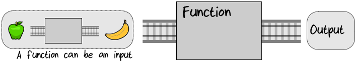
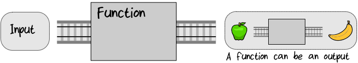
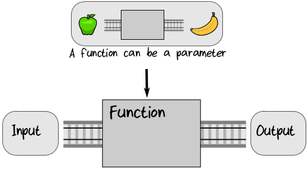

## Functions Are Things

在函数式编程范式中，函数本身就是事物。因为函数是事物，所以它可以作为其它函数的输入：  
  

作为其他函数的输出：  
  


作为参数传递给函数以控制其行为：  
   

把 function 当作事物来对待打开了一个充满可能性的世界。一开始可能会让你困惑，但是你已经看到了，即使只有这个基本原则，您也可以相当迅速地构建复杂的系统。  

> **术语：“Higher Order Functions”**  
> 输入或输出其他函数，或以函数作为参数的函数称为高阶函数，通常缩写为HOFs。

### Treating Functions as Things in F#
来看看 “functions as things” 在 F# 中是如何表现的。以下是四个 function 定义：  
```rust
let plus3 x = x + 3           // plus3 : x:int -> int
let times2 x = x * 2          // times2 : x:int -> int
let square = (fun x -> x * x) // square : x:int -> int
let addThree = plus3          // addThree : (int -> int)
```

前两个定义之前已经见过了。在第三个定义中，let 关键字用于为匿名函数(也称为 lambda 表达式) 分配名称(square)。在第四个定义中，let 关键字用于为前面定义的函数(plus3)分配名称(addThree)。这些函数的类型是 int -> int ，它接受一个 int 作为输入并输出一个新的 int 。  

因为 functions are things， 所以可以将他们放入 list 中：
```rust
// listOfFunctions : (int -> int) list
let listOfFunctions = [addThree; times2; square]
```
> **! 提示：**  
> 在 f# 中，list 使用分号(不是逗号!)作为元素分隔符。

我们现在可以遍历 list 并依次对每个 function 求值：  
```rust
for fn in listOfFunctions do
    let result = fn 100 // call the function
    printfn "If 100 is the input, the output is %i" result

// Result => 
// If 100 is the input, the output is 103
// If 100 is the input, the output is 200
// If 100 is the input, the output is 10000
```

let 关键字不仅仅用于 function 定义——它通常用于为值分配名称，例如，以下使用 let 为 “hello” 分配一个名称：
```rust
// myString : string
let myString = "hello"
```

使用相同的关键字 let 定义 function 和 sample value 并不是偶然的。以一个例子来说明为什么是这样。在第一个代码片段中，我定义了一个名为 square 的 function ：
```rust
// square : x:int -> int
let square x = x * x
```
在第二个代码片段中，我将名称 square 分配给一个 anonymous
function 。这里 let 定义的是一个 sample value，还是一个 function ？
```rust
// square : x:int -> int
let square = (fun x -> x * x)
```
答案是：两者都是！funtion 是一种事物，可以分配一个名称。所以 square 的第二个定义本质上和第一个定义是一样的，它们可以互换。

### Functions as Input

我们说过，“functions as things” 意味着 function 可以用于输入和输出，所以让我们看看在实践中它是什么样的。

首先，让我们看看如何使用 function 作为输入参数。函数 evalWith5ThenAdd2，它接受一个类型为 function 的参数 fn，用5调用它，然后对结果加2。
```rust
let evalWith5ThenAdd2 fn = fn(5) + 2

// evalWith5ThenAdd2 : fn:(int -> int) -> int
```
看看注释的 type signature ，可以看到编译器推断 fn 一定是一个类型为 (int -> int) 的 function 。  
测试一下，首先定义一个 function： add1，类型为：(int -> int)，然后将 add1 作为参数传入。
```rust
let add1 x = x + 1     // an int -> int function
evalWith5ThenAdd2 add1 // fn(5) + 2 becomes add1(5) + 2
//                     // so output is 8
```
执行结果，正如我们期待的是 8 。

可以将任何类型为 (int -> int) 的 function 作为参数。在定义一个 名为 square 的 function，然后将它作为参数传入：
```rust
let square x = x * x     // an int -> int function
evalWith5ThenAdd2 square // fn(5) + 2 becomes square(5) + 2
//                       // so output is 27
```
这一次执行结果是 27 。

### Functions as Output

现在让我们转向作为输出的 function 。为什么要这么做?

一个非常重要的原因是，您可以“传入 ( bake in )”某些参数给函数。

例如，以下有三个 function , 都是做加法操作 ：
```rust
let add1 x = x + 1
let add2 x = x + 2
let add3 x = x + 3
```
很显然，功能类似，我们希望消除重复。怎么做呢？

答案就是创建一个 “adder generator” —— 一个function，它返回一个做加法操作的 function，并且将参数传入到这个返回的 function 中。
```rust
let adderGenerator numberToAdd =
    // return a lambda
    fun x -> numberToAdd + x

// val adderGenerator : int -> (int -> int)
```
type signature 清楚地向我们展示了它接受一个int作为输入，并发出一个类型为 (int -> int) 的 function 作为输出。

我们还可以通过返回一个 named function 而不是 anonymous function 来实现adderGenerator，就像这样：
```rust
let adderGenerator numberToAdd =
    // define a nested inner function
    let innerFn x = numberToAdd + x

    // return the inner function
    innerFn
```
正如前面的 square 示例中看到的那样，这两种实现的效果是一样的。

最后，以下是使用 adderenerator 的 方式：
```rust
// test
let add1 = adderGenerator 1
add1 2     // result => 3

let add100 = adderGenerator 100
add100 2     // result => 102
```

### Currying

将 function 作为返回，通过这种方式，任何有多个参数的 function 都可以转换为一系列只有一个参数的 function 。这种技术手段叫做 currying (柯理化)。

例如，拥有两个参数的 function：add
```rust
// int -> int -> int
let add x y = x + y
```
可以转换为拥有一个参数的 function ，用这个 function 返回一个新的 function，就像上面看到的一样：
```rust
// int -> (int -> int)
let adderGenerator x = fun y -> x + y
```

F# 中，不需要显示的这样做——每个 function 都是 curried function ！  
也就是说，任何 signature 为 'a ->'b ->'c 拥有两个参数的 function，也可以被解释为一个单参数 function ——它接受一个 'a 并返回一个函数 ('b -> 'c) 。

### Partial Application

如果每个 function 都是 柯理化过的(curried)，这意味着您可以接受任何 拥有多个参数的 function 并只传入一个参数，这样将得到一个包含该参数的新 function，但是稍后仍然需要所有其他的参数，以获得执行后最终的结果。

例如，下面的 function： sayGreeting 拥有两个参数：
```rust
// sayGreeting: string -> string -> unit
let sayGreeting greeting name =
    printfn "%s %s" greeting name
```
可以先只传入第一个参数，以此得到一个新的 带有 greeting 参数信息的  function：
```rust
// sayHello: string -> unit
let sayHello = sayGreeting "Hello"

// sayGoodbye: string -> unit
let sayGoodbye = sayGreeting "Goodbye"
```
sayHello 和 sayGoodbye 现在还需要一个参数，即 name 。下面我们提供 name 这个参数，我们就得到了最终的输出：
```rust
sayHello "Alex"
// output: "Hello Alex"

sayGoodbye "Alex"
// output: "Goodbye Alex"
```
这种 “传入 ( bake in )” 参数的方法称为 **partial application** ，是一种非常重要的 函数式设计模式 。在后面的章节：Implementation: Composing a Pipeline , 会使用这种模式来实现 dependency injection 。
