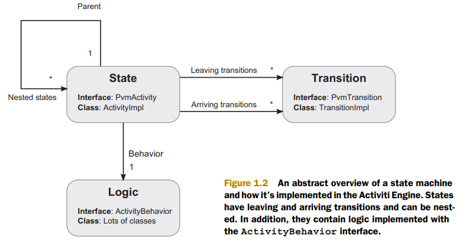

# Introducing the flowable framework
---

## The basics of the Flowable Engine

大多数的 BPMN 2.0 element 在引擎内实现为一个 state， element 带有 transition（包含两种： leaving，arriving）， 这些 transition 在 BPMN 2.0 中被称作 sequence flow 。 每个 state （或与之对应的 element）包含一些 logic，当 process instance 执行到达 state 时会调用这些 logic。如下图，BPMN 2.0 element 中的这些 logic 是在 ActivityBehavior 中实现的。

