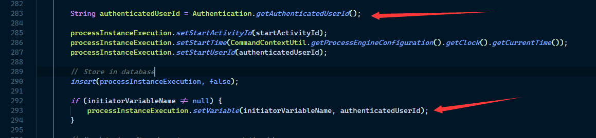
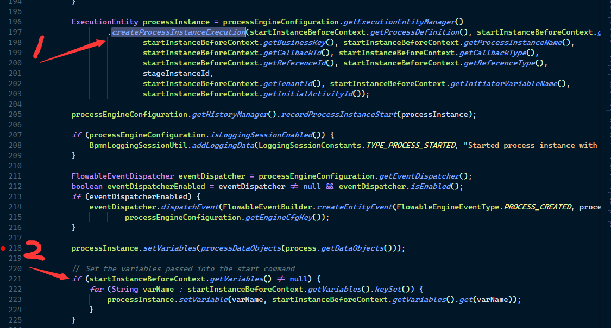

## 设置 initiator 变量的值

initiator：当流程启动的时，这个变量用来存储当前登录的用户 ID，变量名可以任意 
```xml
<startEvent id="request" flowable:initiator="initiator" />
```

file：*\modules\flowable-engine\src\main\java\org\flowable\engine\impl\persistence\entity\ExecutionEntityManagerImpl.java*  
method： *createProcessInstanceExecution*  

<center>图 1</center>

图中的 **initiatorVariableName** 的值就是 在 startEvent 中 flowable:initiator 所设置的值。

如下，启动流程时，有两种方式设置 initiator 变量值，以下两种方式二选一就可以了
```java
    Map<String, Object> variables = new HashMap<>();
    // 第一种
    variables.put("initiator", "jack");

    // 第二种
    identityService.setAuthenticatedUserId("bono");
    
    runtimeService.startProcessInstanceByKey("oneTaskProcess", variables);
```
通过 variables 设置的值会覆盖掉 通过 identityService.setAuthenticatedUserId 设置的值。这段代码在如下位置   
file：*\modules\flowable-engine\src\main\java\org\flowable\engine\impl\util\ProcessInstanceHelper.java*  
method：*createAndStartProcessInstanceWithInitialFlowElement*  

<center>图 2</center>

其中第1步所执行的 createProcessInstanceExecution 方法就包含 图 1 中的那段代码，可见从代码的执行顺序来看，通过 variables 设置的值会覆盖掉 identityService 设置的值。  

那么 identityService.setAuthenticatedUserId 这个方法干了什么事情呢？  
file：*\modules\flowable-engine\src\main\java\org\flowable\engine\impl\IdentityServiceImpl.java*
method：*setAuthenticatedUserId*
```java
    @Override
    public void setAuthenticatedUserId(String authenticatedUserId) {
        Authentication.setAuthenticatedUserId(authenticatedUserId);
    }
```
这里的 Authentication 就是图 1 中的那个 Authentication 。