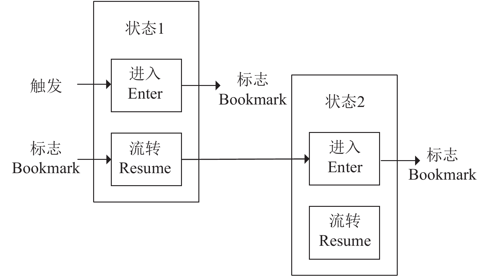
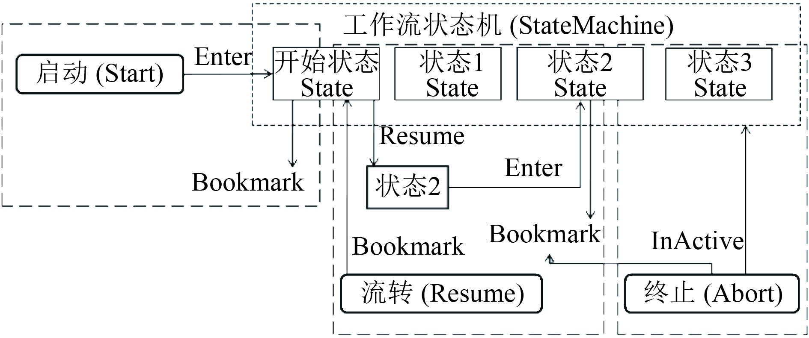
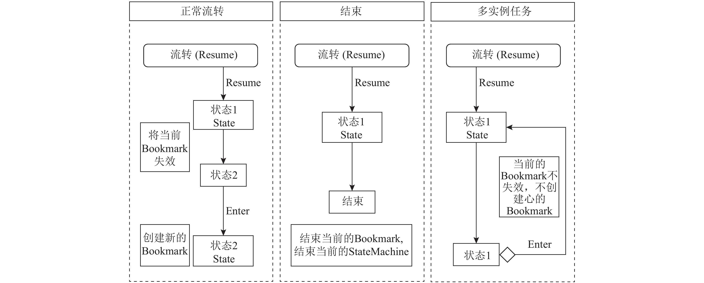
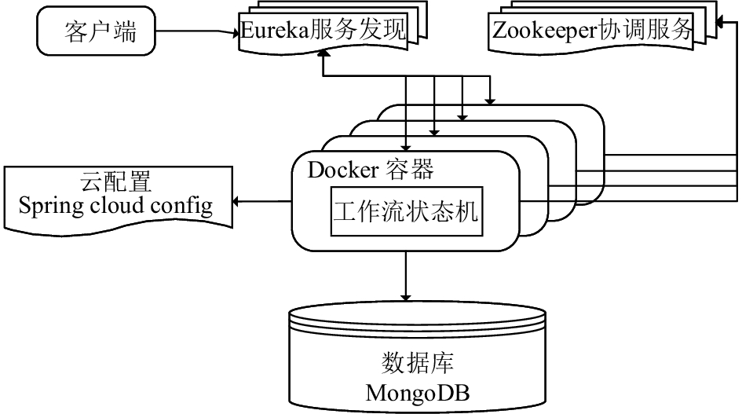
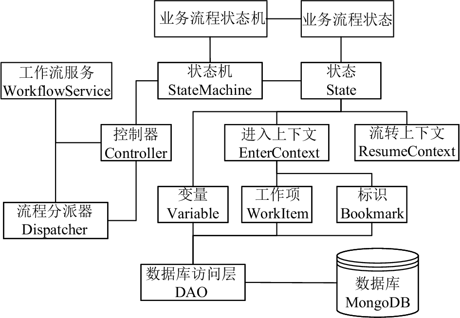

## State machine

自工作流管理联盟(WfMC)1993年成立以来，工作流技术已日趋成熟稳定。 业界提出了众多流程规范，包括流程设计规范[《业务流程模型和符号》2.0版本（BPMN 2.0）](https://www.bpmnquickguide.com/)等，这些都为工作流产品提供了统一的标准，当前主流商业产品如 IBM业务流程管理，开源产品如 Activiti，Flowable 等均支持 BPMN 规范。通常流程引擎采用的核心调度算法包括 **有限状态机**（**FSM**）和基于令牌的Petri网(PetriNet)等。

### 设计原理

工作流状态机是有限状态机的理论在业务流程中的应用，将传统流程中活动的迁移表示为状态之间的变换，以实现流程的流转。

#### 状态机的数学模型

有限状态机有三个特征：状态总数是有限的；任一时刻，只处在一种状态之中；某种条件下，会从一种状态转变到另一种状态。 工作流状态机是一种有限状态机，是表示有限多个状态以及在这些状态之间转移和状态内动作的数学模型。有限状态机是五元组 **(Σ, S, s0, δ, F)** ，其中，**Σ** 是输入字母表（符号的非空有限集合）；**S** 是状态的非空有限集合；**s0** 是初始状态，它是 S 的元素；**δ** 是状态转移函数：δ:S×Σ→S ；**F** 是最终状态的集合，S 的（可能为空）子集.

以工作流状态机为用例，状态机的状态总数为 S ，其中启动流程的初始状态为 s0 ，进入状态时的输入信息为 Σ ，每一个状态（即 S 中的每一个元素）内部包含状态转移函数 δ ，输出状态为 F 。启动流程时，外界输入信息 Σ 到状态 s0 ，s0 状态调用内部状态转移函数 δ ，生成下一步的状态 F ；发送流程时，将 F 作为本次状态转移的初始状态 s0 ，再进行状态迁移，生成下一步状态 F ；结束流程时，生成的下一步状态 F 为空，不再进行状态转移。可见，工作流状态机的下一步状态 F 是由当前状态 s0 中的状态转移函数 δ 和输入信息 Σ 共同决定的。

#### 状态机的运行模式

一个工作流状态机由若干个状态组成，每个状态提供“ 进入（Enter）”和“ 流转（Resume）”方法。状态机进入某个状态（如状态1）后产生一个标志（Bookmark），将标志返回给调用者后就开始等待。直到外界再次通过标志触发流转方法后，该状态继续流转，根据输入值和流转的内部逻辑，决定下一个状态，并进入到下一个状态的进入方法，执行完毕会返回一个标志并开始等待。如此循环直到状态返回“结束”时，工作流状态机不再进入新的状态，而是结束当前状态并结束状态机，实现流程的结束功能。其基本运行模式如图所示：

状态机的基本运行模式

工作流状态机对外暴露“启动(Start)”、“流转(Resume)”和“终止(Abort)”三个基本的方法。一个工作流状态机相当于一个流程实例，可以由外界通过这三个方法控制流程实例的流转。在所有的状态之中必须具有一个开始状态，用于接受启动方法调用，当执行启动方法时，工作流状态机进入到开始状态的“进入”方法，并返回标志(Bookmark)将流程悬挂，等待下一次的调用。当外界调用流转方法时，将标志(Bookmark)传入，根据当前状态的返回值决定并进入下一个要进入的状态。在终止方法被调用时，系统自动设置标志(Bookmark)的状态和工作流状态机的状态为失效，用于标识流程的不可用状态。工作流状态机通过每一个状态的“流转”方法返回的结果实现了不同状态的多次跳转，轻松实现流程的追回、回退以及自由流的功能，从而脱离了原先通过迁移线固化流程运行轨迹的流程设计方式，取而代之的是通过代码操控流程的流向——这种流程设计的优势在于流程的设计更加灵活，不用局限于原有的活动和迁移线的概念，当流程运行场景非常复杂时，可通过代码来简化原先流程的活动节点。工作流状态机的流转机制如图2所示。

状态机的流转机制

流程通过状态的返回结果来控制流程的流向，在流程正常流转到下一个状态的情况下，系统会将当前的标志(Bookmark)置为失效，并创建一个基于新状态的标志(Bookmark)；当状态返回“结束”标志时，流程终结，不再进入后续状态，系统自动结束当前的工作流状态机和标志(Bookmark)；当状态返回为当前本身的状态时，即下一个状态与当前状态相同，那么在重新进入自身状态执行时，当前状态的标志(Bookmark)不失效，且不重新生成新的标志(Bookmark)，此种场景多用于活动的多实例会签。三种场景的比较如图3所示。

三种状态返回场景

### 工作流状态机的实现

结合云技术与工作流状态机的原理，采用微服务化的架构设计开发。传统的工作流服务是一个工作流引擎，可设计运转多个流程，而转变为微服务的模式后，每一个流程就是一个服务，可部署在容器中，从而实现流程服务的动态伸缩，优化利用资源。

#### 微服务化的云架构

当前主流云架构基本使用Docker容器技术搭建，工作流状态机在开发完成后发布成镜像，可启动多个该镜像的Docker容器，技术上选用Spring Cloud解决方案，配合Eureka的服务发现机制和Zookeeper的分布式协调服务，实现微服务化的状工作流状态机集群。

通过Eureka的服务注册发现机制实现负载均衡：每一个工作流状态机启动时向Eureka服务注册，客户端调用映射出的服务，Eureka会根据内部算法将请求自动转发到任意一个状态机容器中；通过Spring Cloud Config的中心化配置实现所有容器中配置信息的统一更新。在启动工作流时，将状态机ID与当前节点信息自动注册到Zookeeper服务器中临时性节点，后续如果有任何与状态机ID相关的操作全部转发到此节点中执行，这样可保证一个流程只在一个节点中执行，同一个流程的并发操作在流程控制器中排队执行。将状态机的Docker容器加入统一的Swarm集群中，可实现状态机之间的请求转发。数据库存储表结构比较简单，无需复杂的SQL查询，因此选用高性能的文档型数据库MongoDB存储，提高插入与查询的效率。微服务化的云架构图如图所示.

微服务化的云架构图

#### 云工作流状态机的处理架构

在云架构下的每个工作流状态机微服务都对外暴露Restful接口，它接收到请求后，通过分派器查找所请求的流程实例所在的微服务节点，找到后将请求转发到目标服务所在节点，目标节点收到请求后由控制器实际处理。流程开发者继承状态机和状态两个基类，开发与具体业务相关的流程状态机和流程状态。控制器中实现了流程状态的跳转，每一个状态都存在“进入”和“流转”两个方法。在“进入”方法中，通过进入上下文创建标识和工作项，在“流转”方法中，返回下一个状态的名称。同时，还可以设置状态机和状态的变量，由数据访问层将状态机以及变量数据、标识数据和工作项保存如MongoDB数据库中。云工作流状态机系统结构图如图所示.

每一个工作流产生的流程实例固定运行在某一个微服务节点上，所有请求由该节点中的控制器处理。控制器中的工作原理是一个单线程池，所有与当前流程实例相关的操作排队进入到控制器中的单线程池中，一个操作处理完毕后再处理下一个操作，这样在处理两个同样的请求时，能够保证只处理一次，在第一次操作处理完毕后，数据的状态已经发生变化，就无法处理第二次请求。简言之，通过单线程的排队处理规避了正常情况下使用锁的机制，以此减少了创建锁和销毁锁的开销，大幅提升了状态机流转效率。控制器中通过原子变量累计请求次数，当控制器中现有多个请求完成后，即请求次数与完成次数相等时，工作流服务卸载当前的控制器.

云工作流状态机系统结构图

#### 基于云工作流状态机的业务研发

云工作流状态机基于Spring Cloud技术提供了云环境下的不同状态之间的迁移功能，从底层保证了状态之间流转的稳定和高效。业务系统基于状态机研发工作流时不用考虑底层状态流转的性能与并发问题，只需要编写每一个状态的进入(Enter)和流转(Resume)方法，根据需要生成工作项，并开发客户端，即可实现一个业务流程。除此之外，云状态机不提供统一的流程图和流程日志，业务研发人员根据需要自行定制流程图，记录流程日志.

虽然与传统的工作流只需要在界面上拖拽流程元素的开发方式相比，编写代码要复杂一些，但遇到极为复杂的流程时，使用状态机的状态来代替传统流程中的活动能够大幅简化流程图的复杂度。将多个顺序或分支活动融合为一个状态，在状态内部通过代码逻辑代替迁移线的判断逻辑，执行后续状态迁移.

