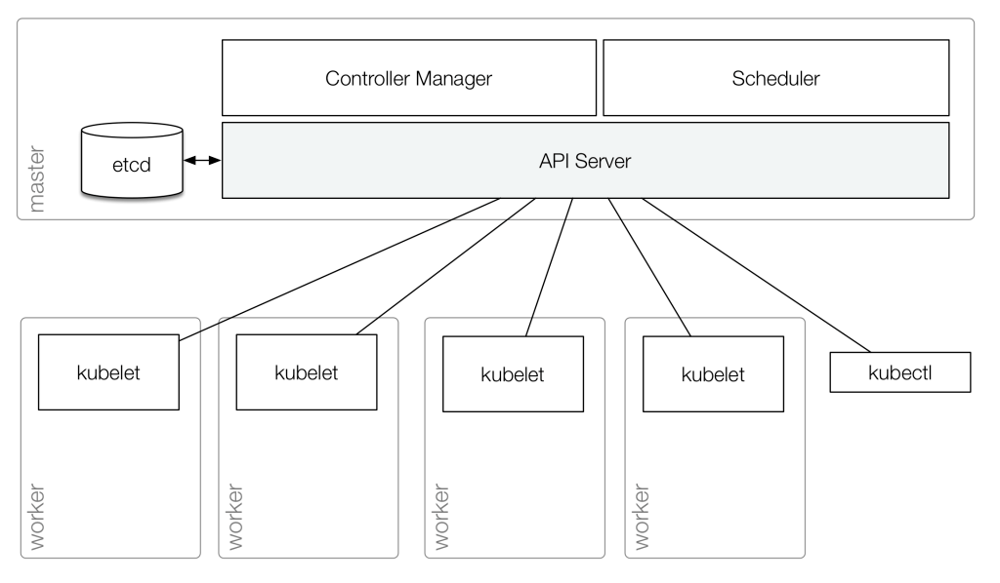
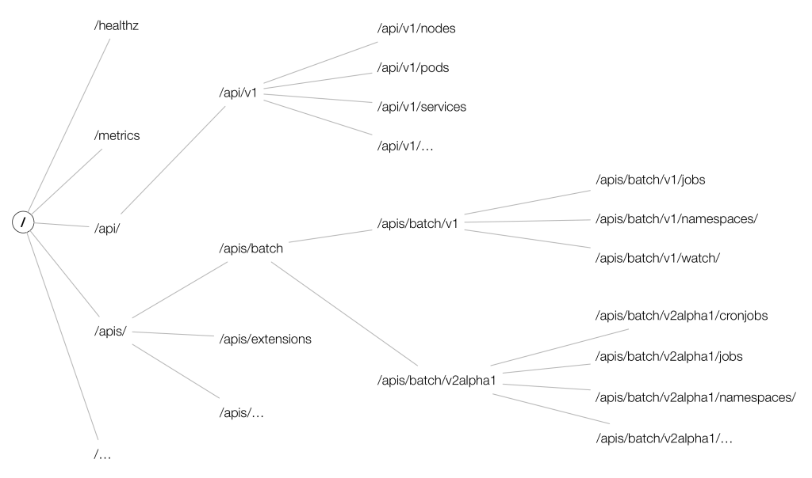
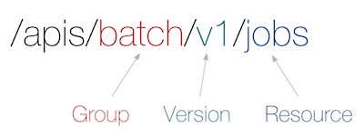
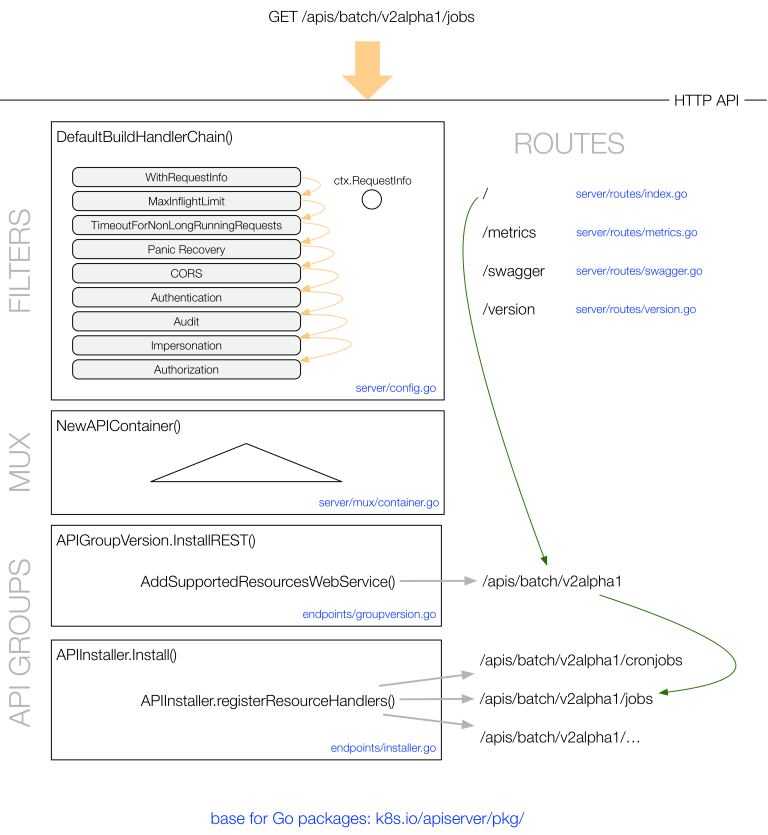

# 从此游览
> Kubernetes 由具有不同角色的 **node** 组成。  
控制面板位于 **master** 节点，它包含：API Server，Controller Manager， Scheduler(s)。

## api server 简介
`有且仅有` **api server** 可以`直接`访问分布式存储组件-**etcd**，它的核心功能包括：
- 提供 Kubernetes API，这些 api 会被位于集群内部的node和 外部的 **kubectl** 调用
- 为集群组件提供代理（proxy），例如：Kubernetes UI
- 允许操作对象的状态，例如：pods，services
- 将对象的状态存储到分布式存储（etcd）  



Kubernetes API 支持 HTTP 和 Protocol Buffers 两种访问方式，集群内部主要以 Protocol Buffer 通信。为了可扩展性，k8s 将API版本化，例如：`/api/v1` 或 `/apis/extensions/v1beta1`。根据版本来标识不同的稳定级别（levels of stability）：

- Alpha level，例如：`v1alpha1`，disabled by default，这一级别提供的功能也许会在任何时间以不被告知的情况下删除，应该只在用于测试目的的集群中使用。
- Beta level，例如：`v2beta3`， enabled by default，这一级别提供了良好的测试，但是对象的定义也许会在下一个 beta 或 stable 版本中以不兼容的方式而改变。
- Stable level，例如：`v1`，将会跟随集群的发布到release。

接下来看看api path是如何定义的。可以将顶级划分为：
- core group，所有以 `/api/v1` 为起始的，（由于一些历史原因而没有叫做 `/apis/core/v1`）
- named groups， 以 `/apis/$NAME/$VERSION`
- system-wide，例如： `/metrics`

部分图：  


来看看一个例子：*batch operations* 。kubernetes 1.5 中，有两个版本：`/apis/batch/v1` 和 `/apis/batch/v2alpha1` 。
```
$ curl http://127.0.0.1:8080/apis/batch/v1
{
  "kind": "APIResourceList",
  "apiVersion": "v1",
  "groupVersion": "batch/v1",
  "resources": [
    {
      "name": "jobs",
      "namespaced": true,
      "kind": "Job"
    },
    {
      "name": "jobs/status",
      "namespaced": true,
      "kind": "Job"
    }
  ]
}
```
下面是 alpha 版本：
```
$ curl http://127.0.0.1:8080/apis/batch/v2alpha1
{
  "kind": "APIResourceList",
  "apiVersion": "v1",
  "groupVersion": "batch/v2alpha1",
  "resources": [
    {
      "name": "cronjobs",
      "namespaced": true,
      "kind": "CronJob"
    },
    {
      "name": "cronjobs/status",
      "namespaced": true,
      "kind": "CronJob"
    },
    {
      "name": "jobs",
      "namespaced": true,
      "kind": "Job"
    },
    {
      "name": "jobs/status",
      "namespaced": true,
      "kind": "Job"
    },
    {
      "name": "scheduledjobs",
      "namespaced": true,
      "kind": "ScheduledJob"
    },
    {
      "name": "scheduledjobs/status",
      "namespaced": true,
      "kind": "ScheduledJob"
    }
  ]
}
```
通常，对于一个给定的 api 路径，Kubernetes API 提供 create，delete，update，get 方法。

大部分api对象会区分以下两种状态：
- **specification of the desired state** of the object
- the status of the object **at the current time**  

specification 是对 desired state 的完整描述，并且会持久化存储到   etcd 里

## 术语
**Kind** 描述 *entity* 类型，每一个对象都有一个 *Kind* 字段，例如，pod：
```
apiVersion: v1
kind: Pod
metadata:
  name: webserver
spec:
  containers:
  - name: nginx
    image: nginx:1.9
    ports:
    - containerPort: 80
```
Kinds 分为三类：
- 代表持久化的 *entity*。包含多个资源的对象，client可以对其执行相应的操作，例如： `Pod` 和 `Namespace`
- 集合，例如: `PodLists` 和 `NodeLists`
- 用于特殊场景的操作和非持久化存储的 *entity*：`/binging`, `/status`，discovery use `APIGroup` 和 `APIResource`, error results use `Status`,

 **API Group** 是一类 逻辑上相关的 Kinds 的集合，例如： 所有和 batch 操作相关的对象，`Job`,`ScheduledJob` 都在 `batch` 这个 API Group 中。

**Version** 每个 API Group 可以有多个版本。

**Resource** 发起 HTTP 请求时，通过 JSON 来描述请求的参数和返回对象，在k8s系统内部用来描述 entity 。

由 API Group，Version，Resource 可以唯一定义一个 HTTP path：  



## HTTP 请求处理流程解析
源码位于 [k8s.io/pkg/api](https://github.com/kubernetes/kubernetes/tree/master/pkg/api)  


处理流程如下：
- 1 http 请求先经由 一组 filter 处理，这些 filter 是 在 `DefaultBuildHandlerChain()`（[config.go](https://github.com/kubernetes/apiserver/blob/master/pkg/server/config.go)）中注册的, 一些信息会添加到`ctx.RequestInfo`，例如：用户信息。
- 2 multiplexer ([handler.go](https://github.com/kubernetes/apiserver/blob/master/pkg/server/handler.go)) 将请求路由到对应的 handler
- 3 routes (定义在 `routes/*`) 将 handlers 绑定到对应的 HTTP paths 
- 4 handler 注册于 API Group（[groupversion.go](https://github.com/kubernetes/apiserver/blob/master/pkg/endpoints/groupversion.go) 和 [installer.go](https://github.com/kubernetes/apiserver/blob/master/pkg/endpoints/installer.go)） 用来处理请求，从 etcd 里获取请求的对象。 
 

