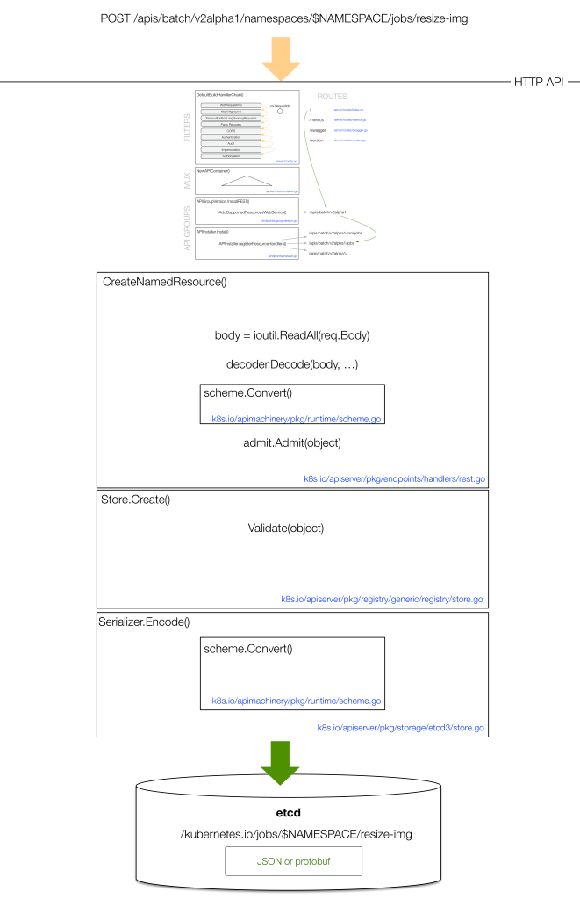

# 集群状态持久化
> 既然 API Server 是 stateless 的，并且只有 apiserver 这个组件可以和底层的分布式存储-etcd 通信。下面将看看 k8s 是如何管理对象的状态的。

## etcd 101
关于 etcd 介绍可以看这里：[k8s love etcd](../花边/k8s-love-etcd.md)

## 集群状态在 etcd 中的数据结构
在 k8s中，etcd 是一个独立的组件。k8s 1.5.2 之前 使用的是 etcd2，之后使用的是 etcd3，两个版本使用不同的数据模型（data model）：  
- 从 developer 的角度来看，不关心底层数据模型是怎样的，因为 API Server抽象出了和 etcd 交互的方式 -- 它会判断使用的是那个版本。  
- 从 cluster‘s admin 的角度来看，admin 只用关心正在使用哪一个版本的 etcd，后续的维护工作，例如：备份和恢复，不同的版本需要使用不同的方式。

API Server [启动的时候](https://kubernetes.io/docs/admin/kube-apiserver/)，有一些 关于 etcd 的参数可以配置：
```
$ kube-apiserver -h
...
--etcd-cafile string   SSL Certificate Authority file used to secure etcd communication.
--etcd-certfile string SSL certification file used to secure etcd communication.
--etcd-keyfile string  SSL key file used to secure etcd communication.
...
--etcd-quorum-read     If true, enable quorum read.
--etcd-servers         List of etcd servers to connect with (scheme://ip:port) …
...
```
k8s 以两种格式将对象保存到 etcd 中：JSON string 和 Protocol Buffers。  
看一个例子：假设在 namespace `apiserver-sandbox` 中运行一个 pod `webserver`，然后使用 [etcdctl](https://github.com/coreos/etcd/tree/master/etcdctl) 命令行查询 etcd 。  
```
$ cat pod.yaml
apiVersion: v1
kind: Pod
metadata:
  name: webserver
spec:
  containers:
  - name: nginx
    image: tomaskral/nonroot-nginx
    ports:
    - containerPort: 80

$ kubectl create -f pod.yaml 

$ etcdctl ls /
/kubernetes.io
/openshift.io

$ etcdctl get /kubernetes.io/pods/apiserver-sandbox/webserver
{
  "kind": "Pod",
  "apiVersion": "v1",
  "metadata": {
    "name": "webserver",
...
```  
所以，当执行 `kubectl create -f pod.yaml` 后，接下来发生了什么? 对象是如何存储到 etcd 中的？  
请看图：  
  
- 1\. 某个 client 如 `kubectl` 提供 对象状态的声明，声明的内容可以用 YAML 来描述，例如：上图中的声明内容用 YAML 来描述，version 是 `v1` 。
- 2\. `kubectl` 将 YAML 转换为 JSON，然后提交。
- 3\. 同一个 `kind`或许有多个版本，API Server 可以在不同版本之间无损转换（lossless conversion），旧版本中无法表示的数据通过 annotations 存储。
- 4\. API Server 将对象的状态调整为标准的 storage version，这依赖于 正在运行的 API Server 自己的版本，通常是最新的 stable，如：v1 。
- 5\. 最后，存储到 etcd 。

可以通过配置 kube-apiserver 的启动参数 `--storage-media-type` 选择序列化的方式，这个参数的默认值为 `application/vnd.kubernetes.protobuf` , 参数 `--storage-versions` 用来配置 每个 group 的基准 storage version

接下来看一个关于 lossless conversion 的例子，创建一个 HPA（Horizontal Pod Autoscaling） 对象, 这个对象会监控和更新 和它关联的 `ReplicationController` ：
```
$ kubectl create -f rc.yaml
$ kubectl autoscale rc rcex --min=2 --max=5 --cpu-percent=80
```
现在来看看上面创建的 HPA 对象，  
可以访问当前的 stable version （`autoscaling/v1`）  
也可以访问之前的某一个版本 （`extensions/v1beta1`）  
然后比较这两个请求的输出：
```
$ http localhost:8080/apis/extensions/v1beta1/namespaces/ reading-k8s-source-code/horizontalpodautoscalers/rcex > hpa-v1beta1.json
$ http localhost:8080/apis/autoscaling/v1/namespaces/reading-k8s-source-code/horizontalpodautoscalers/rcex > hpa-v1.json
$ diff -u hpa-v1beta1.json hpa-v1.json
{
  "kind": "HorizontalPodAutoscaler",
-  "apiVersion": "extensions/v1beta1",
+  "apiVersion": "autoscaling/v1",
  "metadata": {
    "name": "rcex",
    "namespace": "api-server-deepdive",
-    "selfLink": "/apis/extensions/v1beta1/namespaces/api-server-deepdive/horizontalpodautoscalers/rcex",
+    "selfLink": "/apis/autoscaling/v1/namespaces/api-server-deepdive/horizontalpodautoscalers/rcex",
    "uid": "ad7efe42-50ed-11e7-9882-5254009543f6",
    "resourceVersion": "267762",
    "creationTimestamp": "2017-06-14T10:39:00Z"
  },
  "spec": {
-    "scaleRef": {
+    "scaleTargetRef": {
      "kind": "ReplicationController",
      "name": "rcex",
-      "apiVersion": "v1",
-      "subresource": "scale"
+      "apiVersion": "v1"
    },
    "minReplicas": 2,
    "maxReplicas": 5,
-    "cpuUtilization": {
-      "targetPercentage": 80
-    }
+    "targetCPUUtilizationPercentage": 80
```
可以看到 `HorizontalPodAutoscaler` 的 schema 从 `v1beta1` 转换成了 `v1` 。API Server 能够在不同的版本之间做 losslessly 转换，这个转换过程和具体存储的版本无关。

## Serialization 的过程
> 这一节描述一下 API Server 处理 encode 和 decode 的过程

在这里 Go [type registry](https://github.com/kubernetes/kubernetes/tree/master/pkg/registry) 定义了所有在 k8s 中已知的 object kinds，API Server 把这些叫做 `Scheme` 。在这个 registry 中，每个版本的 kinds 都定义了 它是如何被 converted，created， encoded and decoded to JSON or protobuf 。  
 
从某个client 如 `kubectl` 将对象发送到 API Server， 当请求到达时，API Server 可以从 HTTP path 中获取到 version 的值，然后它将用对应于此 version 的 `Scheme` 来创建一个 empty object，用相应的 JSON 或者 protobuf decoder 转换 HTTP payload 。decoder 将 binary payload 解码到前面创建的 empty object 中。  
decoded 之后，获取到了一个 已知 version 的 type 的 对象。有一些 type 的 versions 是贯穿于整个开发周期的。为了避免这个问题。API Server 知道怎样在这些 versions 之间转换（例如：`v1 ⇔ v1alpha1, v1 ⇔ v1beta1, v1beta1 ⇔ v1alpha1`）。  
对于每一个 type， API Server 都有一个 特别的 “**internal**” version。  
对于某个 type 而言， 它的 internal version 包含 所有其它 versions 的功能，它是所有其它 versions 的一个超集。它将收到的对象转换为 internal version 然后 storage version ：
```
v1beta1 ⇒ internal ⇒ v1
```
在第一阶段的转换期间，如果有些字段没有值，那么这期间将会自动设置为默认值。想象一下，假如 `v1beta1` 没有定义某个字段，之后这个字段却添加到了 `v1` 里，这种场景下，用户不一定能设置这个字段。为了可以创建有效的 internal object，这时候就有必要为这些字段设置默认值。

## Validation and Admission
在转换之后还有两个更重要的步骤，像这个样子：
```
v1beta1 ⇒ internal ⇒    |    ⇒       |    ⇒  v1  ⇒ json/yaml ⇒ etcd
                     admission    validation
```
将对象写入 etcd 之前，还需要通过 admission 和 validation 的验证。这两个东西的功能如下：
- **Admission** 检查全局约束条件，为某些字段设置集群里配置的默认值，以下是一些例子：
    - `NamespaceLfecycle` – rejects all incoming requests in a namespace context if the namespace does not exist.
    - `LimitRanger` – enforces usage limits on a per resource basis in the namespace.
    - `ServiceAccount` – creates a service account for a pod.
    - `DefaultStorageClass` – sets the default value of a `PersistentVolumeClaims` storage class, in case the user did not provide a value.
    - `ResourceQuota` – enforces quota constraints for the current user on the cluster and might reject requests if the quota is not enough.
- **Validation** 检查对象的定义，结构是否完整， 字段的值是否有效，例如：
    - It checks that all mandatory fields are set.
    - It checks that all strings have a valid format (for example, only include lowercase characters).
    - It checks that no contradicting fields are set (for example, two containers with the same name).


