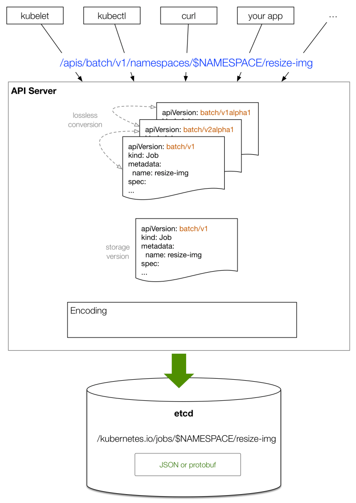

# 集群状态持久化
> 既然 API Server 是 stateless 的，并且只有 apiserver 这个组件可以和底层的分布式存储-etcd 通信。下面将看看 k8s 是如何管理对象的状态的。

## etcd 101
关于 etcd 介绍可以看这里：[k8s love etcd](../花边/k8s-love-etcd.md)

## 集群状态在 etcd 中的数据结构
在 k8s中，etcd 是一个独立的组件。k8s 1.5.2 之前 使用的是 etcd2，之后使用的是 etcd3，两个版本使用不同的数据模型（data model）：  
- 从 developer 的角度来看，不关心底层数据模型是怎样的，因为 API Server抽象出了和 etcd 交互的方式 -- 它会判断使用的是那个版本。  
- 从 cluster‘s admin 的角度来看，admin 只用关心正在使用哪一个版本的 etcd，后续的维护工作，例如：备份和恢复，不同的版本需要使用不同的方式。

API Server [启动的时候](https://kubernetes.io/docs/admin/kube-apiserver/)，有一些 关于 etcd 的参数可以配置：
```
$ kube-apiserver -h
...
--etcd-cafile string   SSL Certificate Authority file used to secure etcd communication.
--etcd-certfile string SSL certification file used to secure etcd communication.
--etcd-keyfile string  SSL key file used to secure etcd communication.
...
--etcd-quorum-read     If true, enable quorum read.
--etcd-servers         List of etcd servers to connect with (scheme://ip:port) …
...
```
k8s 以两种格式将对象保存到 etcd 中：JSON string 和 Protocol Buffers。  
看一个例子：假设在 namespace `apiserver-sandbox` 中运行一个 pod `webserver`，然后使用 [etcdctl](https://github.com/coreos/etcd/tree/master/etcdctl) 命令行查询 etcd 。  
```
$ cat pod.yaml
apiVersion: v1
kind: Pod
metadata:
  name: webserver
spec:
  containers:
  - name: nginx
    image: tomaskral/nonroot-nginx
    ports:
    - containerPort: 80

$ kubectl create -f pod.yaml 

$ etcdctl ls /
/kubernetes.io
/openshift.io

$ etcdctl get /kubernetes.io/pods/apiserver-sandbox/webserver
{
  "kind": "Pod",
  "apiVersion": "v1",
  "metadata": {
    "name": "webserver",
...
```  
所以，当执行 `kubectl create -f pod.yaml` 后，接下来发生了什么? 对象是如何存储到 etcd 中的？  
请看图：  
  
- 1\. 某个 client 如 `kubectl` 提供 对象状态的声明，声明的内容可以用 YAML 来描述，例如：上图中的声明内容用 YAML 来描述，version 是 `v1` 。
- 2\. `kubectl` 将 YAML 转换为 JSON，然后提交。
- 3\. 同一个 `kind`或许有多个版本，API Server 可以在不同版本之间无损转换（lossless conversion），旧版本中无法表示的数据通过 annotations 存储。
- 4\. API Server 将对象的状态调整为标准的 storage version，这依赖于 正在运行的 API Server 自己的版本，通常是最新的 stable，如：v1 。
- 5\. 最后，存储到 etcd 。

可以通过配置 kube-apiserver 的启动参数 `--storage-media-type` 选择序列化的方式，这个参数的默认值为 `application/vnd.kubernetes.protobuf` , 参数 `--storage-versions` 用来配置 每个 group 的基准 storage version

接下来看一个关于 lossless conversion 的例子，创建一个 HPA（Horizontal Pod Autoscaling） 对象, 这个对象会监控和更新 和它关联的 `ReplicationController` ：
```
$ kubectl create -f rc.yaml
$ kubectl autoscale rc rcex --min=2 --max=5 --cpu-percent=80
```
现在来看看上面创建的 HPA 对象，  
可以访问当前的 stable version （`autoscaling/v1`）  
也可以访问之前的某一个版本 （`extensions/v1beta1`）  
然后比较这两个请求的输出：
```
$ http localhost:8080/apis/extensions/v1beta1/namespaces/ reading-k8s-source-code/horizontalpodautoscalers/rcex > hpa-v1beta1.json
$ http localhost:8080/apis/autoscaling/v1/namespaces/reading-k8s-source-code/horizontalpodautoscalers/rcex > hpa-v1.json
$ diff -u hpa-v1beta1.json hpa-v1.json
{
  "kind": "HorizontalPodAutoscaler",
-  "apiVersion": "extensions/v1beta1",
+  "apiVersion": "autoscaling/v1",
  "metadata": {
    "name": "rcex",
    "namespace": "api-server-deepdive",
-    "selfLink": "/apis/extensions/v1beta1/namespaces/api-server-deepdive/horizontalpodautoscalers/rcex",
+    "selfLink": "/apis/autoscaling/v1/namespaces/api-server-deepdive/horizontalpodautoscalers/rcex",
    "uid": "ad7efe42-50ed-11e7-9882-5254009543f6",
    "resourceVersion": "267762",
    "creationTimestamp": "2017-06-14T10:39:00Z"
  },
  "spec": {
-    "scaleRef": {
+    "scaleTargetRef": {
      "kind": "ReplicationController",
      "name": "rcex",
-      "apiVersion": "v1",
-      "subresource": "scale"
+      "apiVersion": "v1"
    },
    "minReplicas": 2,
    "maxReplicas": 5,
-    "cpuUtilization": {
-      "targetPercentage": 80
-    }
+    "targetCPUUtilizationPercentage": 80
```
可以看到 `HorizontalPodAutoscaler` 的 schema 从 `v1beta1` 转换成了 `v1` 。API Server 能够在不同的版本之间做 losslessly 转换，这个转换过程和具体存储的版本无关。