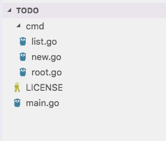
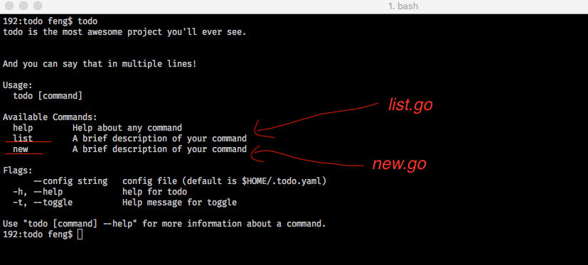
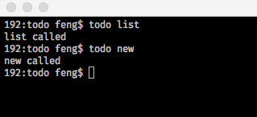

# Cobra 概览

## Cobra 是干什么的
cobra是一个工具包，可以让你很容易的用go写一些CLI应用程序。  
kubectl是用的这个，类似的还有docker的commandline。。。

## Quick start
>cobra的使用方式：
>- 1 使用 **cobra init** 命令生成项目模版（包含一个 rootCmd 对象）
>- 2 使用 **cobra add** 给 rootCmd 添加子命令

### Installing
``` 
go get -u github.com/spf13/cobra/cobra
cd $GOPATH/src/github.com/spf13/cobra/cobra
go install
```

### 创建一个项目文件夹
```
mkdir todo
cd todo
```

### 用cobra命令初始化项目
```
cobra init
``` 

添加一个 list 子命令
```
cobra add list
```
添加一个 new 子命令
```
cobra add new 
```
可以看到生成的项目模版  
 

此时，可以执行：
```
go install
todo
```
看看命令行输出，是不是和你以前使用过的其他命令很相似：
  

试着执行 todo list 或者 todo new 命令，看看输出：  


代码也是很简单  
首先，root.go 里面定义了 rootCmd 对象，这个是根命令 todo，也就是在执行 **cobra init** 命令是生成的。  
其次，list.go 和 new.go 分别定义了 list ，new 两个子命令，这两个子命令分别是通过在各自文件里的 init 函数添加到 rootCmd 上的
```
func init() {
	rootCmd.AddCommand(listCmd)
}
```
而后，当你试着执行 todo list 或者 todo new 命令是，这会调用 Run 定义的函数：
```
var listCmd = &cobra.Command{
	Use:   "list",
	Short: "这个是命令的描述",
	Long: `这个是命令的详细描述信息`,
	Run: func(cmd *cobra.Command, args []string) {
		fmt.Println("list called")
	},
}
```


