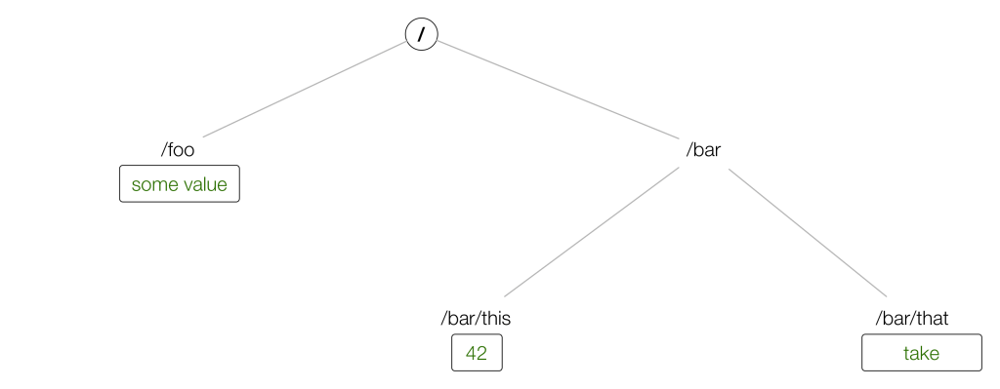

# etcd 101
> 如果你有 unix 的背景，那么你一定知道 `/etc` 是用来存储配置信息的目录，etcd 这个名称就是来源于这里，“d” 代表 distributed 。任何分布式的系统都可以用 etcd 存储描述系统状态的数据。

## etcd 简介

etcd 特点：  
- 1 consistent，reliable
- 2 算法：Raft
- 3 data model：key-value
- 4 In etcd2 the keys formed a hierarchy and with the introduction of etcd3 this has turned into a flat model, while maintaining backwards compatibility concerning hierarchical keys 

  
使用 etcd 实现上图中的数据结构：  
```
$ docker run --rm -d -p 2379:2379 \ 
 --name test-etcd3 quay.io/coreos/etcd:v3.1.0 /usr/local/bin/etcd \
 --advertise-client-urls http://0.0.0.0:2379 --listen-client-urls http://0.0.0.0:2379
$ curl localhost:2379/v2/keys/foo -XPUT -d value="some value"
$ curl localhost:2379/v2/keys/bar/this -XPUT -d value=42
$ curl localhost:2379/v2/keys/bar/that -XPUT -d value=take
$ http localhost:2379/v2/keys/?recursive=true
HTTP/1.1 200 OK 
Content-Length: 327
Content-Type: application/json
Date: Tue, 06 Jun 2017 12:28:28 GMT
X-Etcd-Cluster-Id: 10e5e39849dab251
X-Etcd-Index: 6
X-Raft-Index: 7
X-Raft-Term: 2

{
    "action": "get",
    "node": {
        "dir": true,
        "nodes": [
            {
                "createdIndex": 4,
                "key": "/foo",
                "modifiedIndex": 4,
                "value": "some value"
            },
            {
                "createdIndex": 5,
                "dir": true,
                "key": "/bar",
                "modifiedIndex": 5,
                "nodes": [
                    {
                        "createdIndex": 5,
                        "key": "/bar/this",
                        "modifiedIndex": 5,
                        "value": "42"
                    },
                    {
                        "createdIndex": 6,
                        "key": "/bar/that",
                        "modifiedIndex": 6,
                        "value": "take"
                    }
                ]
            }
        ]
    }
}
```
