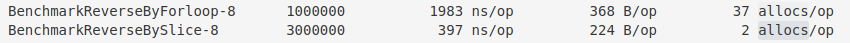

# Reverse string
> [代码在这里](https://github.com/HP-dufeng/algorithm-case/tree/master/reversestring)

## 如何反转字符串

最直接的想法可能是 一个 for 循环遍历 string，然后将遍历的每个字符连起来
```
func ReverseByForloop(str string) string {
	var result string
	for _, c := range str {
		result = fmt.Sprintf("%c%s", c, result)
	}

	return result
}
```

在进一步，可以将 string 转换为一个数组，利用拆半遍历的办法，交换对应位置的字符
```
func ReverseBySlice(str string) string {
	if len(str) <= 0 {
		return str
	}

	result := strings.Split(str, "")
	for i, j := 0, len(result)-1; i < j; i, j = i+1, j-1 {
		result[i], result[j] = result[j], result[i]
	}

	return strings.Join(result, "")
}
```

其实，我还有一个想法，就是函数式里面经常看到的 reduce 方法, go package里面没有对应的方法，我准备用 [ReactiveX](http://reactivex.io/) 这个库，之前使用过，js，c# 的语言实现，这次试试 go 的实现，概念都是一样的。其实 函数式，流式处理是未来的一个重要的方向。  

看看 benchmark 的测试结果：  

